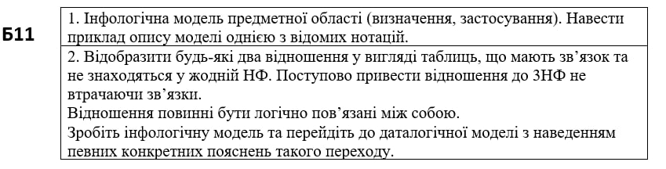
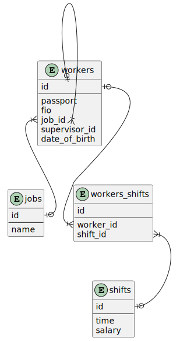

# Модульна контрольна робота

- [Модульна контрольна робота](#модульна-контрольна-робота)
  - [Автор](#автор)
  - [Варіант](#варіант)
  - [Завдання](#завдання)
  - [Виконання](#виконання)
    - [Завдання 1](#завдання-1)
      - [Опис моделі на прикладі школи](#опис-моделі-на-прикладі-школи)
        - [Аналіз предметної області](#аналіз-предметної-області)
        - [Побудова моделі предметної області](#побудова-моделі-предметної-області)
    - [Завдання 2](#завдання-2)
      - [Нормальні форми та зв'язки](#нормальні-форми-та-звязки)
      - [Інфологічна модель](#інфологічна-модель)
      - [Даталогічна модель](#даталогічна-модель)

## Автор

Молчанов Михайло Валерійович, ІА-12

## Варіант

Б11

## Завдання

## Виконання

### Завдання 1

Інфологічна модель - це певна модель бази данних яка представлена у загальному вигляді та не залежить від конкретної бази данних. Ця модель відображає абстактні об'єкти предметної області та їх атрибути та можливі зв'язки. Інфологічна модель включає в себе:

- Аналіз предметної області
- Побудова моделі предметної області
- Визначення можливих користувачів та зостосувань
- Можливо додаткові примітки

Інфологічну модель застосовують для простого розуміння інформації для якої проектується база данних.

#### Опис моделі на прикладі школи

##### Аналіз предметної області

База данних створюється для певної школи щоб керувати розкладом, мати список учнів та викладачів, поточні оцінки учнів та робочі дні викладачів.

##### Побудова моделі предметної області

| Сутність | Атрибут                                |
| -------- | -------------------------------------- |
| student  | id; name; surname; year; date_of_birth |
| teacher  | id; name; surname; date_of_birth       |
| subject  | id; name;                              |

| Зв'язки         | Атрибути                |
| --------------- | ----------------------- |
| teacher_subject | teachder_id; subject_id |
| student_subject | student_id; subject_id  |

### Завдання 2

#### Нормальні форми та зв'язки

Приклад кількох таблиць без нормальних форм

jobs
| id  | name             |
| --- | ---------------- |
| 1   | regional_manager |
| 2   | manager          |
| 3   | janitor          |

workers

| id  | passport | date_of_birth | supervisor | supervisor_job | fio                    | job_id |
| --- | -------- | ------------- | ---------- | -------------- | ---------------------- | ------ |
| 1   | AB1234   | 02.09.2000    | Pavlov     | 1              | Ivanov Ivan Ivanich    | 3      |
| 2   | CD1234   | 01.01.2001    | Zubenko    | 2              | Pavlov Pavel Pavlovich | 1      |

shifts

| id  | time  | salary |
| --- | ----- | ------ |
| 1   | 00:00 | 15$    |
| 2   | 12:00 | 10$    |

workers_shifts

| id  | worker_id | shift_id |
| --- | --------- | -------- |
| 1   | 1         | 1;2      |

Таблиці не знаходяться в жодній нормальній формі. Приведемо це до першої нормальної форми. Для цього виправимо таблицю з кількома значеннями в одній колонці, таблицю worker_shift. Після приведення до першої нормальної форми вона буде виглядати так:

worker_shift
| id  | worker_id | shift_id |
| --- | --------- | -------- |
| 1   | 1         | 1        |
| 2   | 1         | 2        |

Приведемо таблицю до другої нормальної форми. Для цього частину головного ключа workers(passport) зробимо не частиною ключа, щоб прибрати залежність між ключем та іншими значеннями(fio). Таблиця візуально не зміниться, але passport не буде частиною ключа

Приведемо таблицю до третьої нормальної форми. Для цього приберемо залежність між атрибутами. Після всіх перетворень таблиці будуть виглядати так:

jobs
| id  | name             |
| --- | ---------------- |
| 1   | regional_manager |
| 2   | manager          |
| 3   | janitor          |

workers

| id  | passport | date_of_birth | supervisor_id | fio                    | job_id |
| --- | -------- | ------------- | ------------- | ---------------------- | ------ |
| 1   | AB1234   | 02.09.2000    | 2             | Ivanov Ivan Ivanich    | 3      |
| 2   | CD1234   | 01.01.2001    | 3             | Pavlov Pavel Pavlovich | 1      |

shifts

| id  | time  | salary |
| --- | ----- | ------ |
| 1   | 00:00 | 15$    |
| 2   | 12:00 | 10$    |

workers_shifts

| id  | worker_id | shift_id |
| --- | --------- | -------- |
| 1   | 1         | 1        |
| 2   | 1         | 2        |

В таблицях є 2 відношення. Відношення багато до багатьох між workers та shifts яке реалізовано за допомогою асоціативної сутності. Та відношення один до багатьох між працівниками та роботами, яке реалізовано зо допомогою допоміжного атрибута. Під час приведення до нормальної форми зв'язки не були втрачені, навпаки з'явився новий.

#### Інфологічна модель

База данних створюється для великої компанії щоб керувати працівниками та їх робочими годинами.

Сутності

| Сутність | Атрибути                                                |
| -------- | ------------------------------------------------------- |
| workers  | id, passport, date_of_birth, fio, supervisor_id, job_id |
| jobs     | id, name                                                |
| shifts   | id, time, salary                                        |

Зв'язки

| зв'язок              | атрибути                                |
| -------------------- | --------------------------------------- |
| worker to supervisor | workers::id, workers::supervisor_id     |
| worker to job        | workers::job_id, jobs::id               |
| workers to shifts    | workers::id, shifts::id, workers_shifts |

#### Даталогічна модель

В даталогічній моделі додані описи умовності зв'язків. Робочий не може бути без супервайзера, але не кожен робочий супервайзер - умовний вз'язок. В кожного працівника повинна бути робота, але не в кожної роботи є працівник - умовний зв'язок. Не кожен працівник має години роботи та не кожні години роботи мають працівника, тому тут біумовний зв'язок але через асоціативну сутність