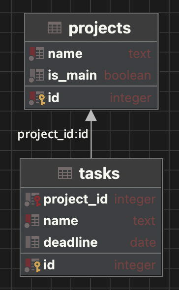

# Модульна контрольна робота 2

- [Модульна контрольна робота 2](#модульна-контрольна-робота-2)
  - [Автор](#автор)
  - [Завдання](#завдання)
  - [Виконання](#виконання)
    - [Завдання 1](#завдання-1)
      - [Open](#open)
      - [Mount](#mount)
      - [Nomount](#nomount)
      - [Shutdown](#shutdown)
    - [Завдання 2](#завдання-2)
      - [Створення](#створення)
      - [Заповнення даними](#заповнення-даними)
        - [Projects](#projects)
        - [Tasks](#tasks)
      - [Select](#select)
  - [Скріни](#скріни)

## Автор

Молчанов

## Завдання


## Виконання

### Завдання 1

Під час вимкнення бази даних, Oracle проходить етапи у зворотньому порядку до включення. Слід додати, що оскільки в нас звичайне вимкнення бази даних, вона не буде дозволяти створювати нові підключення, але дасть всім вже існюючим допрацювати(на відміну від інших, коли їм може кинутись SIGKILL)
Етапи:

1. open
2. mount
3. nomount
4. shutdown

Опишімо їх.

#### Open

Процес запущений та база даних для нього відкрита. Можуть виконуватись запити, працює в нормальному режимі база данних

#### Mount

Початок вимкнення бази даних. Сама база даних закривається, але всі contol файли та redo log ще відкриті.

#### Nomount

Інстанс ще працює, але контрол файли вже закриті, підв'язки до певної бази даних немає.

#### Shutdown

Інстанс oracle вже вимкнувся. База даних перейшла у фінальний стан, далі тільки вмикати.

### Завдання 2

В мене MacBook з M1, оракл не ставиться на мій комп'ютер, тому всі запити я буду відпрацьовувати у PostgreSQL

#### Створення

Спочатку створимо схему, щоб не конфліктувати з іншими данними.

```
create schema mrk2
```

Оскільки Projects - стержнева сутніть, створемо її першою.

```
create table mrk2.projects
(
    id      serial  not null unique primary key,
    name    text    not null unique,
    is_main boolean not null
)
```

Тепер можемо створювати Tasks

```
create table mrk2.tasks
(
    id         serial not null unique primary key,
    project_id serial not null references mrk2.projects (id),
    name       text   not null unique,
    deadline   date
)
```

Оскільки ми вже сказали primary key та foreign key(додали references), нам не потрібно змінювати таблиці та alter писати не потрібно

#### Заповнення даними

##### Projects

```
insert into mrk2.projects (name, is_main)
values ('Movaua', true),
       ('Google', true),
       ('k22', false),
       ('kpi', false),
       ('Apple', false)
```

##### Tasks

```
insert into mrk2.tasks(project_id, name, deadline)
values (1, 'Do spa', '2022-11-30'),
       (1, 'Present', '2022-12-20')
```

```
insert into mrk2.tasks(project_id, name, deadline)
values (4, 'Do MKR2', '2022-11-30'),
       (4, 'Do lab', '2022-12-8'),
       (4, 'Prepare term work', '2022-12-30')
```

#### Select

Для цього зробимо просрочений дедлайн

```
insert into mrk2.tasks(project_id, name, deadline)
values (4, 'Prepare for MRK', '2022-11-29')
```

Використовуємо join, оскільки обираємо за id, дату сказано сьогоднішню, тому бедемо now()

```
select mrk2.tasks.*
from mrk2.tasks
         join mrk2.projects p on p.id = tasks.project_id
where p.id = 4
  and tasks.deadline < now()
order by tasks.name, tasks.deadline
```

## Скріни



