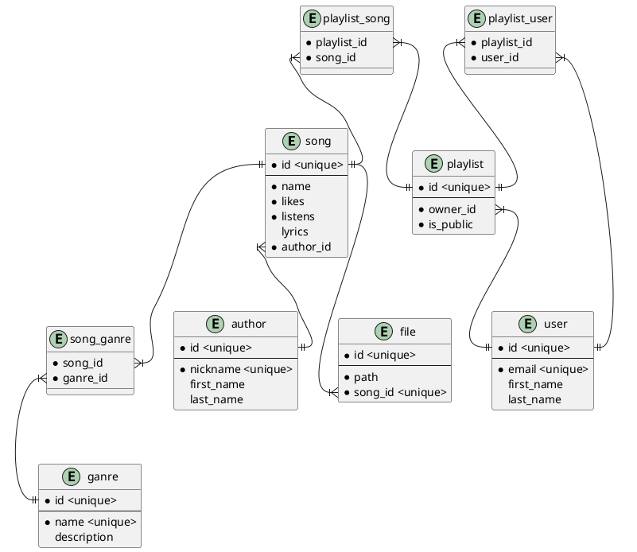

# Лабораторна робота №1

- [Лабораторна робота №1](#лабораторна-робота-1)
  - [Тема](#тема)
  - [Мета](#мета)
  - [Предметна область](#предметна-область)
  - [Хід роботи](#хід-роботи)
    - [Приклади застосування](#приклади-застосування)
    - [Особливості](#особливості)
    - [Базові сутності](#базові-сутності)
      - [Жанр](#жанр)

## Тема

Аналіз предметної області

## Мета

Навчитися збирати та аналізувати дані, визначати корисні дані
(інформацію) для інфологічного проектування.

## Предметна область

Плейлисти

## Хід роботи

База данних створюється для застосунду, де можна слухати музику. Самі файли музики будуть зберігатися окремо, тому просто будемо використовувати uri. Застосунок буде мати у собі багато виконавців та пісень, які користувачі будуть слухати та додавати до плейлистів. Плейлистами можна буде ділитися або робити приватними щоб слухаит самому. Кожна пісня буде певного жанру або кількох жанрів, можна буде переглядати пісні за жанрими.

### Приклади застосування

1. Прослуховувати популярну музику
2. Ділитися музикою
3. Створювати аккаунт
4. Прослуховувати та зберігати плейлисти
5. Створювати свої плейлисти та додавати до них музику
6. Ділитися своїми плейлистами
7. Переглядати музику певного автора
8. Переглядати музику за жанрами
9. Дивитися жанри авторів
10. Дивитися жанри плейлистів

### Особливості

1. Кожна пісня має свого одного єдиного автора
2. Пісня може бути без тексту
3. Аккаунт користувача буде мати збережені користувачем плейлисти
4. Користувач може створити свій плейлист приватним або публічним
5. Жанрів в пісні може бути кілька
6. Плейлист може мати одного автора

### Базові сутності

#### Жанр