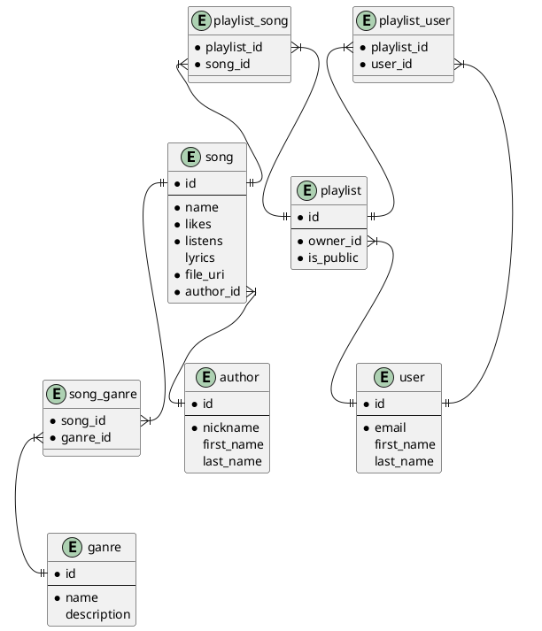

# Лабораторна робота №1

- [Лабораторна робота №1](#лабораторна-робота-1)
  - [Тема](#тема)
  - [Мета](#мета)
  - [Предметна область](#предметна-область)
  - [Хід роботи](#хід-роботи)
    - [Приклади застосування](#приклади-застосування)
    - [Особливості](#особливості)
    - [Базові сутності](#базові-сутності)

## Тема

Аналіз предметної області

## Мета

Навчитися збирати та аналізувати дані, визначати корисні дані
(інформацію) для інфологічного проектування.

## Предметна область

Плейлисти

## Хід роботи

База данних створюється для застосунду, де можна слухати музику. Самі файли музики будуть зберігатися окремо, тому просто будемо використовувати uri. Застосунок 

### Приклади застосування

1. Прослуховувати популярну музику
2. Ділитися музикою
3. Створювати аккаунт
4. Прослуховувати та зберігати плейлисти
5. Створювати свої плейлисти та додавати до них музику
6. Ділитися своїми плейлистами

### Особливості

1. Кожна пісня має свій текст, кількість вподобайок, кількість прослуховувань, посилання на зовнішній файл самої пісні
2. Пісня може бути без тексту
3. Аккаунт користувача буде мати збережені користувачем плейлисти
4. Користувач може створити свій плейлист приватним або публічним
5. Прослухані користувачем пісні будуть автоматично додаватися до плейлиста недавні
6. Плейлист може мати одного автора

### Базові сутності

