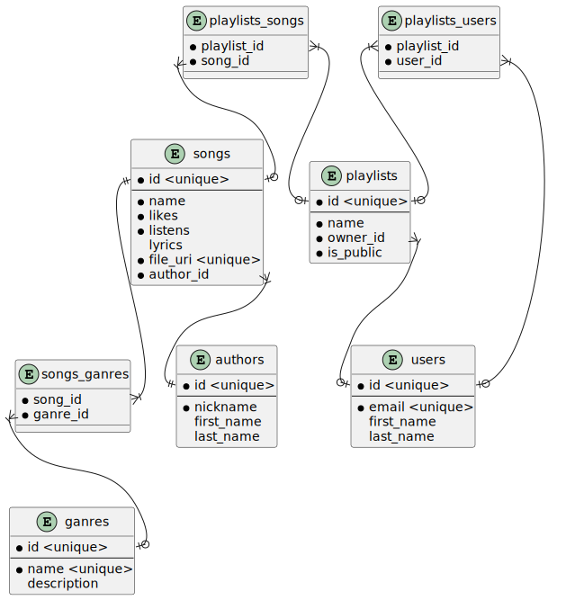

# Лабораторна робота №1

- [Лабораторна робота №1](#лабораторна-робота-1)
  - [Тема](#тема)
  - [Мета](#мета)
  - [Предметна область](#предметна-область)
  - [Хід роботи](#хід-роботи)
    - [Приклади застосування](#приклади-застосування)
    - [Особливості](#особливості)
    - [Базові сутності](#базові-сутності)
      - [Жанри](#жанри)
      - [Автори](#автори)
      - [Користувачі](#користувачі)
      - [Пісні](#пісні)
      - [Плейлисти](#плейлисти)
    - [Зв'язки та допоміжні сутності](#звязки-та-допоміжні-сутності)
      - [Жанри до піснень](#жанри-до-піснень)
      - [Автори до піснень](#автори-до-піснень)
      - [Плейлисти до користувача](#плейлисти-до-користувача)
      - [Плейлисти до пісень](#плейлисти-до-пісень)
      - [Плейлисти до користувачів](#плейлисти-до-користувачів)
    - [Загальна таблиця сутностей](#загальна-таблиця-сутностей)
    - [Таблиці атрибутів](#таблиці-атрибутів)
      - [songs](#songs)
      - [authors](#authors)
      - [ganres](#ganres)
      - [users](#users)
      - [playlists](#playlists)
      - [songs_ganres](#songs_ganres)
      - [playlists_songs](#playlists_songs)
      - [playlists_users](#playlists_users)
    - [Сутності та атрибути](#сутності-та-атрибути)

## Тема

Аналіз предметної області

## Мета

Навчитися збирати та аналізувати дані, визначати корисні дані
(інформацію) для інфологічного проектування.

## Предметна область

Плейлисти

## Хід роботи

База данних створюється для застосунду, де можна слухати музику. Самі файли музики будуть зберігатися окремо, тому просто будемо використовувати uri. Застосунок буде мати у собі багато виконавців та пісень, які користувачі будуть слухати та додавати до плейлистів. Плейлистами можна буде ділитися або робити приватними щоб слухаит самому. Кожна пісня буде певного жанру або кількох жанрів, можна буде переглядати пісні за жанрими.

### Приклади застосування

1. Прослуховувати популярну музику
2. Ділитися музикою
3. Створювати аккаунт
4. Прослуховувати та зберігати плейлисти
5. Створювати свої плейлисти та додавати до них музику
6. Ділитися своїми плейлистами
7. Переглядати музику певного автора
8. Переглядати музику за жанрами
9. Дивитися жанри авторів
10. Дивитися жанри плейлистів

### Особливості

1. Кожна пісня має свого одного єдиного автора
2. Пісня може бути без тексту
3. Аккаунт користувача буде мати збережені користувачем плейлисти
4. Користувач може створити свій плейлист приватним або публічним
5. Жанрів в пісні може бути кілька
6. Плейлист може мати одного автора

### Базові сутності

#### Жанри

> Позначальна сутність

Використовується для позначення жанру пісень та може існувати без них.

Атрибути:

- Унікальний id
- Унікальна назва жанту(rock, pop, classical...)
- Коротка характеристика жанру

#### Автори

> Стержнева сутність

В нашій базі данних будуть вшиті автори пісень та їх пісні, в кожної пісні буде автор.

Атрибути:

- Унікальний id
- Псевдонім автора, яким він підписує пісні
- Можливо ім'я та фамілія, якщо автор їх оприлюднив

#### Користувачі

> Стержнева сутність

Це створений користувачем аккаунт, в якому він буде зберігати плейлисти та створювати свої плейлисти.

Атрибути:

- Унікальний id
- Унікальний Email
- Можливо ім'я та фамілія, якщо користувач їх вказав

#### Пісні

> Слабка стержнева сутність

Кожна пісня належить певному автору, тому вона зв'язана з ним за допомогою публічного ключа. Кожну пісню можуть також додати до плейлистів.

Атрибути:

- Унікальний id
- Назва
- Кількість прослуховувань
- Кількість вподобайок
- Можливо слова пісні, якщо вони існують
- URI до файлу у якому зберігається пісня
- Допоміжний атрибут author_id для реалізації зв'язку

#### Плейлисти

> Слабка стиржнева сутність

Кожна пісня може бути у плейлисті які створив користувач. Плейлист це просто невелика збірка пісень. Плейлист може бути публічним або приватним. Оскільки кожна пісня може бути у кілької плейлистах та у плейлисті може бути багато пісень, тут є відношення багато до багатьох. Плейлист буде мати володаря(користувач який його створив), тому буде відношення один до багатьох. Також плейлисти можуть бути збережені користувачами.

Атрибути:

- Унікальний id
- Певна назва плейлисту
- Модифікатор приватності
- Допоміжний публічний ключ для реалізації зв'язку з володарем

### Зв'язки та допоміжні сутності

#### Жанри до піснень

> Багато до багатьох

В кожної пісні може бути кілька жанрів та до кожного жанру може належати багато пісень. Реалізуємо за допомогою асоціативної сутності `song_ganre`. Вона буде мати унікальні пари публічних ключів до пісень та жанрів. Пісні і жанри будуть поєднані з цією сутністю зв'язками один до багатьох.

#### Автори до піснень

> Один до багатьох

Оскільки в кожної пісні тільки один автор, а в одного автора багато пісень. Реалізуємо за допомогою допоміжного атрибута author_id в пісні.

#### Плейлисти до користувача

> Один до багатьох

Користувач може створити плейлист та в плейлиста може бути тільки один володар(не кажу автор щоб не плутати). В кожного плейлиста один володар але в користувача може бути кільки створені ним плейлисти.

#### Плейлисти до пісень

> Багато до багатьох

Пісня може належати багатьом плейлистам та в плейлистах багато пісень. Реалізуємо відношення за допомогою асоціативної сутності `playlist_song`, до якої будуть зв'язки один до багатьох

#### Плейлисти до користувачів

> Багато до багатьох

В кожного користувача може бути збережено багато плейлистів та в кожен плейлист може бути збережен у багатьох користувачів якщо він публічний. Релізуємо відношення за допомогою асоціативної сутності playlist_user.

### Загальна таблиця сутностей

| Назва сутності          | Тип              |
| ----------------------- | ---------------- |
| Пісні                   | Слабка стержнева |
| Плейлисти               | Слабка стержнева |
| Автори                  | Стержнева        |
| Користувачі             | Стержнева        |
| Жанри                   | Позначаюча       |
| ЖанриДоПісень           | Асоціативна      |
| ПісніДоПлейлистів       | Асоціативна      |
| ПлейлистиДоКористувачів | Асоціативна      |

### Таблиці атрибутів

#### songs

| Атрибут   | Тип           |
| --------- | ------------- |
| id        | Ідентифікатор |
| name      | Вказівний     |
| likes     | Описовий      |
| listens   | Описовий      |
| lyrics    | Описовий      |
| file_uri  | Допоміжний    |
| author_id | Допоміжний    |

#### authors

| Атрибут    | Тип           |
| ---------- | ------------- |
| id         | Ідентифікатор |
| nickname   | Вказівний     |
| first_name | Вказівний     |
| last_name  | Вказівний     |

#### ganres

| Атрибут     | Тип           |
| ----------- | ------------- |
| id          | Ідентифікатор |
| name        | Вказівний     |
| description | Описовий      |

#### users

| Атрибут    | Тип           |
| ---------- | ------------- |
| id         | Ідентифікатор |
| email      | Вказівний     |
| first_name | Вказівний     |
| last_name  | Вказівний     |

#### playlists

| Атрибут   | Тип           |
| --------- | ------------- |
| id        | Ідентифікатор |
| name      | Вказівний     |
| is_public | Описовий      |
| owner_id  | Допоміжний    |

#### songs_ganres

| Атрибут  | Тип        |
| -------- | ---------- |
| song_id  | Допоміжний |
| ganre_id | Допоміжний |

#### playlists_songs

| Атрибут     | Тип        |
| ----------- | ---------- |
| song_id     | Допоміжний |
| playlist_id | Допоміжний |

#### playlists_users

| Атрибут     | Тип        |
| ----------- | ---------- |
| user_id     | Допоміжний |
| playlist_id | Допоміжний |

### Сутності та атрибути

| Сутність        | Атрибути                                              |
| --------------- | ----------------------------------------------------- |
| songs           | id, name, lieks, listens, lyrics, file_uri, author_id |
| authors         | id, nickname, first_name, last_name                   |
| ganres          | id, name, description                                 |
| users           | id, email, first_name, last_name                      |
| playlists       | id, name, owner_id, is_public                         |
| songs_ganres    | song_id, ganre_id                                     |
| playlists_songs | playlist_id, song_id                                  |
| playlists_users | playlist_id, user_id                                  |
