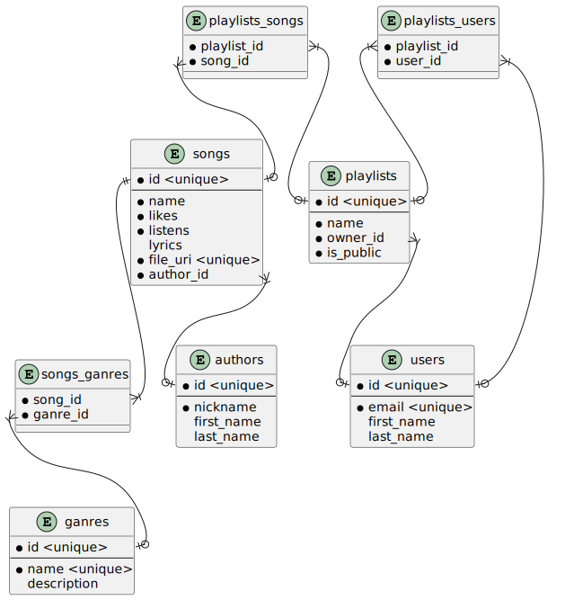

# Лабораторна робота 2

- [Лабораторна робота 2](#лабораторна-робота-2)
  - [Тема](#тема)
  - [Мета](#мета)
  - [Виконання](#виконання)
    - [Класифікація сутностей](#класифікація-сутностей)
    - [Таблиці атрибутів](#таблиці-атрибутів)
      - [songs](#songs)
      - [authors](#authors)
      - [ganres](#ganres)
      - [users](#users)
      - [playlists](#playlists)
      - [songs_ganres](#songs_ganres)
      - [playlists_songs](#playlists_songs)
      - [playlists_users](#playlists_users)
    - [Діаграма](#діаграма)
      - [Позначення](#позначення)
  - [Висновок](#висновок)

## Тема

Інфологічна модель бази даних.

## Мета

Обрати зручну нотацію та навчитися будувати інфологічну модель
даних, використовуючи обрану нотацію.

## Виконання

Була обрана нотація Мартіна, оскіль

### Класифікація сутностей

| Назва сутності          | Тип              |
| ----------------------- | ---------------- |
| Пісні                   | Слабка стержнева |
| Плейлисти               | Слабка стержнева |
| Автори                  | Стержнева        |
| Користувачі             | Стержнева        |
| Жанри                   | Позначаюча       |
| ЖанриДоПісень           | Асоціативна      |
| ПісніДоПлейлистів       | Асоціативна      |
| ПлейлистиДоКористувачів | Асоціативна      |

### Таблиці атрибутів

#### songs

| Атрибут   | Тип           |
| --------- | ------------- |
| id        | Ідентифікатор |
| name      | Вказівний     |
| likes     | Описовий      |
| listens   | Описовий      |
| lyrics    | Описовий      |
| file_uri  | Допоміжний    |
| author_id | Допоміжний    |

#### authors

| Атрибут    | Тип           |
| ---------- | ------------- |
| id         | Ідентифікатор |
| nickname   | Вказівний     |
| first_name | Вказівний     |
| last_name  | Вказівний     |

#### ganres

| Атрибут     | Тип           |
| ----------- | ------------- |
| id          | Ідентифікатор |
| name        | Вказівний     |
| description | Описовий      |

#### users

| Атрибут    | Тип           |
| ---------- | ------------- |
| id         | Ідентифікатор |
| email      | Вказівний     |
| first_name | Вказівний     |
| last_name  | Вказівний     |

#### playlists

| Атрибут   | Тип           |
| --------- | ------------- |
| id        | Ідентифікатор |
| name      | Вказівний     |
| is_public | Описовий      |
| owner_id  | Допоміжний    |

#### songs_ganres

| Атрибут  | Тип        |
| -------- | ---------- |
| song_id  | Допоміжний |
| ganre_id | Допоміжний |

#### playlists_songs

| Атрибут     | Тип        |
| ----------- | ---------- |
| song_id     | Допоміжний |
| playlist_id | Допоміжний |

#### playlists_users

| Атрибут     | Тип        |
| ----------- | ---------- |
| user_id     | Допоміжний |
| playlist_id | Допоміжний |

### Діаграма

#### Позначення

Чорна точка біля деяких атрибутів позначає що цей атрибут повинен бути заданий(not null)  
Атрибути що знаходяться над полоскою - primary key  
В асоціативних сутностях немає id, бо я не бачу ситуації коли він буде потрібен. Ці сутності будуть використовуватися тільки для `SELECT * FROM song_ganres WHERE song_id = blablabla`  
В деяких атрибутах є `<unique>` що буквально значить унікальні атрибути  
В асоціативних сутностях хотілося б зробити унікальними пари атрибутів(поодному можуть повторюватися, але обидва - ні) але я не знаю як це позначити

## Висновок

На цій лабораторній роботі я виправив невеликі помилки проектування зв'язків та побудував ER діаграму, за якою буде зручно потім робити таблиці в базі данних. Також я додатково почитав документацію plantuml для побудови цієї діаграми
