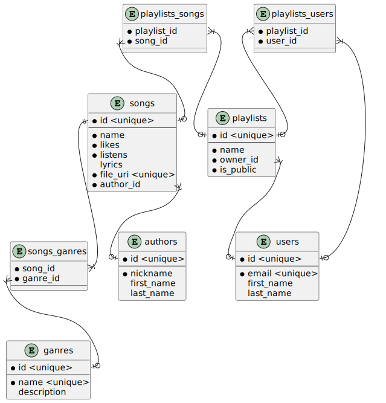

# Лабораторна робота 3

- [Лабораторна робота 3](#лабораторна-робота-3)
  - [Тема](#тема)
  - [Мета](#мета)
  - [Виконання](#виконання)
    - [Результати аналізу з минулих лабораторних робіт](#результати-аналізу-з-минулих-лабораторних-робіт)
      - [Класифікація сутностей](#класифікація-сутностей)
      - [Таблиці атрибутів](#таблиці-атрибутів)
        - [songs](#songs)
        - [authors](#authors)
        - [ganres](#ganres)
        - [users](#users)
        - [playlists](#playlists)
        - [songs_ganres](#songs_ganres)
        - [playlists_songs](#playlists_songs)
        - [playlists_users](#playlists_users)
      - [Зв'язки](#звязки)
    - [Аналіз даталогічної моделі](#аналіз-даталогічної-моделі)
      - [1НФ](#1нф)
      - [2НФ](#2нф)
      - [3НФ](#3нф)
    - [Даталогічна модель](#даталогічна-модель)
      - [Позначення](#позначення)

## Тема

Даталогічна модель бази даних.

## Мета

Навчитися будувати даталогічну модель по існуючій інфологічній
моделі предметної області. Освоїти і застосувати на практиці процес нормалізації
бази даних на основі даталогічної моделі.

## Виконання

### Результати аналізу з минулих лабораторних робіт

#### Класифікація сутностей

| Назва сутності          | Тип              |
| ----------------------- | ---------------- |
| Пісні                   | Слабка стержнева |
| Плейлисти               | Слабка стержнева |
| Автори                  | Стержнева        |
| Користувачі             | Стержнева        |
| Жанри                   | Позначаюча       |
| ЖанриДоПісень           | Асоціативна      |
| ПісніДоПлейлистів       | Асоціативна      |
| ПлейлистиДоКористувачів | Асоціативна      |

#### Таблиці атрибутів

##### songs

| Атрибут   | Тип           |
| --------- | ------------- |
| id        | Ідентифікатор |
| name      | Вказівний     |
| likes     | Описовий      |
| listens   | Описовий      |
| lyrics    | Описовий      |
| file_uri  | Допоміжний    |
| author_id | Допоміжний    |

##### authors

| Атрибут    | Тип           |
| ---------- | ------------- |
| id         | Ідентифікатор |
| nickname   | Вказівний     |
| first_name | Вказівний     |
| last_name  | Вказівний     |

##### ganres

| Атрибут     | Тип           |
| ----------- | ------------- |
| id          | Ідентифікатор |
| name        | Вказівний     |
| description | Описовий      |

##### users

| Атрибут    | Тип           |
| ---------- | ------------- |
| id         | Ідентифікатор |
| email      | Вказівний     |
| first_name | Вказівний     |
| last_name  | Вказівний     |

##### playlists

| Атрибут   | Тип           |
| --------- | ------------- |
| id        | Ідентифікатор |
| name      | Вказівний     |
| is_public | Описовий      |
| owner_id  | Допоміжний    |

##### songs_ganres

| Атрибут  | Тип        |
| -------- | ---------- |
| song_id  | Допоміжний |
| ganre_id | Допоміжний |

##### playlists_songs

| Атрибут     | Тип        |
| ----------- | ---------- |
| song_id     | Допоміжний |
| playlist_id | Допоміжний |

##### playlists_users

| Атрибут     | Тип        |
| ----------- | ---------- |
| user_id     | Допоміжний |
| playlist_id | Допоміжний |

#### Зв'язки

| Зв'язок                   | Сутності з атрибутами                    |
| ------------------------- | ---------------------------------------- |
| Songs and Ganres          | ganres::id, songs_ganres, songs::id      |
| Authors and Songs         | authors::id, songs::author_id            |
| Playlists and their owner | playlists::owner_id, users::id           |
| Playlists and songs       | playlist::id, playlists_songs, songs::id |
| Playlists and users       | playlist::id, playlists_users, users::id |

### Аналіз даталогічної моделі

З попередньої роботи бередо інфологічну модель, яку в цьому випадку можна вважати даталогічною. Проаналізуємо на нормальні форми.

#### 1НФ

У всіх сутностей в кожного атрибута може бути тільки одне значення. Немає помилки типу атрибута жанри в сутності пісні, вони бути винесені в окрему сутність щоб в атрибути не було кілька значень. Можливі помилки з Прізвище Ім'я По-батькові не бути допущені, натомість це окремі атрибути.  
Можна вважати, що першу нормальну форму в даталогічній моделі не порушено

#### 2НФ

Порушення другої нормальної форми бути не може, оскільки в кожній стержневій сутності ключ - унікальний ідентифікатор, а в асоціативних сутностях тільки допоміжні атрибути.

#### 3НФ

Порушень третьої нормальної форми немає, бо між неключовими елементами немає тразнитивних залежностей.

### Даталогічна модель

Повністю нормалізовану даталогічну модель представлено на наступному малюнку

#### Позначення

- Те, що знаходиться над лінією в середині сутності - публічний ключ
- Атрибути з чорною крапочкою завжди повинні бути задані
- Атрибути помічені як `<unique>` мають бути унікальними
