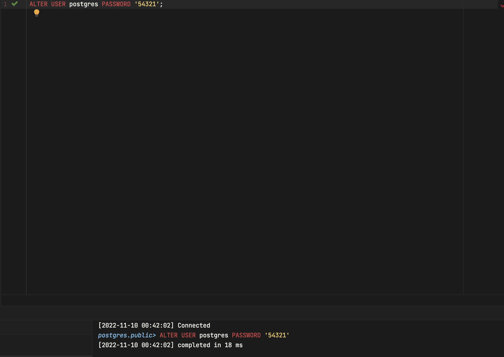

# Лабораторна робота 4

- [Лабораторна робота 4](#лабораторна-робота-4)
  - [Тема](#тема)
  - [Мета](#мета)
  - [Виконання](#виконання)
    - [Обираємо контейнер](#обираємо-контейнер)
    - [Створюємо файл з налагодженнями](#створюємо-файл-з-налагодженнями)
    - [Заходимо в репозиторій](#заходимо-в-репозиторій)
    - [Забираємо імедж](#забираємо-імедж)
    - [Запускаємо контейнер](#запускаємо-контейнер)
    - [Що там є](#що-там-є)
      - [Змінні оточення](#змінні-оточення)
      - [Oracle_Home](#oracle_home)
      - [Scripts](#scripts)
  - [Висновок](#висновок)

## Тема

Розгортання реляційної СУБД Oracle Database Server 11g XE.

## Мета

Встановити та дослідити реляційну систему управління даними
Oracle Database Server 11g XE.

## Виконання

Оскільки в мене операційна система не з сімейства Windows, встановити вказану базу данних я неможу, тому я використаю середовище Docker та налагоджу базу данних там.

### Обираємо контейнер

Заходимо на [сайт з контейнерами оракла](https://container-registry.oracle.com/ords/f?p=113:10::::::) та обираємо Database.

Звідти обираємо Oracle Database Standart Edition 2, створюємо аккаунт, заходимо та читаємо умови використання. Беремо назву контейнеру

### Створюємо файл з налагодженнями

Задаємо назву бази данних, пароль до користувача та домейн компанії, я використав свій.

### Заходимо в репозиторій

Для того щоб отримати цей імедж, заходимо в наш репозиторії за допомогою акаунта який ми створювали

### Забираємо імедж

Використовуємо `docker pull` та беремо обраний раніше імедж

### Запускаємо контейнер

Вказуємо енвайромент файл який ми задали раніше та нагалоджуємо порти для порти з ораклом, вказуємо щоб запустити в режімі без терміналу, вказуємо ім'є контейнеру та задаємо що він буде використовувати 8 ГБ пам'яті(в мене нема оперативної) та вказуємо який саме імедж запустити

На цьому єтапі в нас повністю працює віртуальна машина з лінуксом та ораклом, під'єднаємось туди

### Що там є

Під'єднуємось туди за допомогою sh

#### Змінні оточення

Переглянемо змінні оточення за домопогою команди `env`

Можна побачити змінні які ми задали в файлі раніше та ще цілька змінних вже від оракла

#### Oracle_Home

переглянемо що знаходиться в Oracle_home

#### Scripts

Переглянемо скріпти для керування ораклом

## Висновок

На цій лабораторній роботі я познайомився із базою данних оракл. Я її встановив як контейнер в Докері та переглянув приблизну файлову структуру бази данних. Тепер я зможу легко запускати та керувати нею та в разі непотрібності, повністю її видалити без змін на моїй операційній системі
