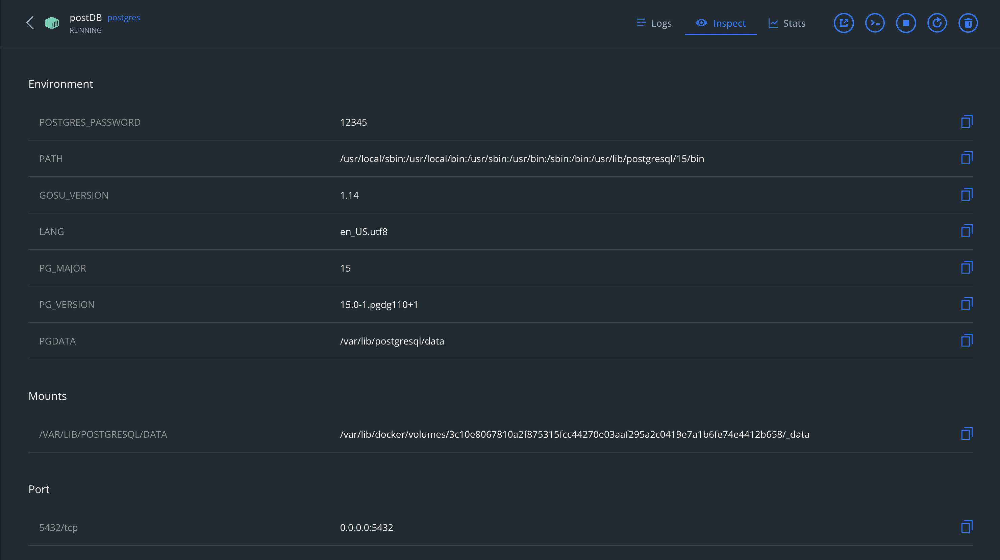
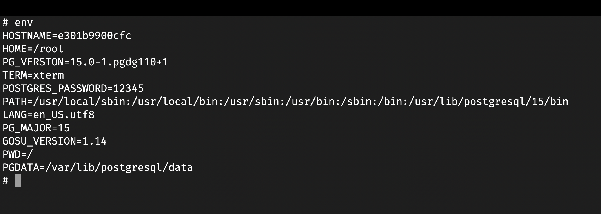
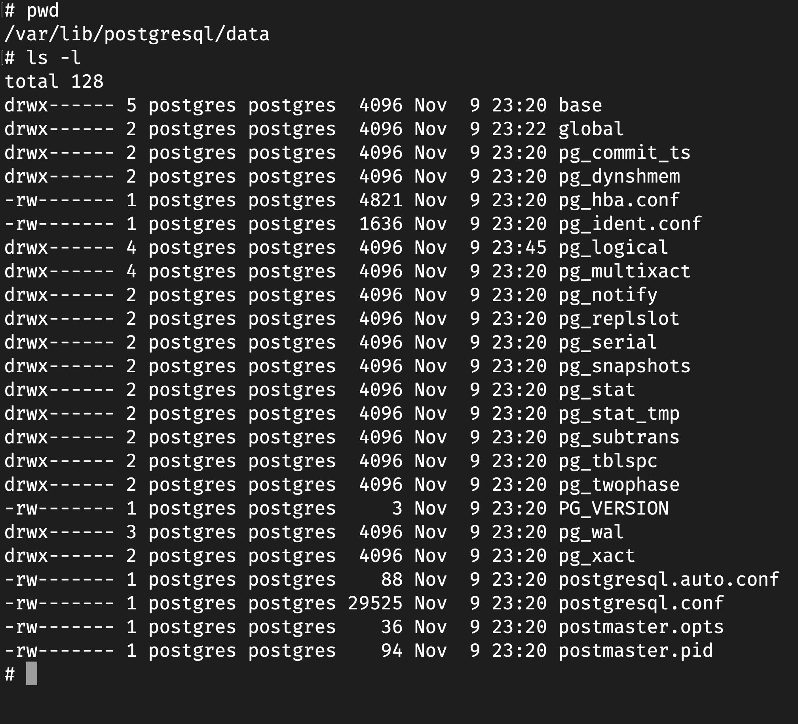

# Лабораторна робота 4

- [Лабораторна робота 4](#лабораторна-робота-4)
  - [Тема](#тема)
  - [Мета](#мета)
  - [Виконання](#виконання)
    - [Встановлення](#встановлення)
    - [Змінні оточення](#змінні-оточення)
    - [Процесси](#процесси)
    - [Файлова система](#файлова-система)
    - [Зміна пароля](#зміна-пароля)
    - [Режими вимкнення](#режими-вимкнення)
    - [Логування](#логування)
    - [Параметри БД](#параметри-бд)
  - [Висновок](#висновок)

## Тема

Розгортання реляційної СУБД Oracle Database Server 11g XE.

## Мета

Встановити та дослідити реляційну систему управління даними
Oracle Database Server 11g XE.

## Виконання

В мене новий MacBook з процессором M1, я всюди шукав, але прийшов до висновку, що Oracle Database на цій архітектурі процесора не працює та поставити я її не зможу. Тому я обрав іншу реліційну СУБД під назвою Postgres.

### Встановлення

Для того щоб не засоряти мій комп'ютер різними файлами та змінними загалом, я буду викорисовувати Docker для контейнеризації бази данних. Використаємо офіційний імедж postgres:latest. Повна команда для запуску виглядає так `docker run -d -p 5432:5432 -it --name postDB postgres:latest`

Як бачимо контейнер працює

### Змінні оточення

Під'єднуємося до контейнера за допомогою `docker exec -it 7c7dec7ff042923002d1bebeb206ee7273b1e1736086c7043e26c032247cbf7f /bin/sh` де оцей страшний код це ідентифікатор контейнера.
Переглядаємо змінні оточення за допомогою команди `env`

Бачимо змінні оточення та серед них є змінні бази данних

### Процесси

Після кучі болі та страждань на пустому лінуксі я поставив команду top та ось що в мене є

### Файлова система

За допомогою запиту `show data_directory` знаходимо де саме зберігаються данні та переходимо туди.  
Ось що тут можна побачити

### Зміна пароля

Подивитися пароль в змінній оточення та за допомогою нього під'єднатись до постгреса, далі можна виконати квірі

Відразу після цього я втратив підлючення та потрібно було використовувати новий пароль

### Режими вимкнення

Для вимкнення бази данних в різних режимах використовують сигнали операційної системи. SIGTERM - забороняє нові підключення але дає вже існуючим допрацювати, SIGINT - забороняє нові піключення та надсилає SIGTERM вже інуючим, SIGQUIT - программа надсилає SIGQUIT усім своїм процесам та протягом 5 секунд якщо хтося залишився - SIGKILL.

### Логування

Логи відризу перенаправляються до докера та їх можна там переглянути, ось результат вимкнення та увіменення БД

### Параметри БД

Параметри бази данних можна отримати за допомогою запиту  `select * from pg_settings;`, тоді ми отримаємо дуже багато вього:

## Висновок

На цій лабораторній роботі я познайомився з реляційною базою данних Postgres. За допомогою докера вона була поставлена та досліджена. Вдалося встановити підключення, базові запити, перегляд логів та її адміністрування
