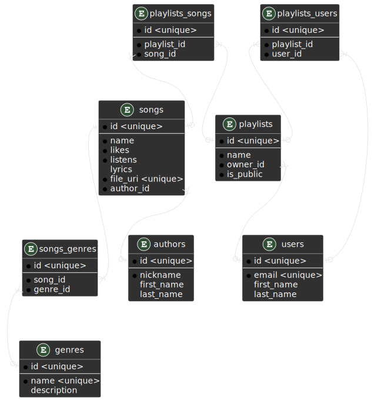
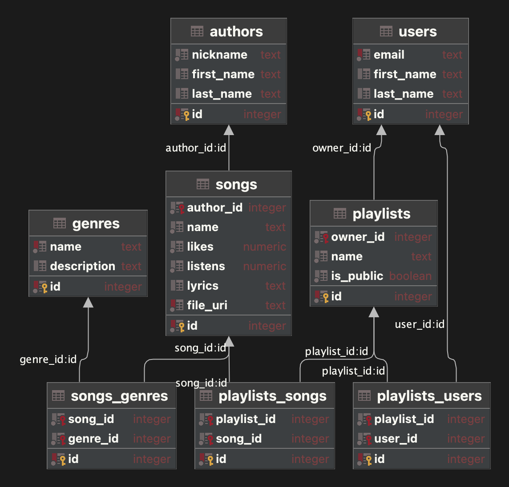

# Лабораторна робота 5

- [Лабораторна робота 5](#лабораторна-робота-5)
  - [Даталогічна модель з лабораторної № 3](#даталогічна-модель-з-лабораторної--3)
  - [Таблиці з атрибутами та обмеженнями цілісності](#таблиці-з-атрибутами-та-обмеженнями-цілісності)
    - [genres](#genres)
    - [songs](#songs)
    - [authors](#authors)
    - [playlists](#playlists)
    - [users](#users)
    - [songs\_genres](#songs_genres)
    - [playlists\_users](#playlists_users)
    - [playlists\_songs](#playlists_songs)
  - [Скрипти](#скрипти)
    - [Створення таблиць, primary key, foreign key](#створення-таблиць-primary-key-foreign-key)
      - [genres](#genres-1)
      - [authors](#authors-1)
      - [songs](#songs-1)
      - [users](#users-1)
      - [playlists](#playlists-1)
      - [songs\_genres](#songs_genres-1)
      - [playlists\_users](#playlists_users-1)
      - [playlists\_songs](#playlists_songs-1)
    - [Створення sequences](#створення-sequences)
      - [authors\_id\_seq](#authors_id_seq)
      - [genres\_id\_seq](#genres_id_seq)
      - [playlists\_id\_seq](#playlists_id_seq)
      - [users\_id\_seq](#users_id_seq)
      - [songs\_id\_seq](#songs_id_seq)
      - [songs\_genres\_id\_seq](#songs_genres_id_seq)
      - [playlists\_users\_id\_seq](#playlists_users_id_seq)
      - [playlists\_songs\_id\_seq](#playlists_songs_id_seq)
    - [Тригери](#тригери)
      - [genres\_id\_tri](#genres_id_tri)
      - [songs\_id\_tri](#songs_id_tri)
  - [Фізична модель](#фізична-модель)
  - [Висновок](#висновок)

## Даталогічна модель з лабораторної № 3



## Таблиці з атрибутами та обмеженнями цілісності

### genres

| Name        | Details                               |
| ----------- | ------------------------------------- |
| id          | serial; primary key; unique; not null |
| name        | text; unique; not null                |
| description | text;                                 |

### songs

| Name      | Details                               |
| --------- | ------------------------------------- |
| id        | serial; primary key; unique; not null |
| author_id | serial; foreign key; not null         |
| name      | text; not null                        |
| likes     | numeric; not null                     |
| listens   | numeric; not null                     |
| lyrics    | text                                  |
| file_uri  | text; not null; unique                |

### authors

| Name       | Details                               |
| ---------- | ------------------------------------- |
| id         | serial; primary key; unique; not null |
| nickname   | text; not null                        |
| first_name | text                                  |
| last_name  | text                                  |

### playlists

| Name      | Details                               |
| --------- | ------------------------------------- |
| id        | serial; primary key; unique; not null |
| owner_id  | serial; foreign key; not null         |
| name      | text; not null                        |
| is_public | boolean; not null                     |

### users

| Name       | Details                               |
| ---------- | ------------------------------------- |
| id         | serial; primary key; unique; not null |
| email      | text; unique; not null                |
| first_name | text                                  |
| last_name  | text                                  |

### songs_genres

| Name     | Details                               |
| -------- | ------------------------------------- |
| id       | serial; primary key; unique; not null |
| song_id  | serial; foreign key; not null         |
| genre_id | serial; foreign key; not null         |

### playlists_users

| Name        | Details                               |
| ----------- | ------------------------------------- |
| id          | serial; primary key; unique; not null |
| playlist_id | serial; foreign key; not null         |
| user_id     | serial; foreign key; not null         |

### playlists_songs

| Name        | Details                               |
| ----------- | ------------------------------------- |
| id          | serial; primary key; unique; not null |
| playlist_id | serial; foreign key; not null         |
| song_id     | serial; foreign key; not null         |

## Скрипти

### Створення таблиць, primary key, foreign key

#### genres

```
create table genres
(
    id          serial not null unique primary key,
    name        text   not null unique,
    description text
)
```

#### authors

```
create table authors
(
    id         serial not null unique primary key,
    nickname   text   not null,
    first_name text,
    last_name  text
)
```

#### songs

```
create table songs
(
    id        serial  not null unique primary key,
    author_id serial  not null references authors (id),
    name      text    not null,
    likes     numeric not null,
    listens   numeric not null,
    lyrics    text,
    file_uri  text    not null unique
)
```

#### users

```
create table users
(
    id         serial primary key unique not null,
    email      text unique               not null,
    first_name text,
    last_name  text
)
```

#### playlists

```
create table playlists
(
    id        serial primary key unique not null,
    owner_id  serial                    not null references users (id),
    name      text                      not null,
    is_public boolean                   not null
)
```

#### songs_genres

```
create table songs_genres
(
    id       serial primary key not null unique,
    song_id  serial             not null references songs (id),
    genre_id serial             not null references genres (id)
)
```

#### playlists_users

```
create table playlists_users
(
    id          serial primary key not null unique,
    playlist_id serial             not null references playlists (id),
    user_id     serial             not null references users (id)
)
```

#### playlists_songs

```
create table playlists_songs
(
    id          serial primary key not null unique,
    playlist_id serial             not null references playlists (id),
    song_id     serial             not null references songs (id)
);
```

### Створення sequences

#### authors_id_seq

```
create sequence authors_id_seq
    as integer;

alter sequence authors_id_seq owner to postgres;

alter sequence authors_id_seq owned by authors.id;
```

#### genres_id_seq

```
create sequence genres_id_seq
    as integer;

alter sequence genres_id_seq owner to postgres;

alter sequence genres_id_seq owned by genres.id;
```

#### playlists_id_seq

```
create sequence playlists_id_seq
    as integer;

alter sequence playlists_id_seq owner to postgres;

alter sequence playlists_id_seq owned by playlists.id;
```

#### users_id_seq

```
create sequence users_id_seq
    as integer;

alter sequence users_id_seq owner to postgres;

alter sequence users_id_seq owned by users.id;
```

#### songs_id_seq

```
create sequence songs_id_seq
    as integer;

alter sequence songs_id_seq owner to postgres;

alter sequence songs_id_seq owned by songs.id;
```

#### songs_genres_id_seq

```
create sequence songs_genres_id_seq
    as integer;

alter sequence songs_genres_id_seq owner to postgres;

alter sequence songs_genres_id_seq owned by songs_genres.id;
```

#### playlists_users_id_seq

```
create sequence playlists_users_id_seq
    as integer;

alter sequence playlists_users_id_seq owner to postgres;

alter sequence playlists_users_id_seq owned by playlists_users.id;
```

#### playlists_songs_id_seq

```
create sequence playlists_songs_id_seq
    as integer;

alter sequence playlists_songs_id_seq owner to postgres;

alter sequence playlists_songs_id_seq owned by playlists_songs.id;
```

### Тригери

#### genres_id_tri

```
create function add_genres_id()
    RETURNS "trigger" AS
     $BODY$
     BEGIN
       New.id:=nextval('genres_id_seq');
       Return NEW;
     END;
     $BODY$
     LANGUAGE 'plpgsql' VOLATILE
```

```
create trigger genres_id_tri
    before insert
    on genres
    for each row
    execute procedure add_genres_id()
```

#### songs_id_tri

```
create function add_songs_id()
    RETURNS "trigger" AS
     $BODY$
     BEGIN
       New.id:=nextval('songs_id_seq');
       Return NEW;
     END;
     $BODY$
     LANGUAGE 'plpgsql' VOLATILE
```

```
create trigger songs_id_tri
    before insert
    on songs
    for each row
    execute procedure add_songs_id()
```

## Фізична модель



## Висновок

На цій лабораторній роботі я нарешті дістався до написання скриптів. Та створив давно задуману мною модель
