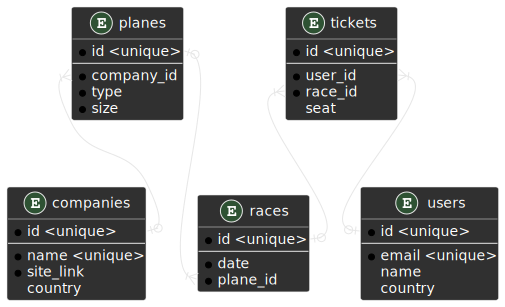

# Захист лабораторної роботи №5

- [Захист лабораторної роботи №5](#захист-лабораторної-роботи-5)
  - [Автор](#автор)
  - [Коментар](#коментар)
  - [Предметна область](#предметна-область)
  - [Даталогічна модель](#даталогічна-модель)
  - [Скрипти](#скрипти)
    - [users](#users)
      - [create table](#create-table)
      - [create sequence](#create-sequence)
      - [insert and select example](#insert-and-select-example)
    - [companies](#companies)
      - [create table](#create-table-1)
      - [create sequence](#create-sequence-1)
    - [planes](#planes)
      - [create table](#create-table-2)
      - [create sequence](#create-sequence-2)
    - [reces](#reces)
      - [create table](#create-table-3)
      - [create sequence](#create-sequence-3)
    - [tickets](#tickets)
      - [create table](#create-table-4)
      - [create sequence](#create-sequence-4)
      - [function](#function)
      - [trigger](#trigger)

## Автор

Молчанов Михайло Валерійович, ІА-12

## Коментар

Для прикладу додав себе, щоб показати, що це я робив.  
Та в постгресі id автоматично генеруються, тому я не робив тригери для всіх ідентифікаторів, вони нічого не дають та тільки сповільнюють роботу, але для прикладу я додав один

## Предметна область

Аеропорти

## Даталогічна модель



## Скрипти

### users

#### create table

```
create table lab5.users
(
    id      serial unique not null,
    email   text unique   not null,
    name    text,
    country text
)
```

#### create sequence

```
create sequence users_id_seq
    as integer;

alter sequence users_id_seq owner to postgres;

alter sequence users_id_seq owned by users.id;
```

#### insert and select example

```
insert into lab5.users (email, name, country) values ('michael.molchanov.2004@gmail.com', 'IA-12 Molchanov Mike', 'Ukraine');
```

```
select * from lab5.users
```

CSV data in table: `1,michael.molchanov.2004@gmail.com,IA-12 Molchanov Mike,Ukraine`

### companies

#### create table

```
create table lab5.companies
(
    id        serial unique not null,
    name      text unique   not null,
    site_link text          not null,
    country   text
)
```

#### create sequence

```
create sequence companies_id_seq
    as integer;

alter sequence companies_id_seq owner to postgres;

alter sequence companies_id_seq owned by companies.id;
```

### planes

#### create table

```
create table lab5.planes
(
    id         serial unique not null,
    company_id serial        not null references lab5.companies (id),
    type       text          not null,
    size       numeric       not null
)
```

#### create sequence

```
create sequence planes_id_seq
    as integer;

alter sequence planes_id_seq owner to postgres;

alter sequence planes_id_seq owned by planes.id;
```

### reces

#### create table

```
create table lab5.races
(
    id       serial unique not null,
    plane_id serial        not null references lab5.planes (id),
    date     date          not null
)
```

#### create sequence

```
create sequence races_id_seq
    as integer;

alter sequence races_id_seq owner to postgres;

alter sequence races_id_seq owned by races.id;
```

### tickets

#### create table

```
create table lab5.tickets
(
    id      serial unique not null,
    user_id serial unique references lab5.tickets (id),
    race_id serial unique references lab5.races (id),
    seat    numeric
)
```

#### create sequence

```
create sequence tickets_id_seq
    as integer;

alter sequence tickets_id_seq owner to postgres;

alter sequence tickets_id_seq owned by tickets.id;
```

#### function

```
create function lab5.add_tickets_id()
    RETURNS "trigger" AS
     $BODY$
     BEGIN
       New.id:=nextval('lab5.tickets_id_seq');
       Return NEW;
     END;
     $BODY$
     LANGUAGE 'plpgsql' VOLATILE
```

#### trigger

```
create trigger ticket_id_tri
    before insert
    on lab5.tickets
    for each row
execute procedure lab5.add_tickets_id()
```
