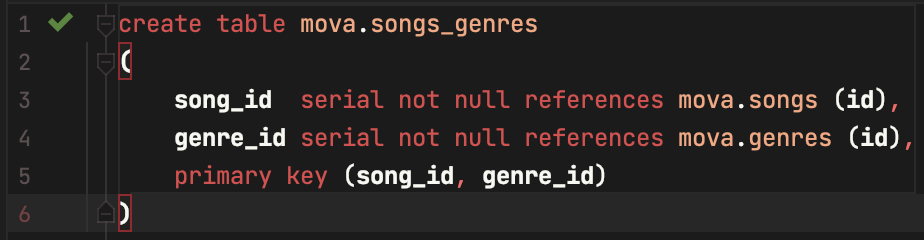

# Лабораторна робота 6

## Тема

Фізична реалізація бази даних на СУБД Oracle Database Server 11g XE.

## Мета

Створити відповідні елементи в СУБД Oracle Database Server 11g XE
для відпрацювання скриптів попередньої роботи. Відпрацювати скрипти DDL.

## Замітка

Після певних обмірковувань, атрибути id були прибрані з асоціативних сутностей, та їх primary key тепер комбінація допоміжних атрибутів.

### Виконання

#### Створення табличного простоту

#### Створення користувачів з та без прав

#### Використання створеного користувача

#### Відпрацювання скриптів та фізична модель

## Висновок

На цій лабораторній роботі я відпрацював скрипти для створення таблиць. Трохи покращив попередню модель. Навчився створювати користувачів та надавати їм права
