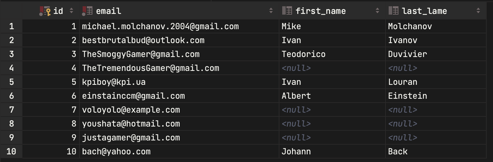
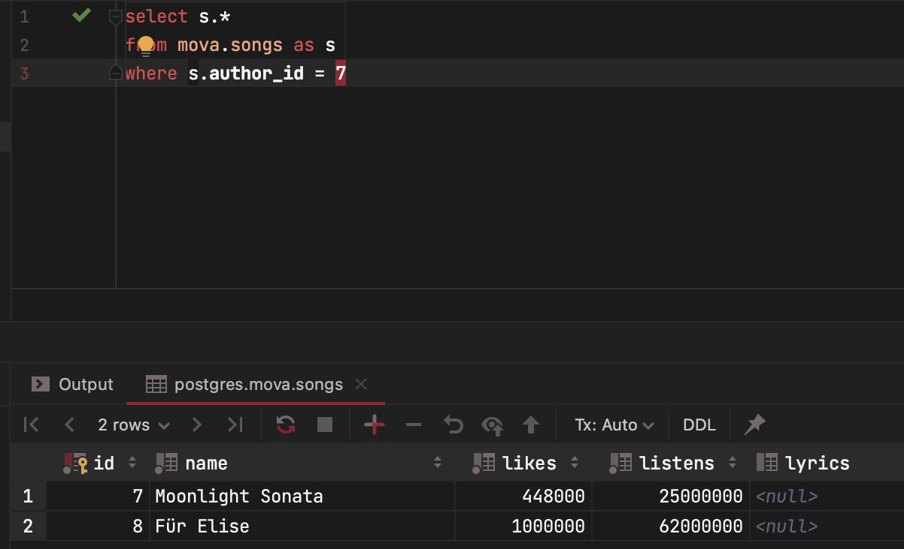
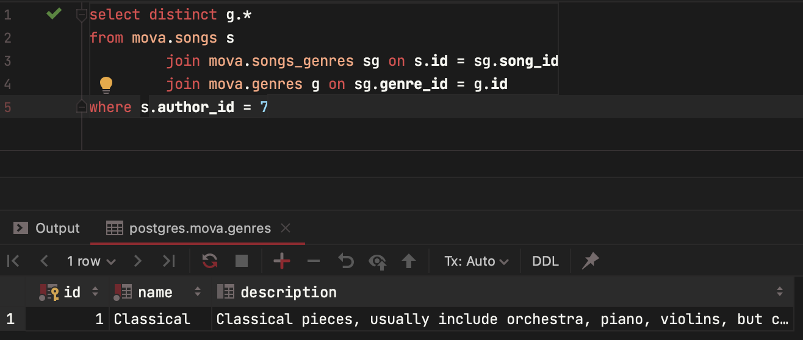

# Лабораторна робота 7

- [Лабораторна робота 7](#лабораторна-робота-7)
  - [Автор](#автор)
  - [Фізична модель](#фізична-модель)
  - [Перелік функцій](#перелік-функцій)
  - [Данні в СУБД](#данні-в-субд)
    - [authors](#authors)
    - [genres](#genres)
    - [playlists](#playlists)
    - [songs](#songs)
    - [users](#users)
    - [songs\_genres](#songs_genres)
    - [playlists\_users](#playlists_users)
    - [playlists\_songs](#playlists_songs)
  - [Виконання функцій](#виконання-функцій)
    - [Створити користувача](#створити-користувача)
    - [Створити плейлист коритсувача](#створити-плейлист-коритсувача)
    - [Додати до плейлиста користувача пісню](#додати-до-плейлиста-користувача-пісню)
    - [Додати плейлист в обране](#додати-плейлист-в-обране)
    - [Видалити пісню з плейлиста](#видалити-пісню-з-плейлиста)
    - [Видалити плейлист](#видалити-плейлист)
    - [Отримати всі пісні з плейлиста](#отримати-всі-пісні-з-плейлиста)
    - [Отримати всі пісні автора](#отримати-всі-пісні-автора)
    - [Отримати всі пісні з усіх плейлистів користувача](#отримати-всі-пісні-з-усіх-плейлистів-користувача)
    - [Отримати всі жанри автора](#отримати-всі-жанри-автора)
    - [Отримати всі жанри плейлиста](#отримати-всі-жанри-плейлиста)
    - [Отримати всіх авторів певного жанру](#отримати-всіх-авторів-певного-жанру)
    - [Отримати всі пісні певного жанру](#отримати-всі-пісні-певного-жанру)
    - [Отримати кількість різних жанрів пісень, обраних користувачем](#отримати-кількість-різних-жанрів-пісень-обраних-користувачем)
    - [Отримати всіх користувачів які додали до обраного певні жанри](#отримати-всіх-користувачів-які-додали-до-обраного-певні-жанри)
  - [Висновок](#висновок)

## Автор

Молчанов Михайло Валерійович

## Фізична модель


## Перелік функцій

1. Створити користувача
2. Створити плейлист коритсувача
3. Додати до плейлиста користувача пісню
4. Додати плейлист в обране
5. Видалити пісню з плейлиста
6. Видалити плейлист
7. Отримати всі пісні з плейлиста
8. Отримати всі пісні автора
9. Отримати всі пісні з усіх плейлистів користувача
10. Отримати всі жанри автора
11. Отримати всі жанри плейлиста
12. Отримати всіх авторів певного жанру
13. Отримати всі пісні певного жанру
14. Отримати кількість різних жанрів пісень, обраних користувачем
15. Отримати всіх користувачів які додали до обраного певні жанри(через пісні)

## Данні в СУБД

### authors


### genres


### playlists


### songs


### users



### songs_genres


### playlists_users


### playlists_songs


## Виконання функцій

### Створити користувача

```
insert into mova.users (email, first_name, last_lame)
values ('example-email@example.com', 'example-first-name', 'example-last-name')
```


### Створити плейлист коритсувача

```
insert into mova.playlists (name, is_public, owner_id)
values ('ExampleName', false, owner_id)
```


### Додати до плейлиста користувача пісню

```
insert into mova.playlists_songs (playlist_id, song_id)
values (11, 10)
```


### Додати плейлист в обране

```
insert into mova.playlists_users (playlist_id, user_id)
values (1, 11)
```


### Видалити пісню з плейлиста

```
delete from mova.playlists_songs where song_id = 10 and playlist_id = 11
```


### Видалити плейлист

```
delete
from mova.playlists_songs
where playlist_id = 11;
delete
from mova.playlists_users
where playlist_id = 11;
delete
from mova.playlists
where id = 11;
```


### Отримати всі пісні з плейлиста

```
select s.* from mova.playlists_songs as ps
join mova.songs as s on ps.song_id = s.id
where ps.playlist_id = 1
```


### Отримати всі пісні автора

```
select s.*
from mova.songs as s
where s.author_id = 7
```



### Отримати всі пісні з усіх плейлистів користувача

```
select distinct s.*
from mova.playlists_users as pu
         join mova.playlists_songs ps on pu.playlist_id = ps.playlist_id
         join mova.songs s on s.id = ps.song_id
```


### Отримати всі жанри автора

```
select distinct g.*
from mova.songs s
         join mova.songs_genres sg on s.id = sg.song_id
         join mova.genres g on sg.genre_id = g.id
where s.author_id = 7
```



### Отримати всі жанри плейлиста

```
select distinct g.*
from mova.playlists_songs ps
    join mova.songs s on s.id = ps.song_id
         join mova.songs_genres sg on s.id = sg.song_id
         join mova.genres g on sg.genre_id = g.id
where ps.playlist_id = 1
```


### Отримати всіх авторів певного жанру

```
select distinct a.*
from mova.songs_genres sg
         join mova.songs s on s.id = sg.song_id
         join mova.authors a on s.author_id = a.id
where sg.genre_id = 1
```


### Отримати всі пісні певного жанру

```
select distinct s.*
from mova.songs_genres sg
         join mova.songs s on s.id = sg.song_id
where sg.genre_id = 1
```


### Отримати кількість різних жанрів пісень, обраних користувачем

```
select g.id, count(g.id), g.name
from mova.playlists_users pu
         join mova.playlists_songs ps on pu.playlist_id = ps.playlist_id
         join mova.songs_genres sg on sg.song_id = ps.song_id
         join mova.genres g on g.id = sg.genre_id
where pu.user_id = 1
group by g.id
```


### Отримати всіх користувачів які додали до обраного певні жанри

```
select u.*
from mova.songs_genres sg
         join mova.playlists_songs ps on sg.song_id = ps.song_id
         join mova.playlists_users pu on ps.playlist_id = pu.playlist_id
         join mova.users u on u.id = pu.user_id
where sg.genre_id = 1
```


## Висновок

На цій лабораторній роботі я зміг використати базу данних, яку весь цей час розробляв. Я використав команди мови SLQ для створення, зміни, видалення та перегляду даних.
