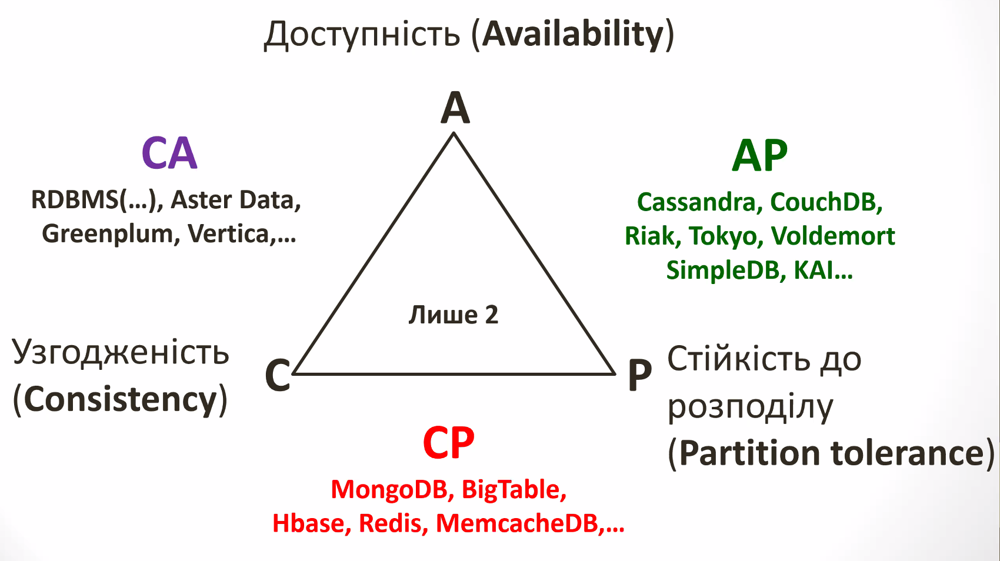

# Бази Данних

- [Бази Данних](#бази-данних)
  - [Туторіал](#туторіал)
    - [Експрес-контрольні](#експрес-контрольні)
    - [Виконання та захист лаб](#виконання-та-захист-лаб)
    - [Модульні контрольні](#модульні-контрольні)
    - [Заохочувальні бали](#заохочувальні-бали)
    - [Бали](#бали)
    - [Курсова робота](#курсова-робота)
    - [Лаби](#лаби)
  - [Загальні поняття курсу. Типи БД, ACID](#загальні-поняття-курсу-типи-бд-acid)
    - [База Данних – погляд з двох сторін](#база-данних--погляд-з-двох-сторін)
    - [Терміни теорії баз даних](#терміни-теорії-баз-даних)
    - [Типи баз даних](#типи-баз-даних)
      - [RDBMS](#rdbms)
      - [NoSQL](#nosql)
      - [Вибір СУБД. Теорема CAP](#вибір-субд-теорема-cap)
      - [RDBMS vs NoSQL по ступеню відповідності ACID](#rdbms-vs-nosql-по-ступеню-відповідності-acid)
      - [Правило трьох НЕ для реляційних БД](#правило-трьох-не-для-реляційних-бд)

Курс буде стосуватись тільки реляційних баз данних

## Туторіал

Рейтинг студента з дисципліна складається з балів, що він отримує за

- Виконання контрольних робіт(2 експрес-контрольних на лабах)
- Виконання та захист 7 лабораторних робіт
- Виконання 2 двогодинних модульних контрольних робіт
- Заохочвальні/Штрафні бали

### Експрес-контрольні

Проводяться на лабах
По суті просто захист складних робіт

### Виконання та захист лаб

Електронний звіт повинен бути на Google drive, **лаба без звіту не зараховується**

### Модульні контрольні

Про них буде попередження. Проводяться на лекціяї. Заборонено користуватися мобільними пристроями, констпектами. Дозволено відпрацьовувати завдання у власних СУБД. Проводяться перед атестаціями

### Заохочувальні бали

За активну роботу на лекціях

Презентації по Самостійній Роботі Студента

### Бали

Експрес контрольні - 2 роботи по 3 бали,  
Лаби - 7 робіт по 5 балів
МКР - 2 роботи по 5 балів
Заохочувальні до 10

### Курсова робота

Буде ще окрема лаба про курсову

Робити лабу та одразу додавати до курсової матеріал цієї лаби. Гарно оформлювати курсову, чітко за стандартами.

### Лаби

Додавати лаби в певні папки, в назві повинно бути хоча б прізвище та можливо номер групи

## Загальні поняття курсу. Типи БД, ACID

### База Данних – погляд з двох сторін

- > Це динамічно оновлювана інформаційна модель предметної області  

- > Це "Склад" даних, назначених для колективного, багаторозового та багатоцільового використання

### Терміни теорії баз даних

- > Предметна облась - це загальна картина того що вам потрібно робити, тут багато надлишкових даних

- > Дані - надлишкові дани які ви отримали після аналізу предметної області, багато сміття, але є те що нам потрібно

- > Інформація - корисні дані. Це сутності, атрибути цих сутностей, та інше.

- > Модель даних - модель побудована на основі інформації, з якою ми будемо працювати. Типу поєднати між собою студентів, групи, викладачів, щоб можна було на основі моделі думати про сам застосунок

- > Схема бази даних - це модель яка є нормалізована. Після нормалізації, в нас данні будуть вимальовуватися в таблиці

- > База даних - базиз або фундамент майбутньої системи

### Типи баз даних

Реляційні бази даних(RDBMS) – Oracle, MSSQL Server, IBM DB2, MySQL, PostgreSAL, Microsoft Access, ...

Нереляційні бази даних(NoSQL) - MondoDB, Cassandra, MemcachedDB, Redis, HBase, BigTable

> BlockChain - технологія запису данних за допомогою блоків

#### RDBMS

> Relational DataBase Management System

- Правила Кодда
- Принкипи ACID
- Цілісність даних
- Контполь доступу
- Використання вичерпної мови SQL

#### NoSQL

> Not only SQL

Обумовлені високими вимогами до швидкості та масштабованості, при низьких вимогаї до надійності даних та гнучності архітектури

#### Вибір СУБД. Теорема CAP

#### RDBMS vs NoSQL по ступеню відповідності ACID

В RDMBS ACID:

- Atomicity
- Consistency
- Isolation
- Durability

В NoSQL BASE:

- Basically Available
- Soft-state
- Eventually Consistent

РЕляційні СУБД акцентуют увагу на дотриманні узгодженості та доступності, залишаючи стійкість до розподілу на достатньо не високому рівні

#### Правило трьох НЕ для реляційних БД

- Не надлишковість
  - База данних ненадлишкова, якщо видалення будь-якого елемену даних веде до втрати інформації про предметну область
  - Надлишковість має бути контрольованою
- Не суперечність
  - якщо всі дани, що в ній зберігаються задовільняють певним умавам, що мають назву - обмеження цілісності
- Не залежність відзастосувань
  - Можливість здійснювати реструктуризацію БД чи її реорганізацію, не змінюючи при цьому застовування
  - Існують логічна та фізична незалежності
