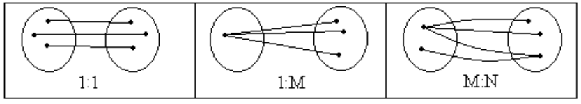
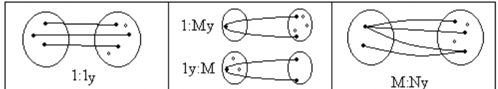
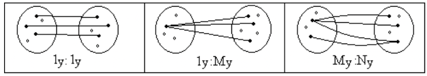

# Етапи проектування РБД. Приклад проектування інфологічної моделі бази даних «Видавництво»

## Этапи створення будь-якої бази даних

1. Аналіз предметної області
проектування БД

2. Визначення вимог до проекту БД

3. Інфологічне проектування БД

4. Визначення вимог до операційної
обстановки

5. Вибір конкретної СУБД

6. Даталогічне проектування БД

7. Фізичне проектування БД

8. Фізична реалізація БД

## Вимоги до проекту БД

1. Коректність схеми БД

2. Забезпечення обмеження на ресурси
обчислювальної системи

3. Ефективність функціонування

4. Забезпечення захисту даних

5. Гнучкість

6. Простота та зручність експлуатації

## Етапи проектування бази даних

> Концептуальне проектування – створення інформаційно-логічної (інфологічної) моделі

> Логічне проектування – створення даталогічної моделі

> Фізичне проектування – реалізація проекту бази даних на мові DDL обраної СУБД

## Інфологічне проектування

- Аналіз предметної області

- Побудова моделі предметної області

- Визначення меж інформаційної підтримки

- Визначення груп користувачів

## Види нотацій ER-діаграми

1. Нотація Чена

2. Нотація (метод) Баркера

3. Методологія IDEF1, IDEF1x

4. Нотація IE (Information Engineering)

5. Нотація Мартіна (Crows Foot)

6. Нотація Yourdona

## Терміни інфологічного проектування

- Сутність

- Атрибут

- Екземпляр сутності

- Значення атрибуту

- Домен атрибуту

- Зв’язок

- К1 Умовність
- К2 Множинність
- К3 Чисельність

## Класифікація сутностей

- Стержнева сутність
- Сутність
- Асоціативна сутність
- Сутність позначення
- Їарактеристична

## Класифікація атрибутів

`<НАЗВА СУТНОСТІ>.<назва атрибуту>`

1. Ідентифікатор – логічно не пов’язаний з
сутністю

2. Описові атрибути – Якимось чином описують сутність(Ім'я прізвище...), не є унікальними

3. Вказівні атрибути – Описові атрибути які є унікальними

4. Допоміжні атрибути – зовнішні ключі

## Правила атрибутів

1. Один екземпляр сутності – одне єдине значення для кожного атрибуту
2. Відсутність внутрішньої структури
3. Атрибут – характеристика всієї сутності, окрім випадку, якщо атрибут є складовою частиною ідентифікатора (в структурі моделі)
4. Атрибут обов’язково характеризує саме екземпляр, вказаний ідентифікатором, а не частину екземпляру чи інший атрибут (в самій сутності)

## Класифікація зв’язків. Умовність. Множинність

### Безумовні

  
Сутність не може існувати без зв'язку

### Умовні

  
З одного з боків зв'язок може бути відсутнім

### Біумовні

  
І там і там можуть бути сутності без зв'язків
