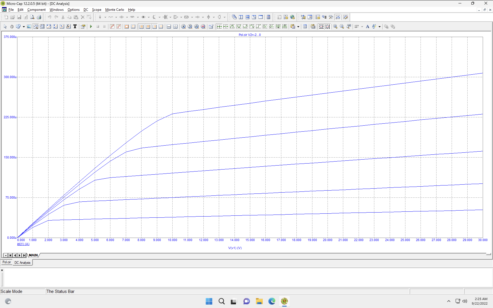

# ЛАБОРАТОРНА РОБОТА №1

- [ЛАБОРАТОРНА РОБОТА №1](#лабораторна-робота-1)
  - [Тема](#тема)
  - [Мета](#мета)
  - [Порядок виконання роботи](#порядок-виконання-роботи)
  - [Виконання](#виконання)
    - [Схема 1](#схема-1)
      - [Аналіз стокових характеристик](#аналіз-стокових-характеристик)
      - [Часові діаграми](#часові-діаграми)
    - [Схема 2](#схема-2)
    - [Схема 3](#схема-3)
    - [Схема 4](#схема-4)
      - [Часові діаграми](#часові-діаграми-1)
      - [Вхідні характеристики](#вхідні-характеристики)
      - [Вихідні характеристики](#вихідні-характеристики)
      - [Підрахунки](#підрахунки)
    - [Схема 5](#схема-5)
      - [Часові діаграми](#часові-діаграми-2)
      - [Обрахунки](#обрахунки)
  - [Висновок](#висновок)

## Тема

Біполярні та польові транзистори.

## Мета

Дослідити принцип дії та основні властивості біполярних (БТ) та польових транзисторів (ПТ); дослідити основні динамічні характеристики БТ, які включено за схемою зі спільним емітером (СЕ); ознайомитися з основними параметрами цих пристроїв та областю їх застосування.

## Порядок виконання роботи

1. Схема1.Дослідитисхемуізпольовимтранзисторомзp–nпереходамита каналом типу n (рисунок 1.21):
   1. зняти та проаналізувати сім’ю стокових характеристик транзистора
(рисунок 1.22)
   2. отримати та проаналізувати часові діаграми роботи транзистора (рисунок 1.23).
2. Схема 2. Дослідити схему підсилювача на польовому транзисторі із затвором у вигляді p–n переходу (рисунок 1.24):
   1. отримати та проаналізувати часові діаграми роботи схеми (рисунок 1.25);
3. Схема 3. Дослідити схему підсилювача на МОН–транзисторі (рисунок 1.26):
   1. отримати та проаналізувати часові діаграми роботи схеми (рисунок 1.27);
4. Схема 4. Дослідити cхему із фіксованим базовим струмом (рисунок 1.32): а
   1. отримати та проаналізувати часові діаграми роботи схеми (рисунок
1.33);
   2. б. зняти та проаналізувати сім’ю вхідних характеристик транзистора
2N699 (рисунок 1.34, 1.35);
   3. в. зняти та проаналізувати сім’ю вихідних характеристик транзистора
2N699 (рисунок 1.36, 1.37);
   4. розрахувати значення основних елементів схеми із фіксованим
базовим струмом (рисунок 1.32).
5. Схема 5. Дослідити схему із фіксованою базовою напругою (рисунок 1.38):
   1. отримати та проаналізувати часові діаграми роботи схеми (рисунок 1.39);
   2. розрахувати значення основних елементів схеми із фіксованою базовою напругою (рисунок 1.38)

## Виконання

Під час виконання схеми були взяті з файлу та налагоджені під мій варіант. Наскільки мені відомо, я 18 варіант, отже у генераторах синусоїди в мене буде `F=18`, тому не бачу сенсу додавати скріншоти схем, оскільки вони такі самі.

### Схема 1

Звичайна схема підсилювача з використанням польвого транзистора з спільним витоком.  

#### Аналіз стокових характеристик

  
Це одна з стандартних характеристик транзистора, в залежності від напруги на затворі, яку ми змінюємо з кроком, ми дивимось залежність сили струму стоку від напруги стоку витоку.  
Як видно з графіків, в мевній точці струм досягає насичення, бо транзистор повністю відкритий або від достатньої напруги.  Вищий графік - там де в нас відкритий транзистор, тому і сила струму вища.

#### Часові діаграми

  

Як видно з графіку, в нас транзистор справді підсилив вхідний сигнал, але оскільки в транзисторі змінюється полярніть сигналу, що проходить, в нас зелений сигнал приходить в протифазі до сигналу, що виходить.

###  Схема 2

На відміну від попередньої схеми, тут робоча точка задається не окремою батарейкою, а резистором, який створює напругу між затвором та витоком.  

  

Щодо діаграм, ми бачимо, що це дійсно підсилювач, який на виході дає сильніший сигнал ніж попередній, але так само в протифазі

### Схема 3

Тут вже використовується інший вид транзистора, на відміну від іншого, затвір ізольований оксидом від підкладки, там створюватиметься індукований канал.  

  

Його вихідна напруга трохи гірша ніж в попередніх.

### Схема 4

Стандартна схема підкючення біполярного транзистора зі спільним емітером. В цьому випадку робочу напругу задано за допомогою батарейки, яка і використовуєтсья під час підсилення.  

#### Часові діаграми

  
На цій діаграмі розбиті графіки вхідної та вихідної напруги на два, але це не змінює суті діаграми, підсилювач є підсилювач

#### Вхідні характеристики

Одна з дуже важливих характеристик транзистора, щоб знайти початкову робочу напругу. Залежність сили струму бази від напруги між базою та емітером, де із кроком змінюється напруга на колекторі-емітері  
  
Занадто мале значення початкової напруги призведе до відсічки синусоїди згори, а занадто високе відріже її знизу, тому треба обирати початкову напругу поцентру, щоб цього не було та на лінійному участку параболи, щоб синусоїда не кривилася

#### Вихідні характеристики

Ще одна важлива характеристика, яка допомагає обирати правильно резистори.

#### Підрахунки

  
Для того щоб обрати початкове значення резисторів, дивимось на вихідну характеристику, щоб обрати робочу точку. З неї ми знаємо Напругу батарейки, напругу на колекторі та силу струму там. З цього знайдемо опір. Там під графіком є обрахунок.  
Наступне це знайти опір для задання робочого положення. Тут використаємо вхідну характеристику. З якої оберемо струм бази та напругу на ній. Знаючи їх ми можемо обрати опір.

### Схема 5

#### Часові діаграми

#### Обрахунки

Тут такі самі обрахунки, але треба використати формулу роздільника напруги, бо задається в нас не струмом а напругою. Просто за допомогою формули знаходимо опір останнього резистора якщо вважати, що через нього повинен пройти струм у 5 разів більше ніж через базу

## Висновок

На цій лабораторній роботі я дізнався як працює неодмінна складова сьогодення - транзистери. За допомогою них підсилюються сигнали, працюють сучасні процессори та взагалі я зробив лабу тільки за допомогою них.  
Я тепер знаю які бувають транзистери, як їх підключати та як збирати прості схеми підсилювачів з ними