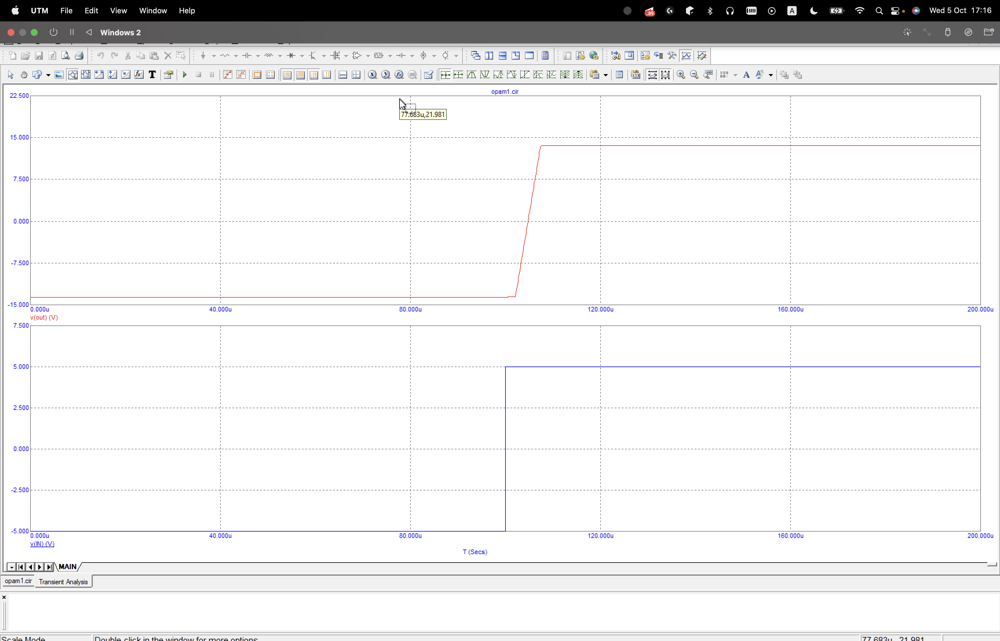
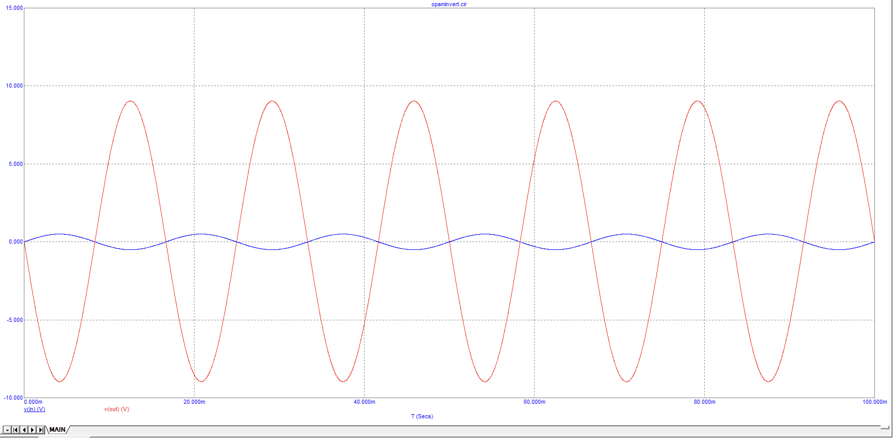
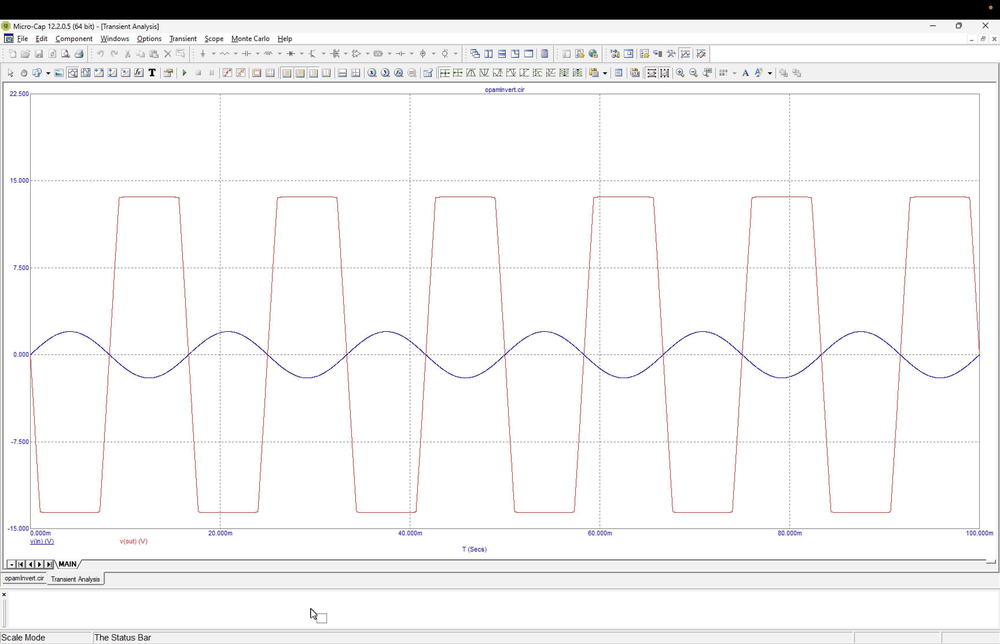
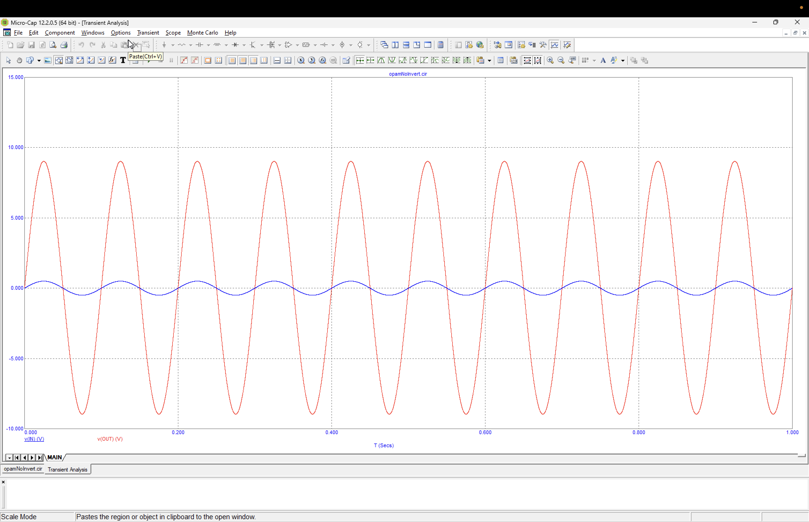
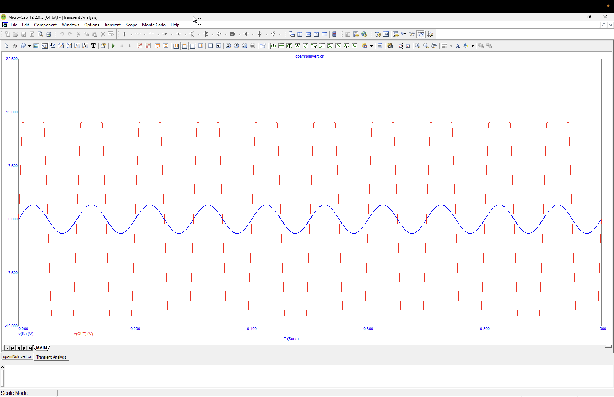
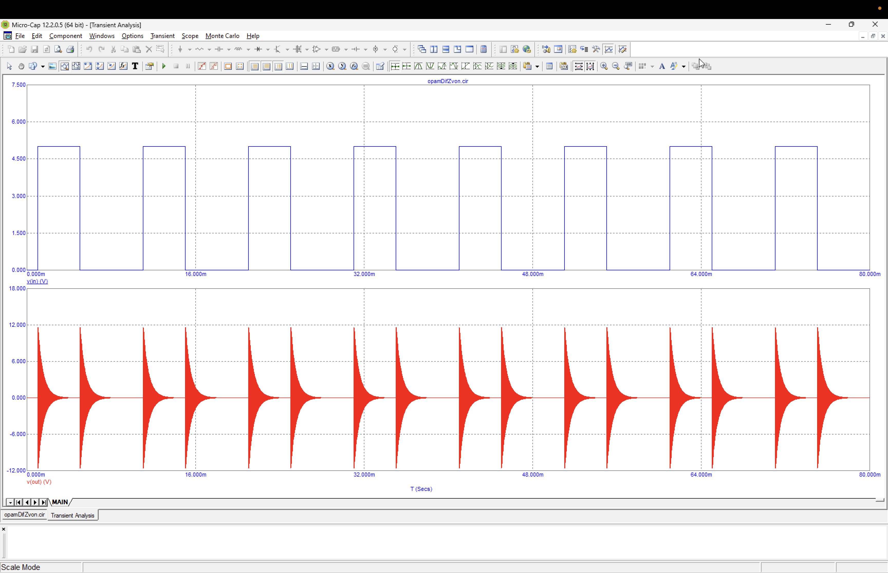
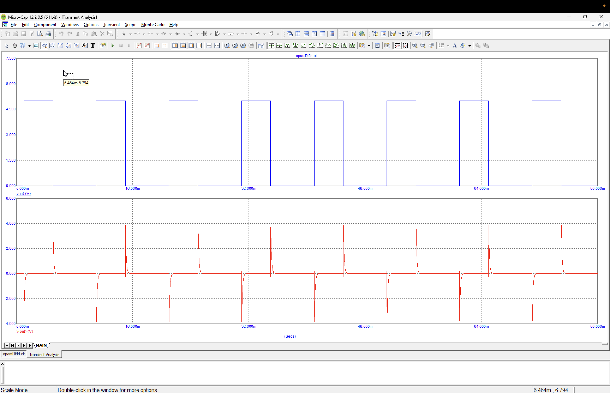
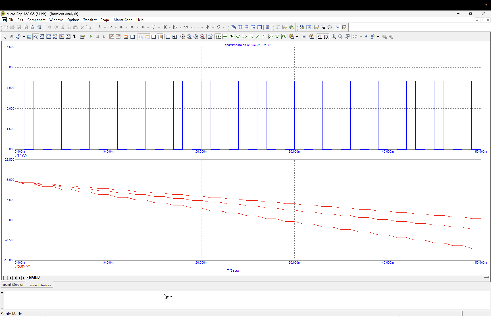
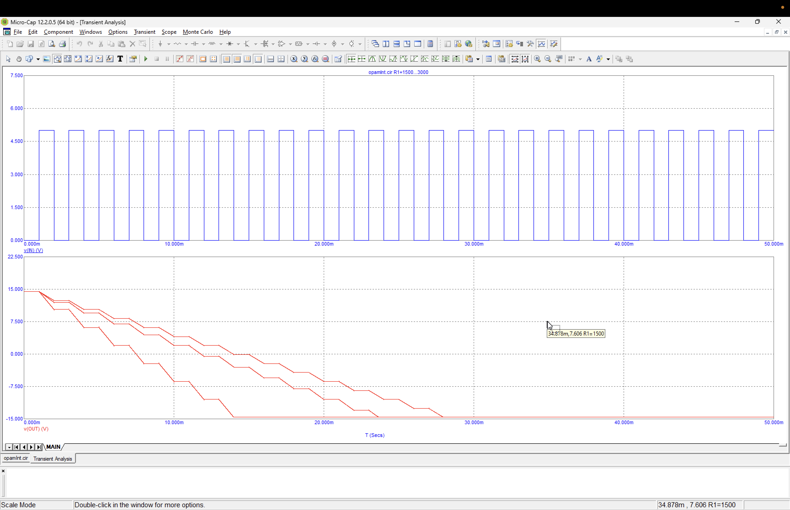

# Лабораторна робота 2

- [Лабораторна робота 2](#лабораторна-робота-2)
  - [Тема](#тема)
  - [Мета](#мета)
  - [Порядок виконання роботи](#порядок-виконання-роботи)
  - [Виконання](#виконання)
    - [Схема 1](#схема-1)
    - [Схема 2](#схема-2)
    - [Схема 3](#схема-3)
    - [Схема 4](#схема-4)
    - [Схема 5](#схема-5)
  - [Висновок](#висновок)

## Тема

Дослідження операційних підсилювачів.

## Мета

Дослідити принцип дії, основні властивості та характеристики операційних підсилювачів (ОП). Ознайомитись із основними параметрами цих пристроїв та областю їх застосування.

## Порядок виконання роботи

1. Схема 1. Випробування розімкненого ОП: 95
   1. Зняти та проаналізувати часові діаграми роботи розімкненогоІМС ОП. Приклад діаграм наведено на рисунках 2.10, 2.12.
2. Схема 2. Дослідження підсилювача на базі ІМС ОП , який інвертує:
   1. зняти та проаналізувати залежність вхідної/вихідної напруг від часу при не насиченому режимі роботи ІМС ОП. Приклад характеристик наведений на рисунку 2.14;
   2. зняти та проаналізувати залежність вхідної/вихідної напруг від часу при насиченому режимі роботи ІМС ОП. Приклад характеристик наведений на рисунку 2.15.
3. Схема 3. Дослідження підсилювача на базі ІМС ОП, який не інвертує:
   1. зняти та проаналізувати залежність вхідної/вихідної напруг від часу при не насиченому режимі роботи ІМС ОП. Приклад характеристик наведений на рисунку 2.17;
   2. зняти та проаналізувати залежність вхідної/вихідної напруг від часу при насиченому режимі роботи ІМС ОП. Приклад характеристик наведений на рисунку 2.18.
4. Схема 4. Дослідження диференціюючого ланцюга на базі ІМС ОП:
   1. зняти та проаналізувати залежність вхідної/вихідної напруг від часу. Приклад характеристик наведений на рисунку 2.20;
   2. зняти та проаналізувати залежність вхідної/вихідної напруг від часу для модифікованого ДЛ з попередженням дзвону. Приклад характеристик наведений на рисунку 2.22.
5. Схема 5. Дослідження інтегруючої ланки на базі ІМС ОП:
   1. зняти та проаналізувати залежність вхідної/вихідної напруг від часу для випадку одночасно поданих живлення на ІМС ОП та вхідного сигналу. Приклад характеристик наведений на рисунку 2.24
   2. зняти та проаналізувати залежність вхідної/вихідної напруг від часу для випадку подачі живлення на ІМС ОП раніше вхідного сигналу. Приклад характеристик наведений на рисунку 2.25.

## Виконання

### Схема 1

### Схема 2

### Схема 3

### Схема 4

### Схема 5

## Висновок

На цій роботі я навчився використовувати операційний підсилювач. Це складна схема з транзисторів яку зручно використовувати замість одиночних транзисторів. За допомогою цих схем я зможу інтегрувати та диференціювати сигнали.
