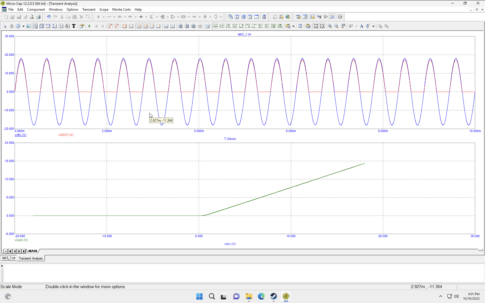
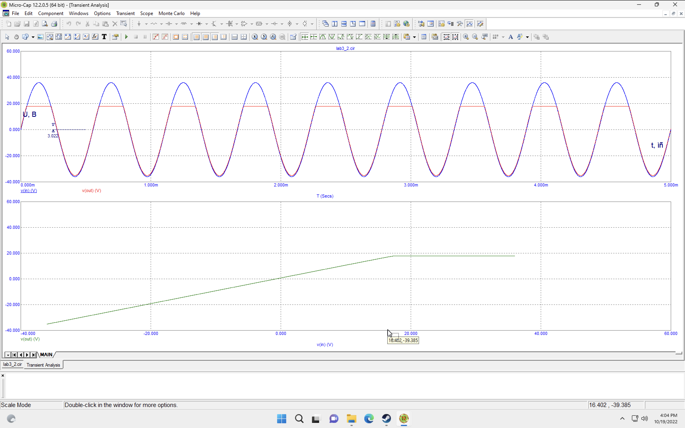
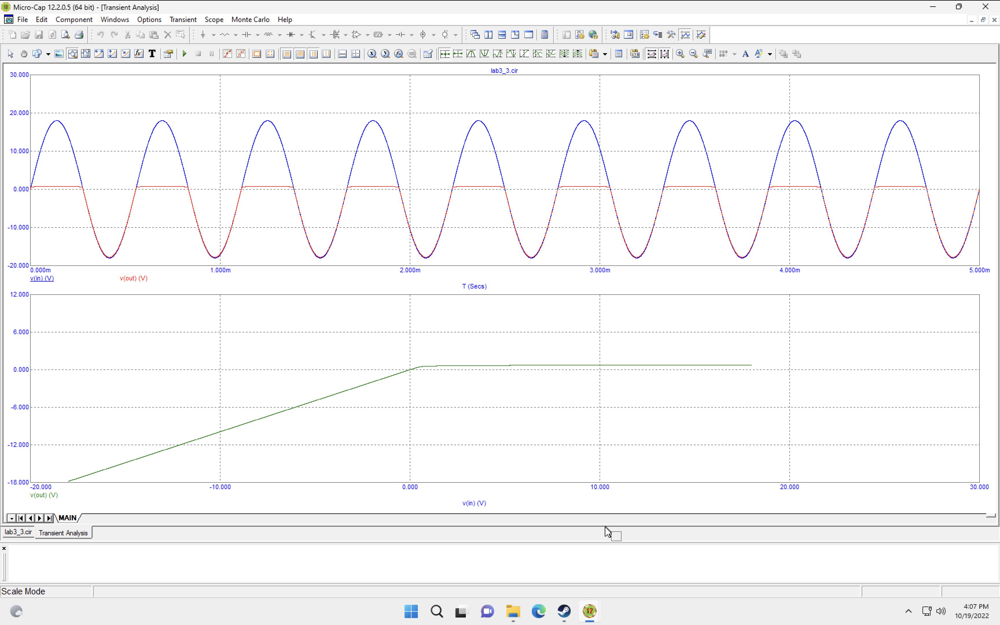
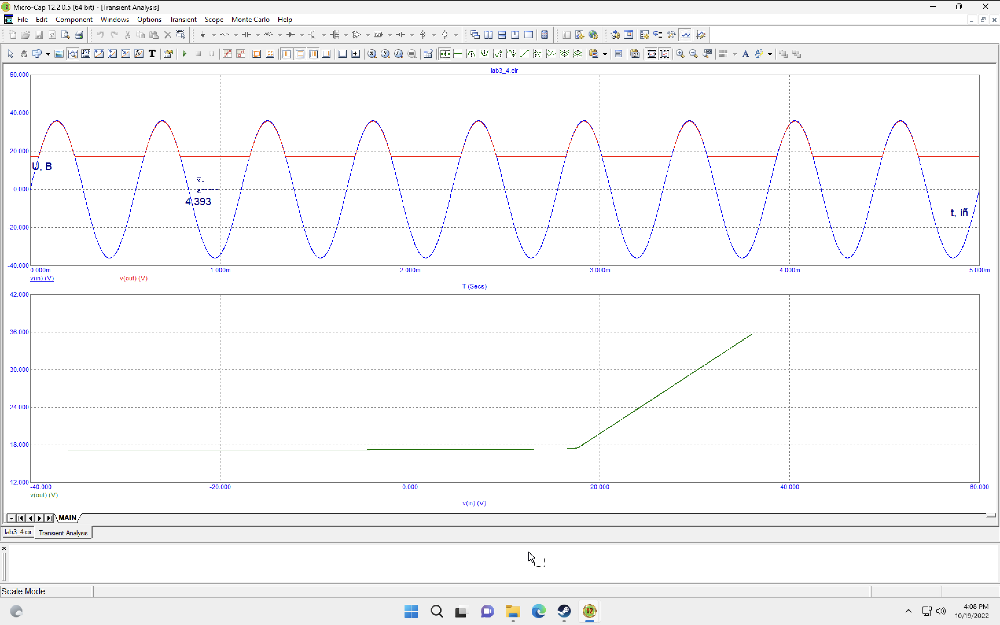
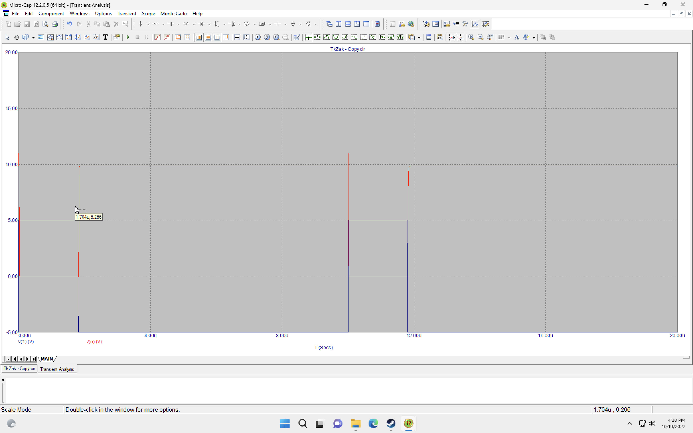
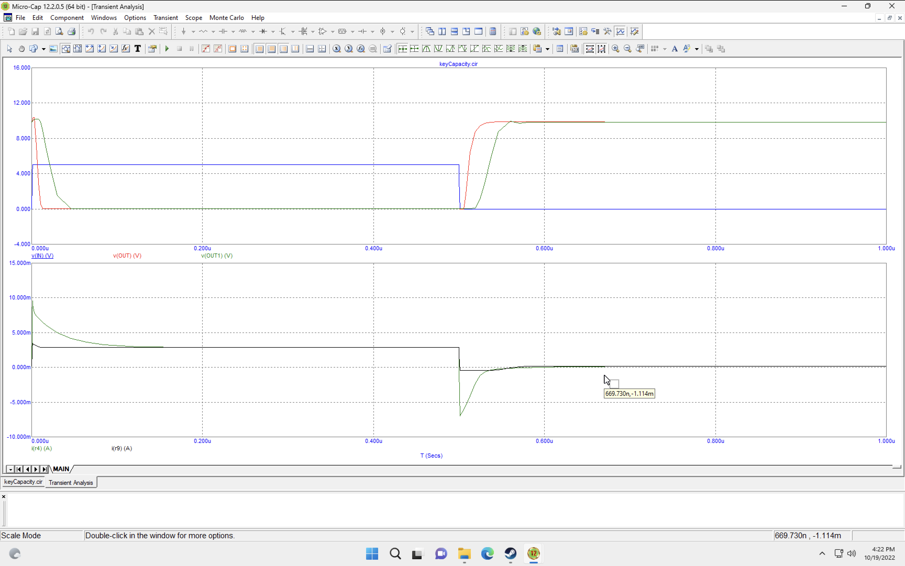
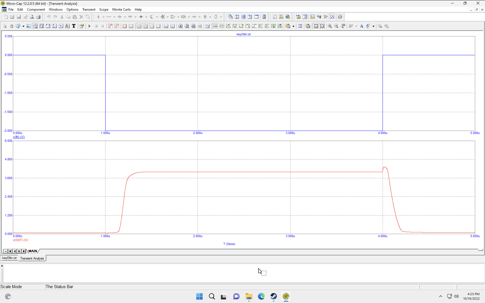
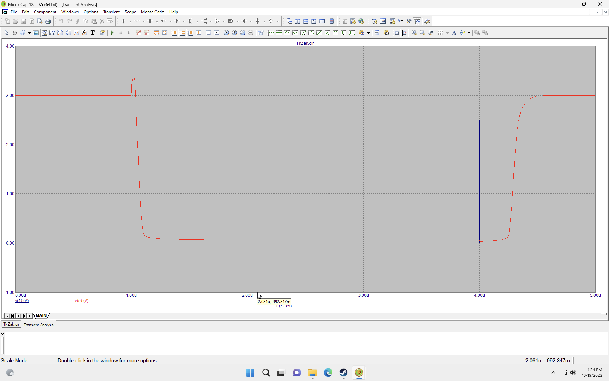
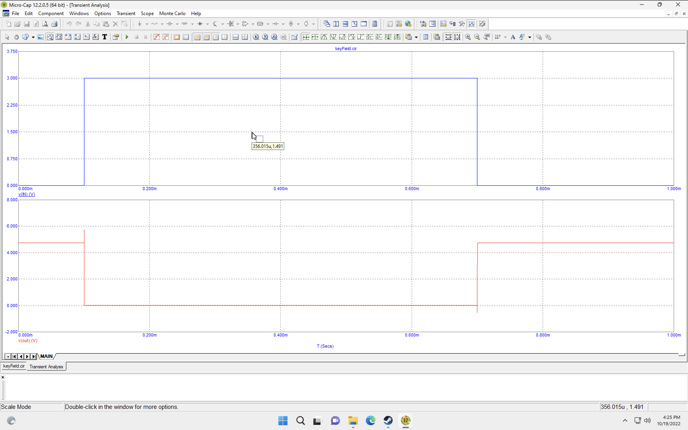
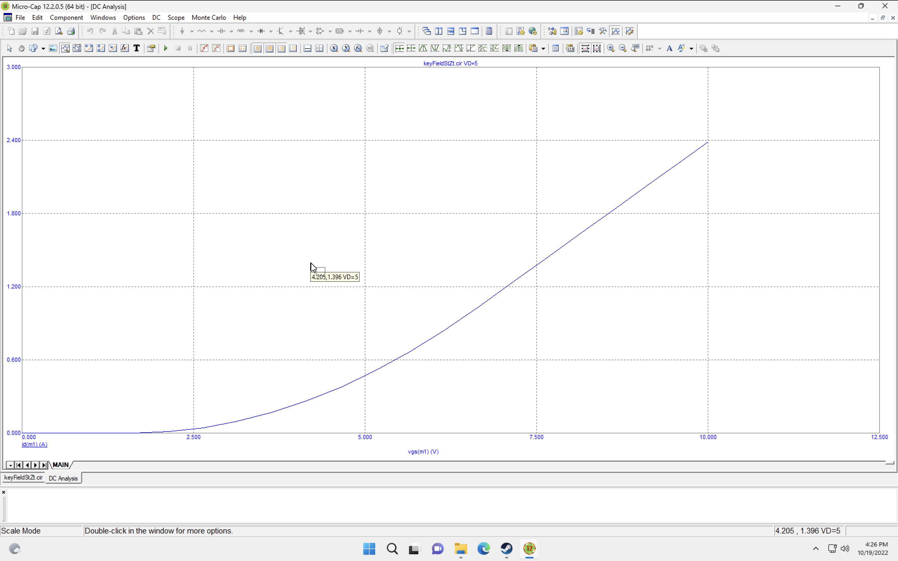

# Лабораторна робота 3

- [Лабораторна робота 3](#лабораторна-робота-3)
  - [Тема](#тема)
  - [Мета](#мета)
  - [Порядок виконання роботи](#порядок-виконання-роботи)
  - [Виконання](#виконання)
    - [Схема 1](#схема-1)
    - [Схема 2](#схема-2)
    - [Схема 3](#схема-3)
    - [Схема 4](#схема-4)
    - [Схема 5](#схема-5)
    - [Схема 6](#схема-6)
    - [Схема 7](#схема-7)
    - [Схема 8](#схема-8)
    - [Схема 9](#схема-9)
    - [Схема 10](#схема-10)
    - [Схема 11](#схема-11)
  - [Висновок](#висновок)

## Тема

Діодні та транзисторні ключі

## Мета

Дослідити принцип дії, основні властивості та характеристики діодних та транзисторних ключів (ДК та ТК). Ознайомитись із основними параметрами цих пристроїв та областю їх застосування.

## Порядок виконання роботи

1. Схема 1. Дослідження передатних та часових характеристик послідовного ДК:
    1. Зняти та проаналізувати передатну характеристику для послідовного ДК. Приклад характеристики наведений на рисунку 3.20, внизу;
    2. Зняти та проаналізувати залежність вхідної/вихідної напруг від часу послідовного ДК. Приклад характеристики наведений на рисунку 3.20, зверху.
2. Схема 2. Дослідження передатних та часових характеристик послідовного ДК зі зміщенням:
    1. Зняти та проаналізувати передатну характеристику для послідовного ДК зі зміщенням. Приклад характеристики наведений на рисунку 3.22, внизу;
    2. Зняти та проаналізувати залежність вхідної/вихідної напруг від часу послідовного ДК зі зміщенням. Приклад характеристики наведений на рисунку 3.22, вгорі.
3. Схема 3. Дослідження передатних та часових характеристик паралельного ДК:
    1. Зняти та проаналізувати передатну характеристику для паралельного ДК. Приклад характеристики наведений на рисунку 3.24, внизу;
    2. Зняти та проаналізувати залежність вхідної/вихідної напруг від часу паралельного ДК. Приклад характеристики наведений на рисунку 3.24, вгорі .
4. Схема 4. Дослідження передатних та часових характеристик паралельного ДК зі зміщенням:
   1. Зняти та проаналізувати передатну характеристику для паралельного ДК зі зміщенням. Приклад характеристики    2.ведений на рисунку 3.26, внизу;
   2. Зняти та проаналізувати залежність вхідної/вихідної напруг від часу паралельного ДК зі зміщенням. Приклад характеристики наведений на рисунку 3.26, вгорі.
5. Схема 5. Дослідження часових характеристик ТК на базі n–p–n– транзистора, який включено за схемою зі спільним     1ітером, при подачі на вхід різнополярних імпульсів :
   1. Зняти та проаналізувати залежність вхідної/вихідної напруг та струму бази від часу для зібраної схеми ТК. Приклад    2.рактеристик наведений на рисунку 3.29.
6. Схема 6. Дослідження часових характеристик ТК з прискорюючим конденсатором та без нього на базі n–p–n     1ранзистора, який включено за схемою зі спільним емітером:
   1. Зняти та проаналізувати залежність вхідної/вихідної напруг та струму бази від часу для зібраної схеми    2.К з прискорюючим конденсатором та без нього. Приклад характеристик наведений на рисунках 3.31, 3.32.
7. Схема 7. Дослідити схему транзисторного ключа відкритого у початковому стані:
    1. Зняти та проаналізувати залежність вхідної/вихідної напруг від часу для зібраної схеми ТК відкритого у початковому стані. Приклад характеристик наведений на рисунку 3.34.
8. Схема 8. Дослідити схему транзисторного ключа закритого у початковому стані:
    1. Зняти та проаналізувати залежність вхідної/вихідної напруг від часу для зібраної схеми ТК закритого у початковому стані. Приклад характеристик наведений на рисунку 3.36 2.47
9. Схема 9.1. Дослідити схему транзисторного ключа на польовому транзисторі:
    1. Зняти та проаналізувати залежність вхідної/вихідної напруг від часу для зібраної схеми ТК на польовому МОН–транзисторі. Приклад характеристик наведений на рисунку 3.40.
10. Схема 9.2. Дослідити схему для зняття стоко–затворної характеристики польового транзистора:
    1. няти та проаналізувати стоко–затворну характеристику польового транзистора. Приклад характеристик наведений на рисунку 3.42.
11. Схема 10. Дослідити схему транзисторного ключа на базі діода Шотткі. Приклад характеристик наведений на     р1унку 3.

## Виконання

### Схема 1

### Схема 2

### Схема 3

### Схема 4

### Схема 5

### Схема 6

### Схема 7

### Схема 8

### Схема 9

### Схема 10

### Схема 11

## Висновок

На цій лабораторній роботі я дізнався про ключі у фізиці які перемикаються не за допомогою якихось механічних рухів, а за допомогою чистої електрики. Такі ключі можуть бути зроблені за допомогою діодів та допоміжних батарейок та транзисторів різного типу. Оскільки це все електрика, в транзисторах є свої недоліки та особливості які потрібно знати під час роботи з ними.
