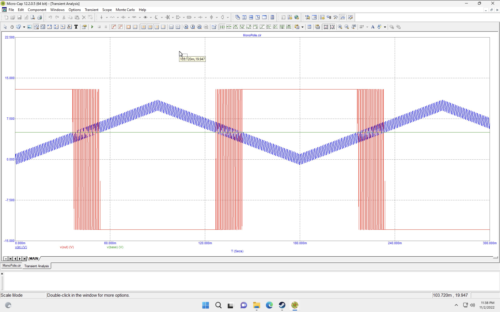

# Лабораторна робота 4

- [Лабораторна робота 4](#лабораторна-робота-4)
  - [Тема](#тема)
  - [Мета](#мета)
  - [Порядок виконання роботи](#порядок-виконання-роботи)
  - [Виконання](#виконання)
    - [1](#1)
    - [2](#2)
    - [3](#3)
    - [4](#4)
    - [5](#5)
    - [6](#6)
    - [7](#7)
    - [8](#8)
    - [9](#9)
  - [Висновок](#висновок)

## Тема

Дослідження імпульсних тригерів, аналогових компараторів та
схем формування рівнів.

## Мета

Дослідити принцип дії, основні властивості та характеристики імпульсних тригерів (ІТ), аналогових компараторів (АК) та схем формування рівнів (СФР). Ознайомитись із основними параметрами цих пристроїв та областю їх застосування.

## Порядок виконання роботи

1. Схема 1. Дослідження перехідних та часових характеристик однополярного АК:
   1. Зняти та проаналізувати передатну характеристику для однополярного АК. Приклад характеристики наведений на рисунку 4.20 (внизу);
   2. Зняти та проаналізувати залежність вхідної/вихідної та опорної напруг від часу однополярного АК. Приклад характеристики наведений на рисунку 4.20 (вгорі) .
2. Схема 2. Дослідження передатних та часових характеристик однополярного АК при наявності завад:
   1. Зняти та проаналізувати передатну характеристику АК. Приклад характеристики наведений на рисунку 4.23;
   2. Зняти та проаналізувати залежність вхідної/вихідної та опорної напруг від часу. Приклад характеристики наведений на рисунку 4.24.
3. Схема 3. АК з додатним зворотним зв'язком для порівняння однополярних імпульсів за умови наявності завад (регенеративний АК): 203
   1. a. Зняти та проаналізувати залежність вхідної/вихідної та опорної напруг від часу. Приклад характеристики наведений на рисунку 4.26.
4. Схема 4. Дослідження перехідних та часових характеристик АК для порівняння різнополярних імпульсів:
    1. Зняти та проаналізувати передатну характеристику. Приклад характеристики наведений на рисунку 4.28 (внизу);
    2. Зняти та проаналізувати залежність вхідної/вихідної та опорної напруг від часу різнополярного АК. Приклад характеристики наведений на рисунку 4.28 (вгорі).
5. Схеми 5, 6. Дослідження передатних та часових характеристик ТШ на базі ІМСОП із пам’яттю та без:
   1. Зібрати схему ТШ з пам’яттю на базі ІМСОП;
   2. Зняти та проаналізувати передатну характеристику для ТШ з пам’яттю. Приклад характеристики наведений на рисунку 4.30 (внизу);
   3. Зняти та проаналізувати залежність вхідної/вихідної та опорної напруг від часу ТШ з пам’яттю. Приклад характеристик наведений на рисунках 4.30 (вгорі);
   4. Зняти та проаналізувати передатну характеристику для ТШ без пам’яті. Приклад характеристики наведений на рисунку 4.33 (внизу);
   5. Зняти та проаналізувати залежність вхідної/вихідної та опорної напруг від часу ТШ без пам’яті. Приклад характеристики наведений на рисунку 4.33 (вгорі).
6. Схема 7. Дослідження формувача рівня (паралельна схема):
   1. Зняти та проаналізувати залежність вхідної/вихідної напруг від часу формувача рівня. Приклад характеристики наведений на рисунку 4.34.
7. Схема 8. Дослідження формувача рівня (послідовна схема):
   1. Зняти та проаналізувати залежність вхідної/вихідної напруг від часу формувача рівня. Приклад характеристики наведений на рисунку 4.36 204
8. Схема 9. Дослідження асинхронного RS-тригера із зовнішнім зміщенням:
   1. Зняти та проаналізувати часові діаграми роботи асинхронного RS- тригера із зовнішнім зміщенням Приклад діаграм наведений на рисунку 4.39.
9. Схема 9. Дослідження тригера з лічильним входом:
   1. Зняти та проаналізувати часові діаграми роботи тригера з лічильним входом. Приклад діаграм наведений на рисунку 4.41.

## Виконання

### 1

### 2

### 3

### 4

### 5

### 6

### 7

### 8

### 9

## Висновок

На цій лабораторній роботі я познайомився з компараторами та трірегами. Дізнався які саме бувають та де вони використовуються. Також познайомився з недоліком та схемою для його усунення а також більш детальну схему тригерів
