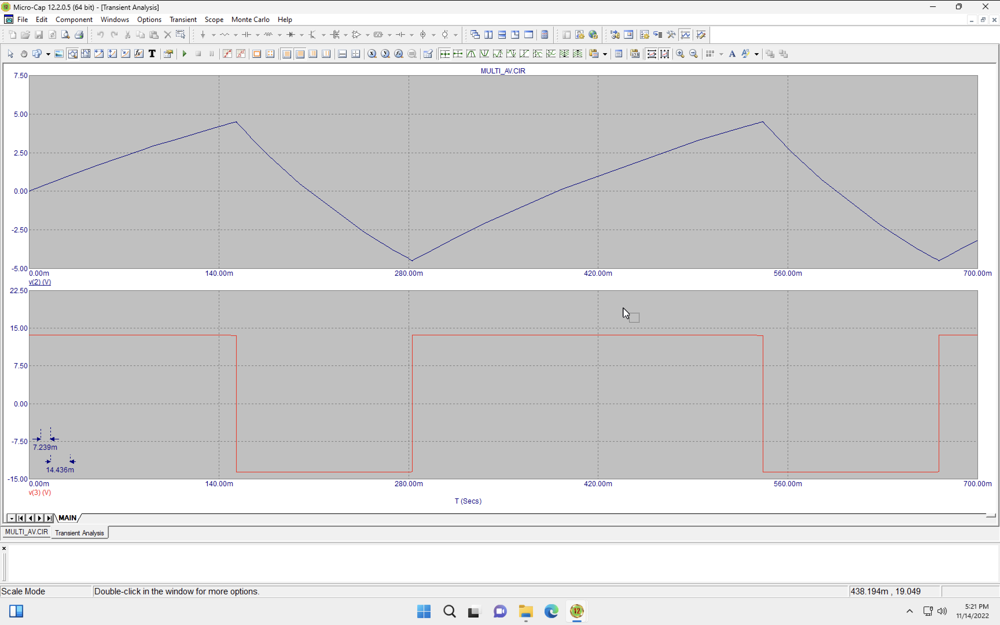
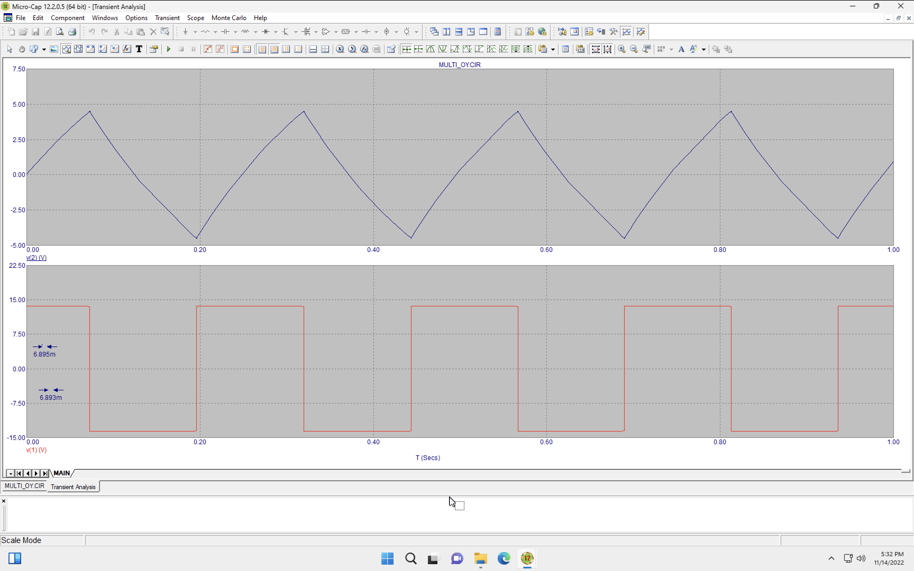
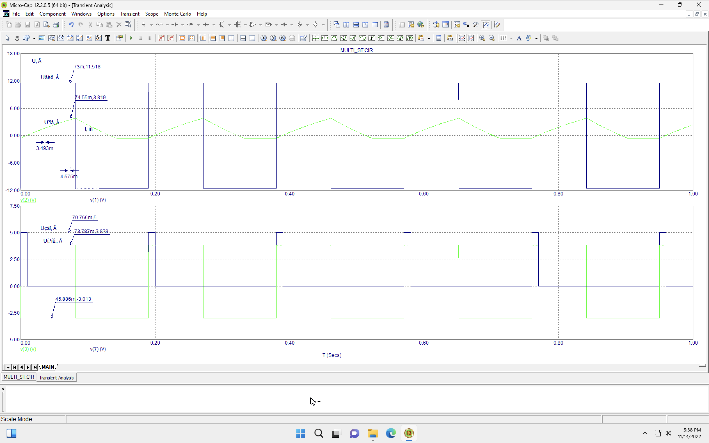
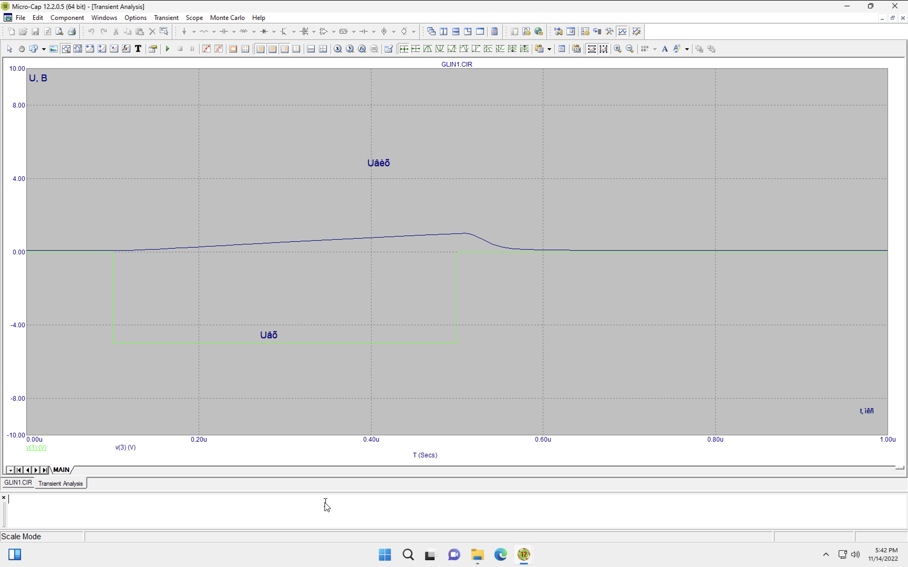
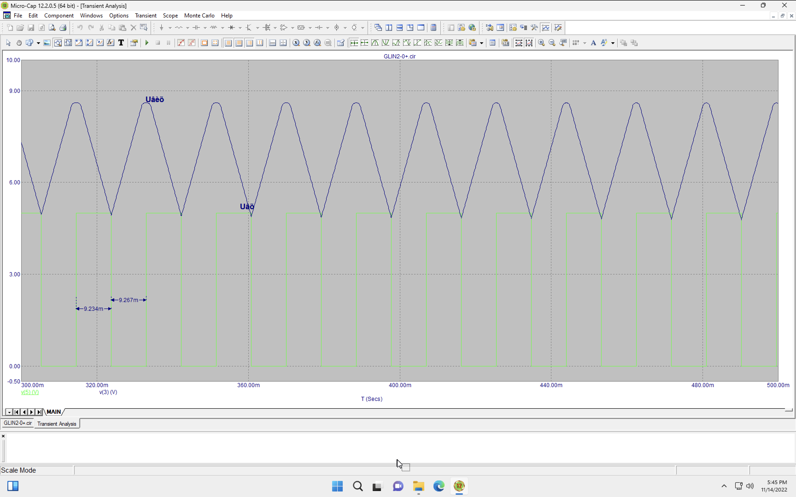
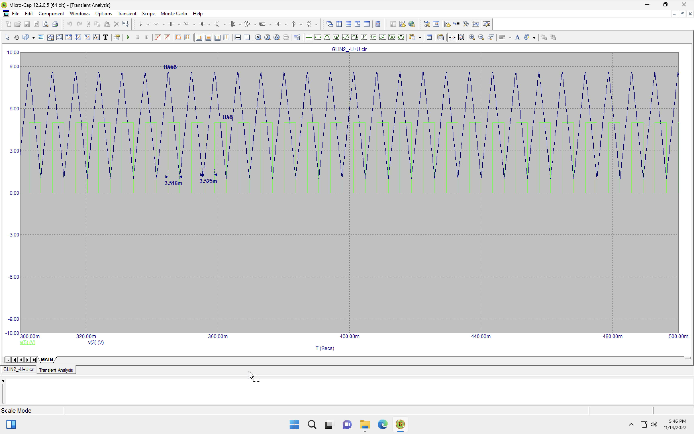
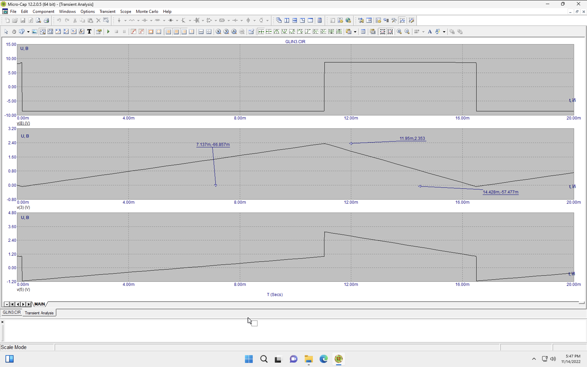

# Лабораторна робота 5

## Тема

Дослідження мультивібраторів та генераторів лінійно змінюваної напруги (ГЛЗН).

## Мета

Дослідити принцип дії, основні властивості та характеристики мультивібраторів та генераторів лінійнозмінюваної напруги (ГЛЗН). Ознайомитись із основними параметрами та характеристиками цих пристроїв та областю їх застосування.

## Порядок виконання роботи

1. Схема 1. Дослідження часових характеристик, параметрів та принципу дії автоколивального мультивібратора:
   1. зняти та проаналізувати часові діаграми роботи автоколивального мультивібратора. Приклад діаграм наведено на рисунку 5.17;
   2. розрахувати основні параметри імпульсного сигналу на виході мультивібратора, схему якого наведено на рисунку 5.16. Порівняти результати розрахунків з часовими діаграмами.
2. Схема 2. Дослідження часових характеристик, параметрів та принципу дії автоколивального мультивібратора зі шпаруватістю 2:
    1. зняти та проаналізувати часові діаграми роботи автоколивального мультивібратора зі шпаруватістю 2. Приклад діаграм наведено на рисунку 5.19;
    2. розрахувати основні параметри імпульсного сигналу на виході мультивібратора зі шпаруватістю 2, схему якого наведено на рисунку 5.18. Порівняти результати розрахунків з часовими діаграмами.
3. Схема 3. Дослідження часових характеристик, параметрів та принципу дії чекаючого мультивібратора:
    1. зняти та проаналізувати часові діаграми роботи чекаючого мультивібратора. Приклад діаграм наведено на рисунку 5.21;
    2. розрахувати основні параметри імпульсного сигналу на виході чекаючого мультивібратора, схему якого наведено на рисунку 5.20. Порівняти результати розрахунків з часовими діаграмами.
4. Схема 4. Дослідження часових характеристик, параметрів та принципу дії найпростішого ГЛЗН із зовнішнім запуском:
    1. зняти та проаналізувати часові діаграми роботи найпростішого ГЛІН із зовнішнім запуском. Приклад діаграм наведено на рисунку 5.23;
5. Схема 5. Дослідження часових характеристик, параметрів та принципу дії чекаючого ГЛЗН:
   1. зняти та проаналізувати залежність вхідної/вихідної напруг чекаючого ГЛЗН від часу. Отримати два різні варіанти графіка при якому в першому випадку вихідна напруга змінюється від –Uнас до +Uнас , а в іншому від нуля до +Uнас. Графіки залежностей слід рознести. Приклад характеристик наведено на рисунках
   2. перевірити умову нормального функціонування схеми;
6. Схема 6. Дослідження часових характеристик, параметрів та принципу дії автоколивального ГЛЗН:
   1. зняти та проаналізувати залежність вхідної/вихідної напруг чекаючого ГЛЗН від часу. Приклад характеристик наведено на рисунку 5.29.
   2. перевірити умову нормального функціонування схеми.

## Виконання

### Cхема 1

### Схема 2

### Схема 3

### Схема 4

### Схеми 5

### Схема 6

## Висновок

На цій лабораторній роботі я познайомився детальніше з тим, що постійно використовував - генератори змінної напруги, а точніше - мультивібратори. Дізнався про два різних типи мультивібраторів. Також познайомився з генераторами пилкоподібної напруги та зігзагової.
