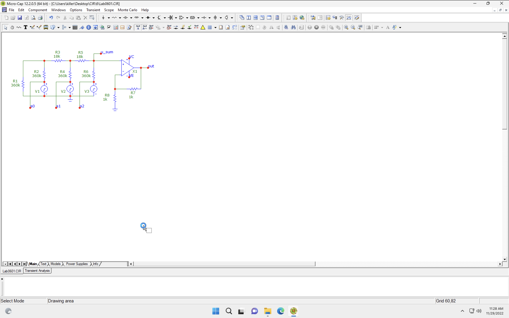
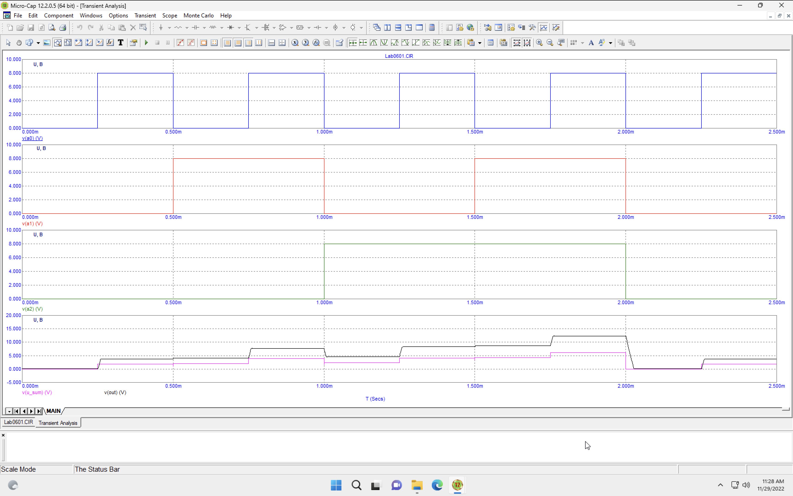
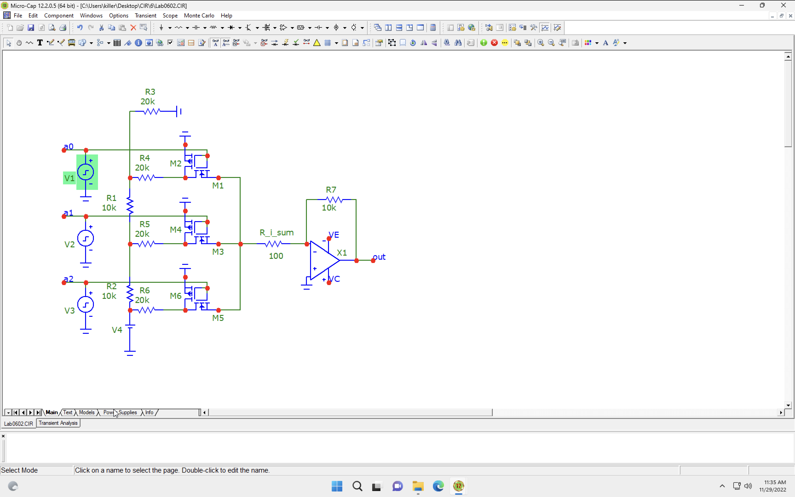
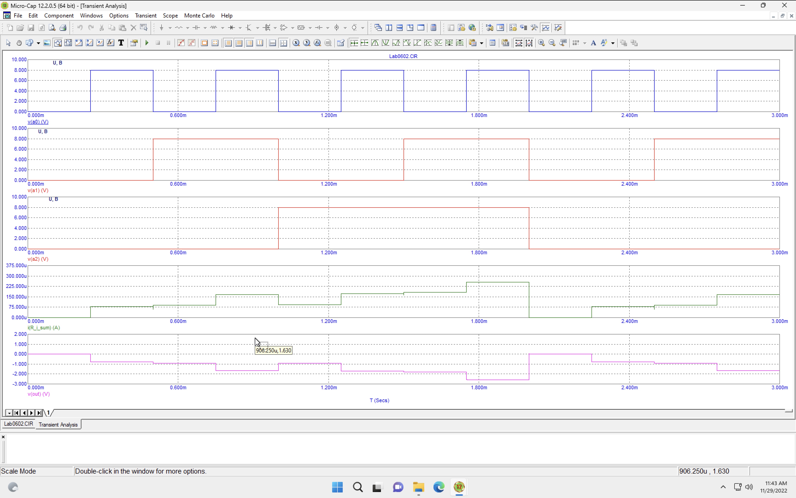

# Лабораторна робота №6

## Тема

Дослідження цифро – аналогових перетворювачів (ЦАП).

## Мета

Дослідити принцип дії, основні властивості та характеристики цифро–аналогових перетворювачів (ЦАП). Ознайомитись із основними видами, параметрами цих пристроїв та областю їх застосування.

## Порядок виконання роботи

1. Схема 1. Дослідження часових характеристик, принципу дії та структури ЦАП із підсумовуванням напруг (рисунок 6.5):
   1. зняти та проаналізувати залежність вихідної напруги, суми напруг ЦАП із підсумовуванням напруг від часу при всіх можливих комбінаціях розрядів a0...a2. Для проходу по всім можливим комбінаціям слід використовувати генератори прямокутних імпульсів. Частота генератора меншого розряду повинна бути в 2 рази більша ніж частота генератора сусіднього старшого розряду. Частоту генератора молодшого розряду слід обрати за номером бригади. Графіки залежностей слід рознести на різні площини, але залишити на одному листі. Приклад характеристик наведений на рисунку 6.7.

2. Схема 2. Дослідження часових характеристик, принципу дії та структури ЦАП із підсумовуванням струмів (рисунок 6.8):
   1. зняти та проаналізувати залежність вихідної напруги, суми токів ЦАП із підсумовуванням струмів від часу при всіх можливих комбінаціях розрядів a0...a2. Для проходу по всім можливим комбінаціям слід використовувати генератори прямокутних імпульсів. Частота генератора меншого розряду повинна бути в 2 рази більша ніж частота генератора сусіднього старшого розряду. Частоту генератора слід обрати за номером бригади. Графіки залежностей слід рознести на різні площини, але залишити на одному листі. Приклад характеристик наведений на рисунку 6.9.

## Виконання

### Підсумування напруг

### Підсумування струмів

## Висновок

На цій лабораторній роботі я познайомився з ЦАП, девайсом який дозволяє трансформувати цифровий сигнал в аналаговий, що дозволить керувати аналаговими обігрівачами, моторами, маніпуляторами та таким іншим.
