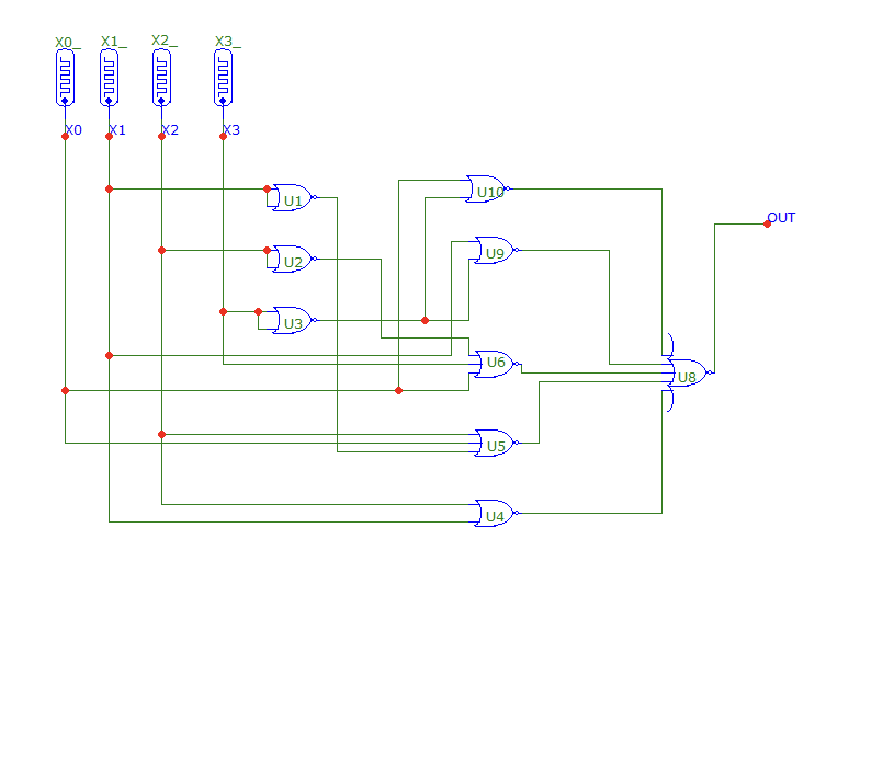
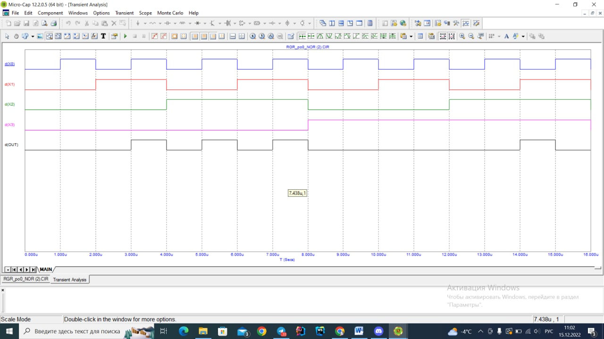

# Лабораторна робота №7

## Тема

Дослідження цифро – аналогових перетворювачів (ЦАП).

## Мета

Дослідити принцип дії, основні властивості та характеристики цифро–аналогових перетворювачів (ЦАП). Ознайомитись із основними видами, параметрами цих пристроїв та областю їх застосування.

## Завдання

1. За таблицею істинності для цільової функції скласти ДДНФ.
2. При можливості спростити або мінімізувати отриману ДДНФ.
3. Перевести ДДНФ, отриману в завданні 2 (якщо ДДНФ була мінімізована) в базис NAND (І–НІ), промоделювати схему в Mikrocap 9, подавши на входи всі можливі комбінації для перевірки правильності схеми.
4. Перевести ДДНФ, отриману в завданні 2 (якщо ДДНФ була мінімізована) в базис NOR (АБО–НІ), промоделювати схему в Mikrocap 9, подавши на входи всі можливі комбінації для перевірки правильності схеми.
5. Зробити відповідні висновки.

## Варіант

F18 - 00100001

## Виконання лабораторної

### Розрахунки та моделі

### Мікрокап

#### NOR

#### NAND

## Виконання розрахункової

### Розрахунки з мінімізацією та моделями схем

### Мікрокап

В мене не хотів запускатися аналіз, тому я дав запустити схему одногрупниці

## Висновок

На цій лабораторній роботі я дізнався як на логічних елементах моделювати значення булевих функцій трьої змінних. Ще рік тому в нас була дискретна математика та ми готувались до таких ось завдань. За допомогою цього ми зможемо моделювати сигнали та реагувати контролерами на певні значення деяких сенсорів.
