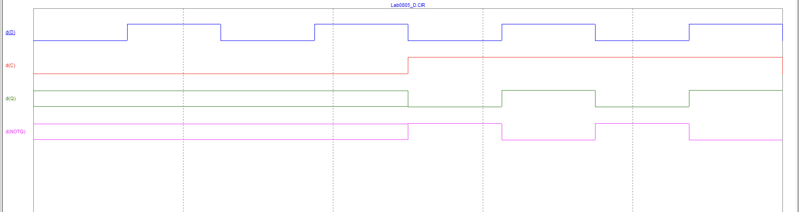

# Лабораторна робота 8

## Тема

Дослідження послідовних цифрових пристроїв (ПЦП).

## Мета

Дослідити принцип дії, основні властивості та характеристики
тригерів. Ознайомитись із основними видами, параметрами цих пристроїв та
областю їх застосування.

## Завдання

1. Схема 1. Дослідження асинхронного RS–тригера на елементній базі NOR (АБО–НІ):
   1. зняти та проаналізувати залежність цифрових виходів та асинхронного RS–тригера від часу при всіх можливих комбінаціях цифрових входів та . Приклад характеристик наведений на рисунку 8.14.
2. Схема 2. Дослідження асинхронного RS–тригера на елементній базі NAND (І–НЕ):
   1. зняти та проаналізувати залежність цифрових виходів та асинхронного RS–тригеру від часу при всіх можливих комбінаціях цифрових входів та . Приклад характеристик наведений на рисунку 8.16.
3. Схема 3. Дослідження однотактного синхронного RSC–тригера:
   1. зняти та проаналізувати залежність цифрових виходів та однотактного синхронного RSC–тригера від часу при всіх можливих комбінаціях цифрових входів , та . Приклад характеристик наведений на рисунку 8.18.
4. Схема 4. Дослідження схеми Т–тригера (тригера з рахунковим входом):
   1. зняти та проаналізувати залежність цифрових виходів та Т– тригера (тригера з рахунковим входом) від часу при всіх можливих комбінаціях цифрового входу: Т. Приклад характеристик наведений на рисунку 8.21.
5. Схема 5. Дослідження однотактного синхронного D–тригера;
   1. зняти та проаналізувати залежність цифрових виходів та однотактного синхронного D–тригера від часу при всіх можливих комбінаціях цифрових входів та . Приклад характеристик наведений на рисунку 8.23.

## Виконання

### Завдання 1

### Завдання 2

### Завдання 3

### Завдання 4

### Завдання 5

## Висновок

На цій лабораторній роботі я ще більше дізнався про тригери та як їх можна зробити за допомогою логічних елементів. Розібрав різні типи тригерів та де вони можуть використовуватись. 