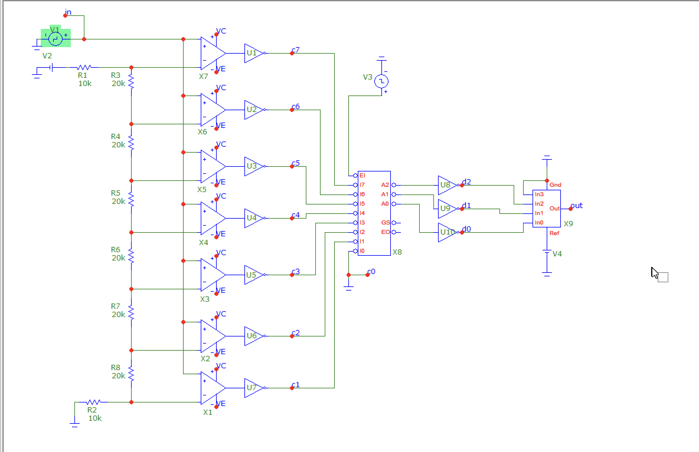
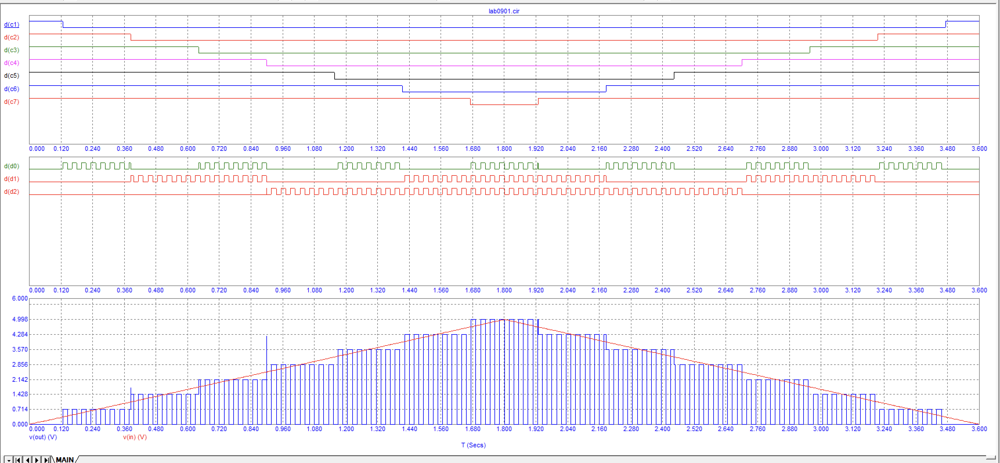
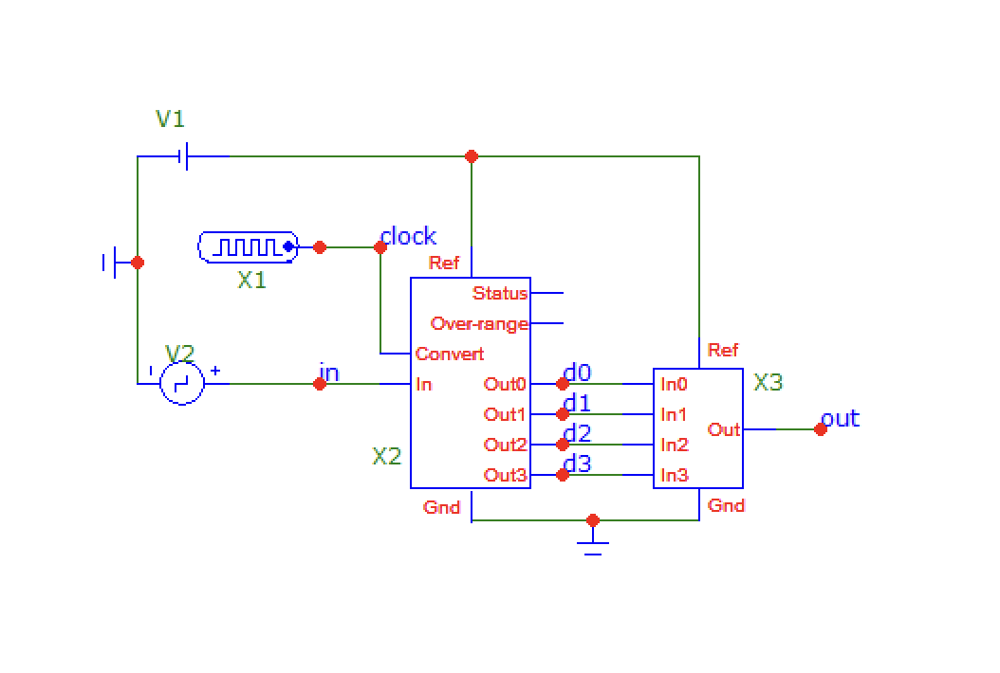
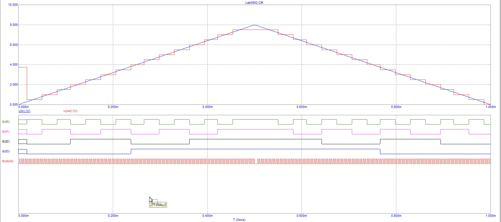

# Лабораторна робота 9

- [Лабораторна робота 9](#лабораторна-робота-9)
  - [Тема](#тема)
  - [Мета](#мета)
  - [Завдання](#завдання)
  - [Виконання](#виконання)
    - [Схема 1](#схема-1)
    - [Схема 2](#схема-2)
  - [Висновок](#висновок)

## Тема

Дослідження аналого–цифрових перетворювачів (АЦП).

## Мета

Дослідити принцип дії, основні властивості та характеристики
аналого–цифрових перетворювачів (АЦП). Ознайомитись із основними
видами, параметрами цих пристроїв та областю їх застосування.

## Завдання

1. Схема 1. Паралельний АЦП;
   1. Зняти та проаналізувати залежність вхідної, вихідної напруг паралельного АЦП, а також значень цифрових розрядів d0...d2 від часу. Вихідна напруга даної схеми – це напруга на виході мікросхеми ЦАП. Приклад характеристик наведений на рисунку 9.10.392
   2. Проаналізувати вплив пріоритетного шифратора на роботу пристрою. Пояснити чому в даному пристрої неможливе використання звичайного шифратора.
2. Схема 2. Використання мікросхем АЦП та ЦАП:
   1. зняти та проаналізувати залежність вхідної, вихідної напруг зібраної схеми, а також значень цифрових розрядів d0...d3 від часу. Вихідна напруга даної схеми – це напруга на виході мікросхеми ЦАП. Приклад характеристик наведений на рисунку 9.12.

## Виконання

### Схема 1

### Схема 2

## Висновок

На цій лабораторній роботі я дізнався про інший вид перетворювачів – аналогово-цифрові перетворювачі. Вони конветрують аналоговий сигнал у двійковий код та можуть застосовуватись для передавання комп'ютеру даних з аналогового термометру.
