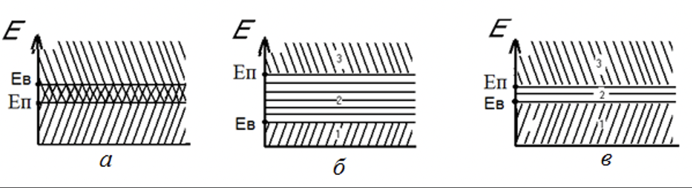
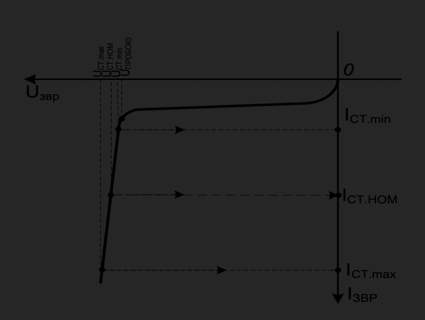

# Комп'ютерна електроніка

- [Комп'ютерна електроніка](#компютерна-електроніка)
  - [Електрофізичні властивості напівпровідників](#електрофізичні-властивості-напівпровідників)
    - [Елергетичні рівні електронів у атомі](#елергетичні-рівні-електронів-у-атомі)
    - [Стани електронів в твердому тілі](#стани-електронів-в-твердому-тілі)
    - [Електропровідність матеріалів](#електропровідність-матеріалів)
    - [Розподіл електронів за квантовими станами](#розподіл-електронів-за-квантовими-станами)
    - [Фізичні властивості напівпровідників](#фізичні-властивості-напівпровідників)
    - [Власна провідність напівпровідників](#власна-провідність-напівпровідників)
    - [Домішкова провідність напівпровідників](#домішкова-провідність-напівпровідників)
      - [Утворення електронної провідності домішкових напівпровідників](#утворення-електронної-провідності-домішкових-напівпровідників)
  - [Електронно-дірковий перехід](#електронно-дірковий-перехід)
    - [Фізичні процеси у p-n-переході за відсутності зовнішнього електричного поля](#фізичні-процеси-у-p-n-переході-за-відсутності-зовнішнього-електричного-поля)
    - [Ефект випрямлення у p-n-переході](#ефект-випрямлення-у-p-n-переході)
    - [Вольт-амперна характеристика p-n-переходу](#вольт-амперна-характеристика-p-n-переходу)
    - [Пробій p-n-переходу](#пробій-p-n-переходу)
    - [Температурні властивості p-n-переходу](#температурні-властивості-p-n-переходу)
    - [Частотні властивості p-n-переходу](#частотні-властивості-p-n-переходу)
  - [Напівпровідникові діоди](#напівпровідникові-діоди)
    - [Загальна характеристика напівпровідникових діодів](#загальна-характеристика-напівпровідникових-діодів)
    - [Випрямні діоди](#випрямні-діоди)
    - [Високочастотні і надвисокочастотні діоди](#високочастотні-і-надвисокочастотні-діоди)
    - [Імпульсні діоди](#імпульсні-діоди)
    - [Напівпровідникові стабілітрони (опорні діоди)](#напівпровідникові-стабілітрони-опорні-діоди)
    - [Тунельні діоди](#тунельні-діоди)
    - [Обернені діоди](#обернені-діоди)
    - [Перехід Шотткі](#перехід-шотткі)

## Електрофізичні властивості напівпровідників

### Елергетичні рівні електронів у атомі

Будь-яка речовина складається з великої кільності найдрібніших чатснок - молекул.  
Кожна молекула, своєю ерною, складаєтсья з атомів, а якщо точніше, з атомних ядер, оточених певнім числом внутрішніх електронів, та зовнішніх валентних електронів.  
Валентні електрони обертаються навколо ядра, займають зовнішні елетронні орбіти на найслабше зв'язані з ядром атома.  
За взаємними розрашуванням атомів або молекул тверді тіла поділяють на кристалічні та аморфні. Основним матеріаллом для виготолення електронних пристороїв є напівпровідники, які відносяться до кристалічних.  
Згідно з квантовою теорією електрон може мати цілком певні дискретн або квантові значення ерергії і дискрені значення орбітальної швидкості, тому електрон навколо ядра може рухатися тільки за певними орбітами.  
Кожній орбіті відповідає своя енергія електрона або енергетичний рівень.  
Під час поглинання ерергії атотом якийсь електорон може перейті на ндин з вищих рівнів або зовсім залишити атом

### Стани електронів в твердому тілі

Взаємодія багатьох атомів у твердому тілі викликає зсув і розщеплювання енергетичних рівнів електронів.  
Якщо r >> r2, атоми не впливають один на одний. У разі зближенні атомів на відстань r < r2 відбувається розщеплення рівня   на шість дискретних значень. Подальше зменшення r < r1 супроводжується розщепленням енергетичного рівня  . Якщо r = r0, у системі утворюються дві сукупності дискретних енергетичних станів, що лежать в інтервалах   і  , іх називають дозволеними енергетичними зонами. Зони   і   за r = r0 розділені проміжком ∆Е3, що не містить енергетичних станів. Такий проміжок називають забороненою зоною.  
  
Заборонені зони відповідають таким значенням енергії, які електрон мати не може.
Рівні енергії, зайняті електронами за температури 0 К, коли немає зовнішніх впливів, утворюють у твердому тілі заповнену зону. Сукупність енергетичних рівнів валентних електронів утворює валентну зону (верхня частина заповненої зони).  
Дозволені рівні енергії, які залишаються незайнятими за Т = 0 К, утворюють вільну зону. Нижню частину вільної зони називають зоною провідності, оскільки рівні, що входять у неї, можуть займати валентні електрони, що отримали додаткову енергію ззовні.  
Енергетичні рівні та енергетичні зони характеризують тільки енергетичне положення електрона, а не його геометричне розміщення у твердому тілі.

### Електропровідність матеріалів

Електропровідність матеріалів визначається шириною забороненої зони між валентною зоною і зоною провідності.  
У провідника провідності і валентна зона перекриваються
У діелектриків ширина забороненої зони велика
Для напівпровідників заборонена зона відносно невелика (приблизно 0,5–2 еВ).  
  
а – провідник; б – діелектрик;
в – напівпровідник

### Розподіл електронів за квантовими станами

Процес заняття електронами того або іншого енергетичного рівня має імовірнісний характер
  

### Фізичні властивості напівпровідників

Напівпровідникові матеріали мають питомий опір 10^-4 Ом см
Отже, за своїм питомим опором напівпровідники займають проміжну область між провідниками і діелектриками
Чистий напівпровідник за досить низьких температурах подібний до діелектрика.  
Характерною властивістю напівпровідників є сильна зміна питомого опору під впливом електричного поля, опромінювання світлом або іонізованими частинками, а також під час введення у напівпровідник домішки або під час його нагрівання.

### Власна провідність напівпровідників

Кристалічних ґрат германію – елемента IV групи періодичної системи елементів Менделєєва. На рисунку об’ємні кристалічні ґрати германію, елементарною геометричною фігурою якої є тетраедр, зображена у вигляді площинних ґрат.
  
Атоми германію розташовуються у вузлах ґрат і пов’язані з іншими атомами за допомогою чотирьох валентних електронів. Подвійні лінії між вузлами ґрат умовно зображають ковалентний зв’язок між кожною парою електронів, що належать двом різним атомам. У ідеальному кристалі германію за температури абсолютного нуля   = 0 К всі ковалентні зв’язки заповнені і кожен атом має добудовану оболонку, що складається з восьми електронів. Валентна зона повністю зайнята електронами, а зона провідності порожня.  
За температури вище абсолютного нуля частина електронів розриває ковалентні зв’язки і переходить у зону провідності, звільняючи енергетичні рівні у валентній зоні. Вакантний енергетичний рівень у валентній зоні називають діркою провідності, яка у електричному і магнітному полях поводиться, як частинка із додатним зарядом. Такий процес утворення пар електрон провідності, дірка провідності називають генерацією пар електрон дірка
можливий процес захоплення електронів зони провідності дірками валентної зони.  
Процес зникнення пар електрон дірка називають рекомбінацією. Цей процес супроводжується виділенням енергії, яка нагріває кристалічні ґрати і частково випромінюється у зовнішнє середовище.  
за температури вище за абсолютний нуль кристал набуває здатність проводити електричний струм.
Провідність визначається рухом обох видів носіїв – електронів і дірок.
Таку провідність називають власною, а напівпровідник – власним напівпровідником. Ця провідність зазвичай невелика і збільшується з підвищенням температури.

### Домішкова провідність напівпровідників

Якщо у кристал германію або кремнію додати домішки елементів III або V групи таблиці Менделєєва, то такий напівпровідник називають домішковим.  
Домішкові напівпровідники мають значно більшу провідність порівняно з напівпровідниками із власною провідністю.  
Домішки бувають донорні і акцепторні. Донорні домішки віддають свої електрони, створюючи у кристалі електронну провідність, а акцепторні – захоплюють електрони з ґрат основного кристалу, створюючи діркову провідність домішкового напівпровідника.  

#### Утворення електронної провідності домішкових напівпровідників

Під час внесення до заздалегідь очищеного германію домішки п’ятивалентного елемента (наприклад, миш’яку – As) атоми домішки заміщають у вузлах кристалічних ґрат атоми германію, при цьому чотири з п’яти валентних електронів миш’яку утворюють ковалентні зв’язки з чотирма сусідніми атомами германію подібно до зв’язків у власному напівпровіднику. П’ятий електрон виявляється надлишковим
Енергетичний рівень донорної домішки   лежить у забороненій зоні поблизу дна зони провідності.  

У вузлах кристалічних ґрат германію, що зайняті атомами домішки, утворюються додатно заряджені іони (на рис. 1.9 показані у вигляді квадратиків)
  
У вузлах кристалічних ґрат германію, що зайняті атомами домішки, утворюються додатно заряджені іони (на рис. 1.9 показані у вигляді квадратиків)
Такий напівпровідник має, переважно, електронну провідність, або провідність  n-типу (n-напівпровідник), а домішка, здатна віддавати електрони, називається донорною.
Під час додавання у кристал германію домішки елементів III групи (наприклад, індію –  ) атоми індію заміщають у вузлах кристалічних ґрат атоми германію  
  
Оскільки домішковий енергетичний рівень індію   лежить у забороненій зоні поблизу валентної зони Ge, то досить дуже невеликої енергії
У результаті у валентній зоні утворюються надлишкові вакантні енергетичні рівні (дірки), а атоми індію перетворюються на від’ємні іони (на показано три від’ємних іони домішки у вигляді квадратиків).  
Домішку, введення якої зумовлює утворення дірок у валентній зоні, називають акцепторною. У напівпровіднику типу p основними носіями є дірки, а неосновними – електрони.

## Електронно-дірковий перехід

### Фізичні процеси у p-n-переході за відсутності зовнішнього електричного поля

Під час виготовлення p-n-переходів концентрація атомів донорної домішки у n-області складає близько 10^15  см–3, а концентрація атомів акцепторної домішки у р-області – близько 10^18  см–3

Розглянемо фізичні процеси у p-n-переході за умови, що:

- На межі розділу p- і n-областей відсутні механічні дефекти і включення інших хімічних матеріалів
- За кімнатної температури всі атоми домішки іонізовані
- На межі p- та n-областей p-n-переходу тип домішки різко змінюється. Оскільки концентрація електронів в n-області набагато більше концентрації електронів в p-області, а концентрація дірок у p-області набагато більше концентрації дірок в n-області то на межі розділу напівпровідників виникає градієнт (перепад) концентрації рухомих носіїв заряду (дірок і електронів)
Під дією градієнта концентрації заряди дифундуватимуть із області з вищою концентрацією в область із зниженою концентрацією, тобто електрони переміщаються із n-області у p-область, а дірки – у протилежному напрямку. Це рух зарядів (основних носіїв) утворює дифузійний струм
p-n-переходу  
Це поле перешкоджає подальшому проходженню дифузійного струму (струму основних носіїв). Збіднений шар має малу електропровідність, оскільки в ньому практично відсутні рухомі носії заряду. Тому його ще називають запірним шаром. Наявність цього шару обумовлює виникнення у p-n-переході контактної різниці потенціалів, що зазнає найбільшу зміну на межі напівпровідників n- і p-типів і називається потенційним бар’єром
Неосновні носії – електрони p-області дрейфуватимуть у n-область, а дірки n-області – у зворотному напрямку

### Ефект випрямлення у p-n-переході

Зворотне включення p-n-переходу. Зворотне включення
p-n-переходу наведено на рис. 1.13, г. У цьому випадку зовнішнє електричне поле збігається з полем p-n-переходу
Для неосновних носіїв потенційний бар’єр відсутній, і вони будуть втягуватися у p-n-перехід полем, що створюється зовнішньою напругою UЗВР, і будуть виводитися через нього у область, де вони є основними носіями. Цей процес називають екстракцією.
У цьому разі напрямок дії зовнішнього поля протилежний дії поля p-n-переходу. Висота потенційного бар’єру зменшується

Процеси у p-n-переході за: а, б, в – відсутності зовнішньої напруги; г, д, е – за U = Uзвр ; ж, з, и – за U = Uпр
Ширина збідненого шару p-n-переходу і його опір проходженню дифузійного струму зменшуються.  
Дифузійна складова струму через перехід збільшується, а дрейфова зменшується. Поблизу p-n-переходу з’являється велика кількість неосновних носіїв. Процес введення носіїв заряду через p-n-перехід у область, де вони є неосновними носіями, під час зниження висоти потенційного бар’єру називається інжекцією
область p буде більш низькоомною – її називають емітером, а область n – більш високоомною – її називають базою.  
Під час збільшення Uпр потенційний бар’єр у p-n-переході зникає, дрейфовий струм прагне до нуля і через p-n-перехід буде проходити дифузійний струм (струм основних носіїв).
Неосновні носії, що вводяться через p-n-перехід за рахунок явища інжекції, частково рекомбінують з основними носіями відповідних областей.

### Вольт-амперна характеристика p-n-переходу

Вольт-амперна характеристика (ВАХ) p-n-переходу – це залежність струму через p-n-перехід від величини і полярності прикладеної напруги.  
  
Починаючи з точки 1, потенційний бар’єр зникає, і характеристика    p-n-переходу є прямою лінією, нахил якої залежить від опору базової області.  
У разі зворотного включення опір p-n-переходу дуже великий і через нього проходить лише невеликий струм   – зворотний струм насичення.  
У точці 2 за   настає пробій p-n-переходу. Аналіз ВАХ
p-n-переходу дозволяє зробити висновок про нелінійність властивостей
p-n-переходу, а також відзначити головну властивість p-n-переходу – властивість односторонньої провідності.

### Пробій p-n-переходу

Різке збільшення диференціальної провідності p-n-переходу під час досягнення зворотною напругою деякого критичного значення називається пробоєм p-n-переходу.  
Електричний (оборотний) пробій. Електричний пробій p-n-переходу буває двох видів:

- Лавинний
- Тунельний

Електричний пробій є оборотним  
Необоротний пробій p-n-переходу. Необоротний пробій буває двох видів:

- Тепловий
- Поверхневий

### Температурні властивості p-n-переходу

### Частотні властивості p-n-переходу

Це пояснюється наявністю власної ємності між шарами напівпровідника з різними типами провідності.  
Під час зворотної напруги, що прикладена до p-n-переходу, носії заряду обох знаків знаходяться по обидва боки переходу, а у самому переході їх дуже мало  
Цю ємність називають бар’єрною  . Під час малої зворотної напруги носії зарядів протилежних знаків знаходяться на невеликій відстані один від одного, при цьому величина бар’єрної ємності велика (ширина p-n-переходу мала). Із зростанням величини зворотної напруги ширина p-n-переходу збільшується, а бар’єрна ємність зменшується.  
Під час роботи на високих частотах ємнісний опір переходу зменшується і шунтує високий опір зворотно включеного p-n-переходу. Перехід при цьому втрачає властивість односторонньої провідності.
Окрім бар’єрної ємності p-n-перехід має так звану дифузійну ємність.
Вона не має істотного впливу на роботу p-n-пер

## Напівпровідникові діоди

### Загальна характеристика напівпровідникових діодів

Напівпровідниковим діодом (НД) називають електронний прилад з дірково-електронним p-n-переходом, що має два виводи.  
За призначенням НД поділяються на випрямні, високочастотні і надвисокочастотні (ВЧ- і НВЧ-діоди), імпульсні, напівпровідникові стабілітрони (опорні), тунельні, варикапи, фотодіоди, світлодіоди та інші  
На рис показані умовні графічні позначення діодів на електричних схемах: а – випрямних, імпульсних, ВЧ- і НВЧ- діодів; б – стабілітронів; в – двосторонніх стабілітронів; г – тунельних діодів; д – обернених діодів; е – варикапів; ж – фотодіодів; з – світлодіодів.

### Випрямні діоди

Випрямні діоди (ВД) – це НД, що призначені для перетворення змінного струму у постійний у обмеженому діапазоні частот (50 Гц...100 кГц).  
У наш час в якості ВД широко використовуються кремнієві площинні діоди, що мають значно менші зворотні струми і велику зворотну напругу порівняно з германієвими. Недолік кремнієвих діодів – декілька більше пряме падіння напруги, чим на германієвих.  
В основі роботи ВД лежить властивість односторонньої провідності  p-n-переходу  
  
Ідеальний діод буде відкритий, якщо потенціал анода більш додатний (менш від`ємний) ніж потенціал катода  
  
  

### Високочастотні і надвисокочастотні діоди

Високочастотні діоди є більш універсальними, ніж випрямні, тому їх називають універсальними. Вони можуть працювати у випрямлячах змінного струму, а також у модуляторах, детекторах, різних перетворювачах електричних сигналів у широкому діапазоні частот (до сотень мегагерців). Їх недоліком порівняно з ВД є нижча здатність навантаження (потужність). ВЧ діоди ранніх розробок містять точковий p-n-перехід і називаються точковими

### Імпульсні діоди

Імпульсні діоди (ІД) – різновид ВЧ діодів, призначених для використання як ключові елементи у швидкодіючих імпульсних схемах із часом переключення ≤ 1 мс

### Напівпровідникові стабілітрони (опорні діоди)

### Тунельні діоди

Тунельним називається НД, у якому використовується тунельний механізм перенесення носіїв заряду через p-n-перехід і у ВАХ якого є ділянка від’ємного диференціального опору (ділянка 1–2)  

### Обернені діоди

Різновидом ТД є обернені діоди – ТД, у яких максимум струму на прямій гілці ВАХ або незначний або повністю відсутній. У таких діодах ппід час прямого зсуву p-n-переходу проходить дифузійний струм, як у звичайному діоді, а у разі зворотного – тунельний.  
ВАХ оберненого діода (рис. 1.25) є оберненою ВАХ звичайного ВД. Провідність обернених діодів під час зворотної напруги вища, ніж у разі прямої (у області малих напруг: 0,3…0,5 В).  

### Перехід Шотткі

Під час контакту металу з напівпровідником n-типу з’являється перехід Шотткі. Його особливість – відсутність неосновних носіїв заряду.
