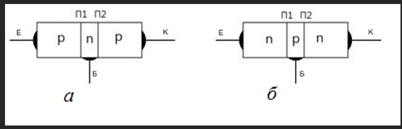
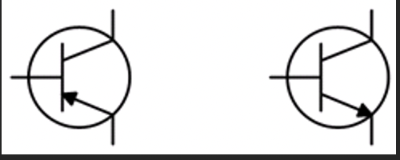
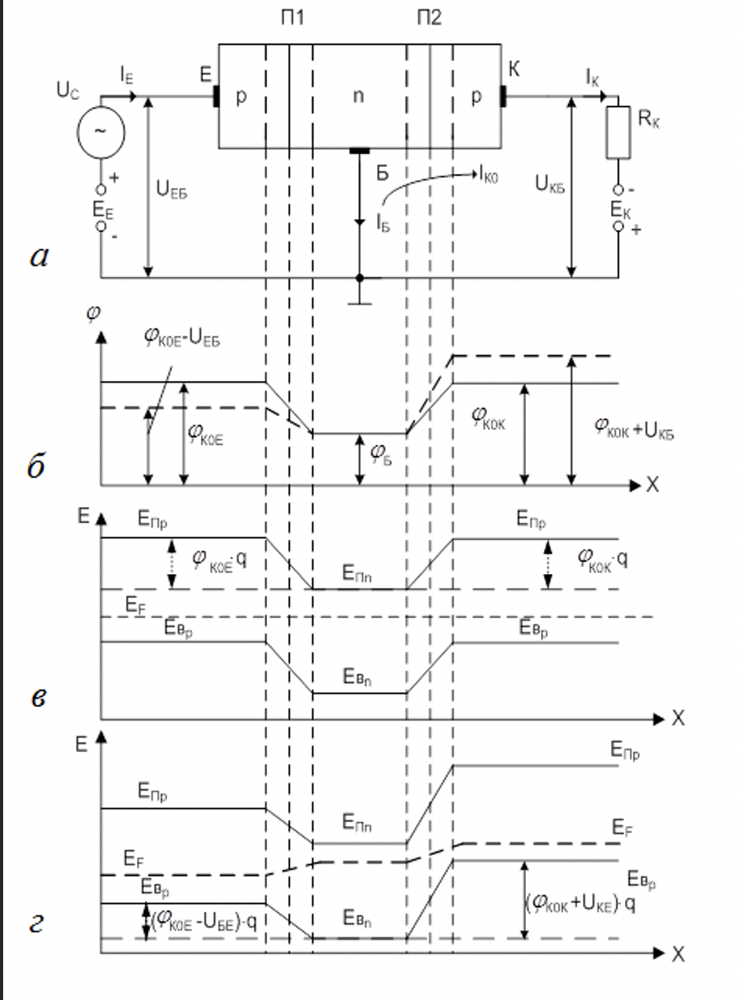
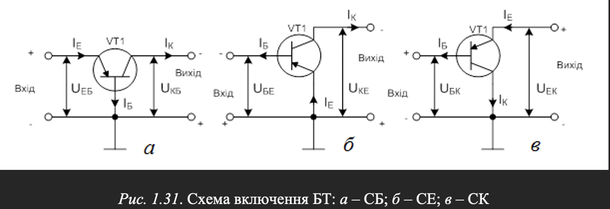
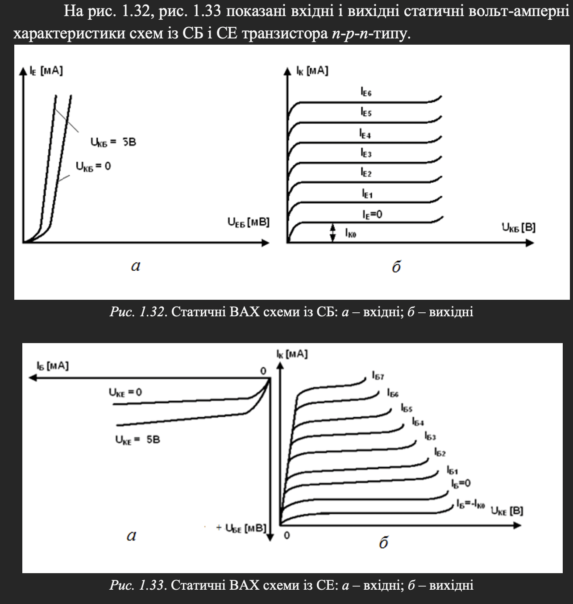
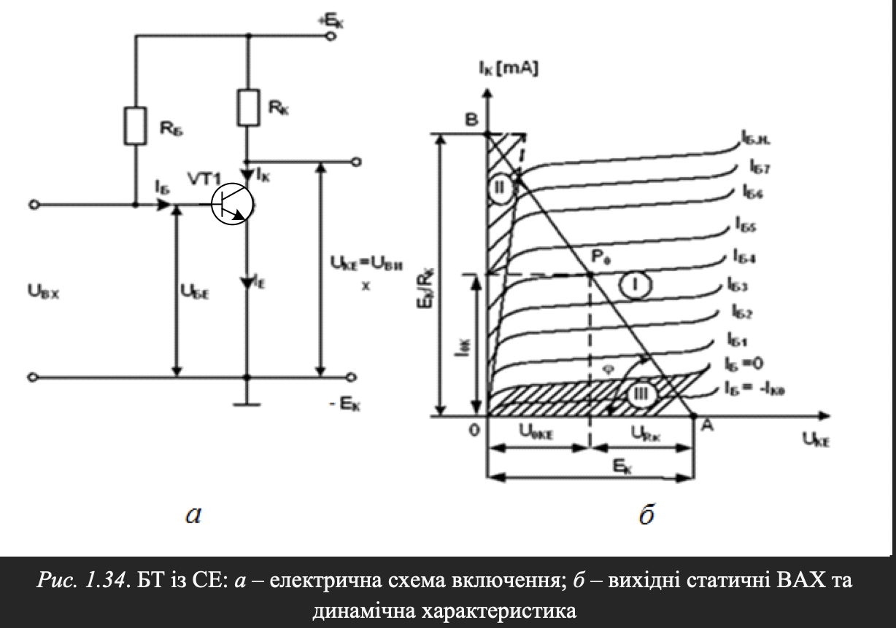
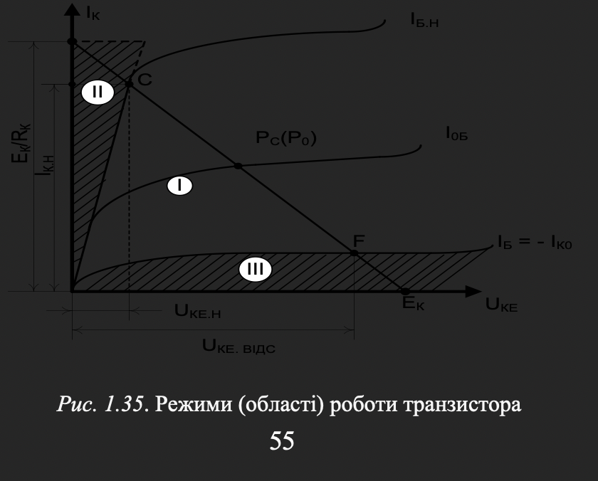
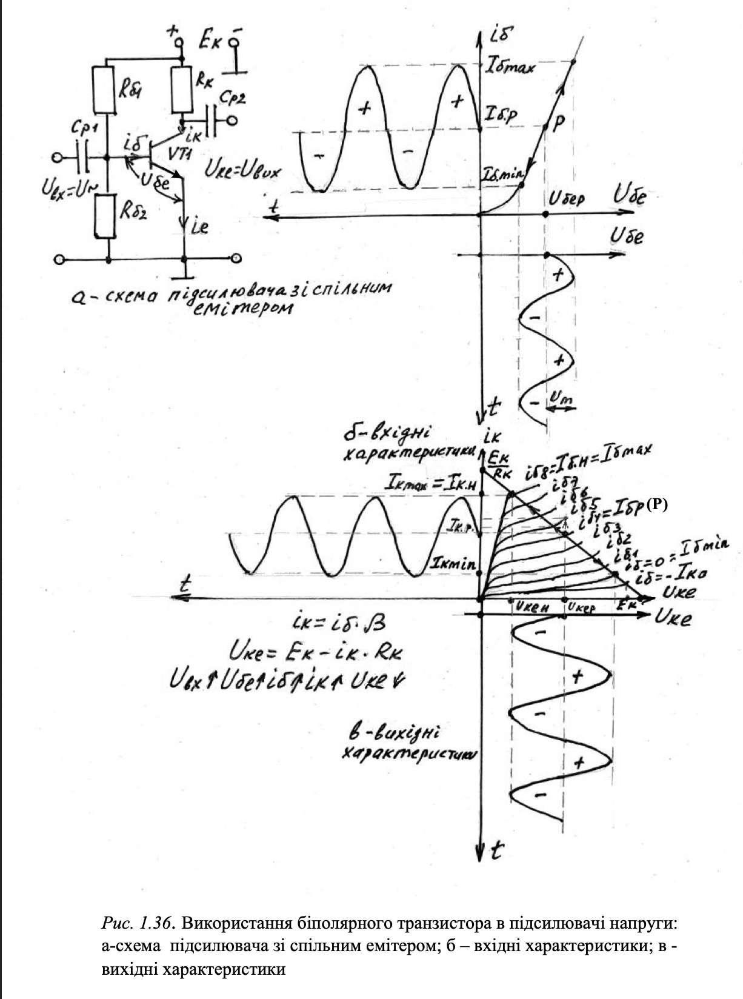

# Біполярні транзистори

Транзистори поділяються на біполярні та польові.
Біполярний транзистор (БТ) – це напівпровідниковий пристрій, який має два p-n-переходи і три виводи. У перші роки після їх винаходу транзистори називали напівпровідниковими тріодами.  
Транзистори призначені для підсилення та перетворення електричних сигналів.  
У роботі транзистора використовуються носії заряду обох полярностей (електрони та дірки), тому вони називаються біполярними  
У роботі транзистора використовуються носії заряду обох полярностей (електрони та дірки), тому вони називаються біполярними.  
  
Внутрішня область, що розділяє p-n-переходи, називається базою (Б). Зовнішній шар, призначений для інжектування носіїв у базу, називається емітером (Е), а p-n-перехід П1, що примикає до емітера, – емітерним. Інший зовнішній шар, екстрактуючий (той, що витягує) носії із бази, називається колектором (К), а p-n-перехід П2 – колекторним.  
Умовні графічні позначення БТ на схемах електричних принципових показано  
  
База створюється дуже вузькою (декілька мікрометрів); емітер містить значно більшу концентрацію домішки, ніж база; площа колекторного переходу більша, ніж емітерного.

## Принцип роботи транзистора

БТ може працювати у декількох режимах: той, що підсилює, імпульсному, ключовому і т. ін. У режимі роботи БТ, що підсилює, його емітерний перехід зміщують у прямому, а колекторний – у зворотному напрямках (рис. 1.30, а).  
За відсутності зовнішніх напруг ( ) електричні поля p-n-переходів створюються лише об’ємними зарядами іонів домішок і потенційні бар’єри обох переходів ( ) підтримують рівновагу у транзисторі (рис. 1.30, б).  
Сумарні струми через p-n-переходи дорівнюють нулю, при цьому у бездрейфових транзисторах (найбільш поширених) концентрація домішки у базі рівномірна за всією товщиною і електричне поле у базі відсутнє. Потенціал бази постійний за всією товщиною ( , рис. 1.30, б).  
  
Напругу   прикладено до емітерного переходу у прямому напрямку, а   до колекторного переходу – у зворотному Опір емітерного переходу малий і для отримання нормального струму у цьому переході достатньо напруги   у десяті долі вольта.  
Опір колекторного переходу великий, і напруга   складає одиниці – десятки вольт. У емітерному переході виникає явище інжекції  
Оскільки концентрація дірок у емітері значно перевищує концентрацію електронів у базі ( ), потік дірок із емітера у базу значно перевершує потік електронів у зворотному напрямку.  
Інжектовані дірки проникають у глибину бази  
Не зважаючи на цю відмінність, дірки, потрапивши у базу, для якої вони є неосновними носіями, починають рекомбінувати із електронами бази. Цей процес викликає додаткове прибуття електронів від зовнішнього джерела у базову область, тобто з’являється базовий струм  
У колекторному переході, включеному у зворотному напрямку, відбувається явище екстракції  
Таким чином, у транзисторі, включеному як показано на рис. 1.30, через емітерний перехід проходить вхідний струм   – який керує, а через колекторний перехід – вихідний струм  , яким керують. Інакше кажучи, транзистор – прилад, у якого вхідний струм керує вихідним.

## Схеми включення біполярних транзисторів

У електричний ланцюг транзистор включають таким чином, що один із його електродів є вхідним, в іншій – вихідним. Третій електрод – спільний щодо входу і виходу. У ланцюг вхідного електрода включають джерело вхідного змінного сигналу, а в ланцюг вихідного – опір навантаження.  
Слід пам’ятати, що у підсилювальному режимі роботи транзистора його емітерний перехід включений у прямому напрямку, а колекторний – у зворотному незалежно від схеми включення  
  
Найбільш поширеною є схема включення із СЕ (рис. 1.31, б), що має найбільше підсилення потужності.  

## Статичні вольт-амперні характеристики  транзистора

Кожна схема включення характеризується чотирма сім’ями ВАХ: а – вихідними; б – вхідними; в – характеристиками передачі за струмом;  г – характеристиками зворотного зв’язку (ЗЗ) за напругою. Перші дві з них є основними.  

  

## Робота транзистора з навантаженням  

Статичні ВАХ (рис. 1.32, рис. 1.33) знімаються за відсутності опору навантаження у вихідному ланцюзі.  
У практичних випадках вихідний ланцюг містить опір навантаження   (для схеми із СЕ). У цьому разі мають на увазі динамічний режим роботи транзистора  
У динамічному режимі зміни колекторного струму за   і   залежать не лише від зміни базового струму, але і від зміни напруги на колекторі ( ). Рівняння динаміки при цьому має вигляд  
  
Напруга  , у свою чергу, визначається змінами як базового, так і колекторного струмів, тобто у динаміці одночасно змінюються всі струми і напруги у транзисторі  
Точка перетину динамічної характеристики (прямої навантаження) з однією із статичних ВАХ називається робочою точкою транзистора ( ). Змінюючи  , можна переміщати робочу точку по прямій навантаження. Початкове положення робочої точки за відсутності вхідного змінного сигналу називають точкою спокою  

## Режими роботи транзистора

Залежно від положення робочої точки, є три основні режими роботи транзистора: активний (лінійний, підсилюючий), насичення і відсічення. Поняття режиму пов’язане із наявністю трьох областей у транзистора: активної, насичення і відсічення.
На рис. 1.35 наведено три області транзистора, відповідно I, ІІ і ІІІ.
Область відсічення обмежена зверху ВАХ, що відповідає    (обидва р-n-переходи транзистора закриті). Область насичення обмежена справа прямою лінією, з якої виходять статичні ВАХ (обидва p-n-переходи транзистора відкриті). Активна область лежить між областями відсічення і насичення (емітерний перехід відкритий, а колекторний – закритий).  
  
У активному режимі точка спокою   транзистора знаходиться приблизно посередині ділянки прямої навантаження CF (рис. 1.35), а робоча точка не виходить за межі ділянки CF. У режимі насичення робоча точка знаходиться в області насичення, а у режимі відсічення – відповідно у області відсічення.  
Активний режим є основним. Він використовується у більшості підсилювачів, генераторів і т. ін. Режими відсічення та насичення характерні для імпульсної роботи транзистора і використовуються в імпульсних пристроях.  
Властивості транзисторів істотно залежать від температури. Підвищення температури насамперед збільшує зворотний струм насичення колекторного переходу (початковий струм колектора).  

### Використання біполярного транзистора в підсилювачі напруги

На рис. 1.36а в якості прикладу наведено схему однокаскадного підсилювача з фіксованою базовою напругою, виконаного на біполярному транзисторі зі спільним емітером.  
Робоча точка транзистора обирається приблизно посередині відрізку динамічної вихідної характеристики (навантажувальної прямої) між iб.8 = Iб.Н (границя області насичення) та iб = 0 (границя області відсичення)                      (рис. 1.36в) . Положення цієї точки відповідає струму  iб.4 = Iб.Р.
Цей струм визначає положення робочої точки за вхідною статичною ВАХ (рис. 1.36б), яка в схемі задається за допомогою подільника напруги Eк – Rб1, Rб2. Цей визначає значення напруги Uбер. Всі названі струми та напруги забезпечують налаштування схеми за постійним струмом, оскільки підсилювач ізольований від вхідного сигналу Uвх та виходу Uвих роздільними конденсаторами Ср1, Ср2, які пропускають змінні складові сигналу та не пропускать постійну складову.  
  
При подачі на вхід схеми підсилювальної синусоїдальної напруги її додатний напівперіод буде пересувати робочу точку вгору за вхідною ВАХ. Це викличе зміну струму бази також за синусоїдальним законом, відповідно також пересування робочої точки за навантажувальною пря мою в бік області насичення.
За наведеним вище рівнянням дінаміки (6.4) збільшення струму колектора призводить до зменшення вихідної напруги Uке, тобто на виході з'являється її від'ємний напівперіод. Це говорить про те, що схема зі спільним емітером інвертує фазу вхідної напруги
