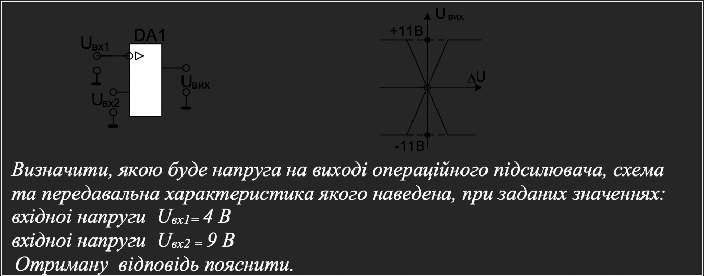
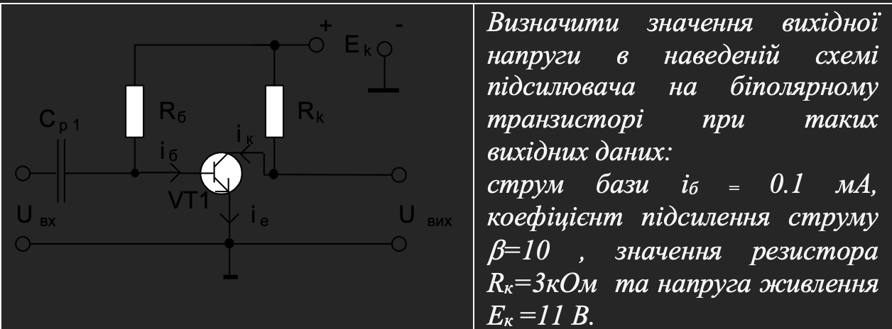
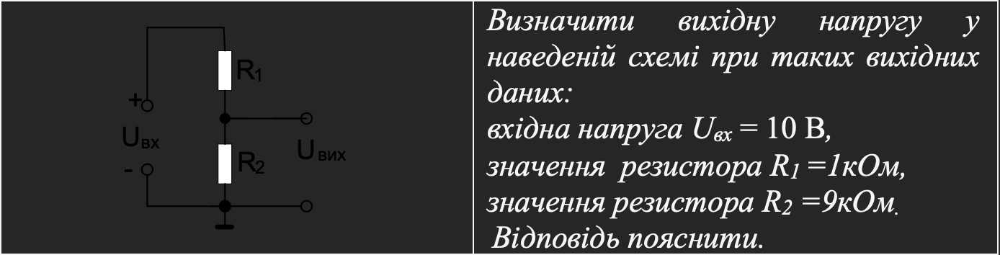
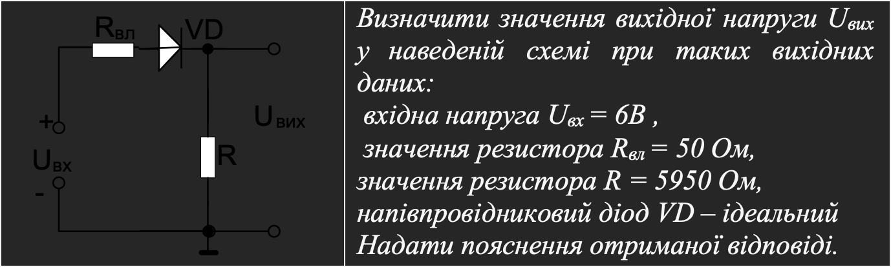
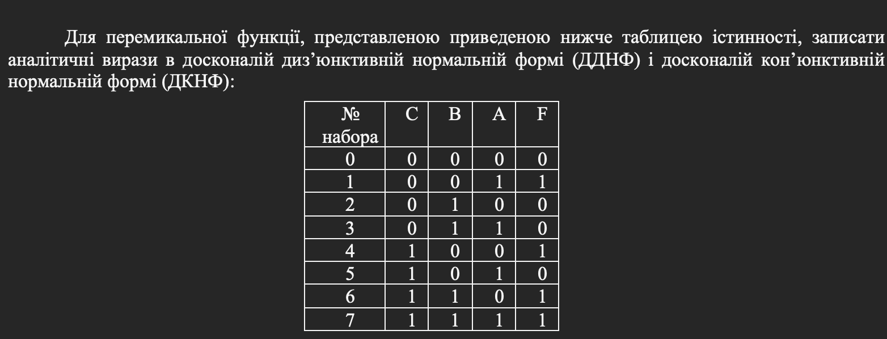
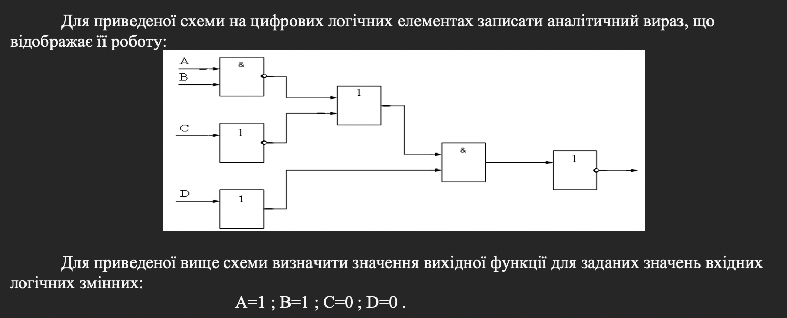
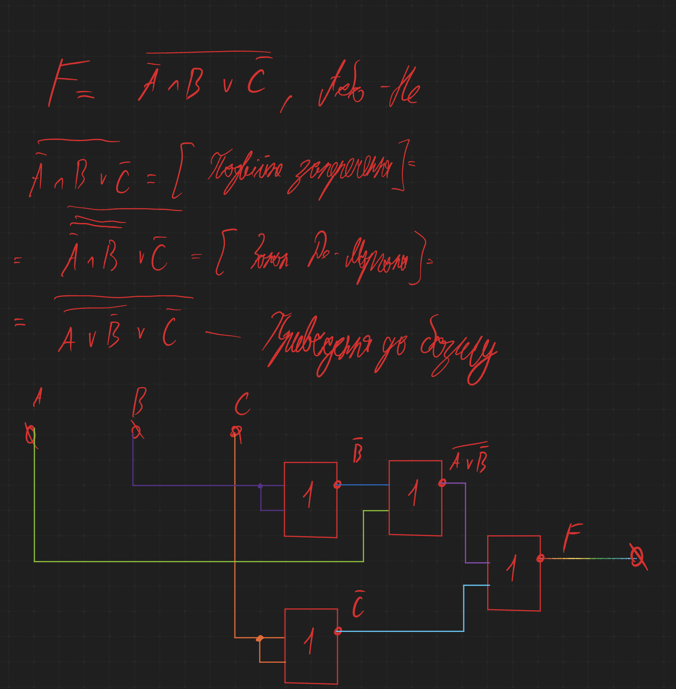
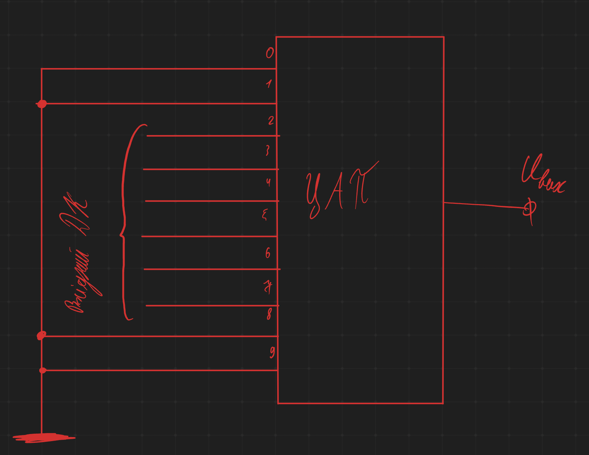

# Модульна Контрольна Робота

- [Модульна Контрольна Робота](#модульна-контрольна-робота)
  - [Автор](#автор)
  - [Варіант](#варіант)
  - [Виконання](#виконання)
    - [Питання 1](#питання-1)
    - [Питання 2](#питання-2)
    - [Питання 3](#питання-3)
    - [Питання 4](#питання-4)
    - [Питання 5](#питання-5)
    - [Питання 6](#питання-6)
    - [Питання 7](#питання-7)
    - [Питання 8](#питання-8)
    - [Питання 9](#питання-9)

## Автор

Молчанов Михайло Валерійович, ІА-12

## Варіант

45

## Виконання

### Питання 1

Передавальна характеристика операційного підсилювача у випадку, коли $\Delta U = U_{вх1} - U_{вх2}$ має вигляд прямої яка біля ові вихідної напруги змінює значення від $+U_{нас}$ до $-U_{нас}$

$\Delta U_{1} \approx |\Delta U_2| = \frac{+U_{нас}}{K_{U ІМС ОП}}$, де $U_{нас} = +11В$, а $K_{U.ІМСОП}$ - коефіцієнт підсилення інтегральної мікросхеми операційного підсилювача, який має значення десятки або сотні тисяч. Наприклад, якщо $K_{U.ІМСОП} = 10000$, то $\Delta U_1 \approx |\Delta U_2| = \frac{11}{10000} = 1.1 * 10^{-3} = 1.1 мВ$

У нашому завданні $\Delta U = U_{вх1} - U_{вх2} = 4B - 9B = -5B$. На передавальній характеристиці при $\Delta U = -5B, U_{вих} = +U_{нас} = +11B$

**Відповідь +11B**

### Питання 2

Запишемо рівняння, яке описує динамічний режим роботи транзистора:

$U_{вих} = U_{ке} = Е_{к} - i_{к} * R_{к}$

Струм колектора $i_к = i_б *\beta$, тоді $U_{вих} = E_к - i_б* \beta *R_к = 11 - 0.1* 10^{-3} *10* 3 * 10^3 = 11 - 3 = 9B$

**Відповідь $U_{вих}=9B$**

### Питання 3

Наведена схема являє собою подільник напруги $U_{вх}$s. Для неї вихідна напруга $U_{вих} = I_{подільника} * R_2$

В свою чергу струм подільника $I_{подільника} = \frac{U_{вх}}{R_1+R_2}$.

Тоді $U_{вих} = \frac{U_{вх} * R_2}{R_1+R_2}$

Для наведених вихідних даних $U_{вих} = \frac{10 * 9*10^3}{1*10^3+9*10^3} = 9B$

**Відповідь $U_{вих} = 9В$**

### Питання 4

Наведена схема являє собою подільник напруги $U_{вх}$. Для неї вихідна напруга $U_{вих} = \frac{U_{вх}*R}{R_{вл}+R_{vd}+R}$, де $R_{vd}$ опід діода VD, який включений у прямому напрямку, тобто відкритий. Для ідеального діоді його опір у відкритому стані дорівнює нулю.

Тоді $U_{вих} = \frac{U_{вх}*R}{R_{вл}+R}$.

Для наведених вхідних даних $U_{вих} = \frac{6*5950}{50 + 5950} = 5.95$

**Відповідь: $U_{вих} = 5.95B$**

### Питання 5

Ця функція має чотири конституенти одиниці $K_1, K_4, K_6, K_7$ (конституента одиниці - це одиничне значення ПФ на одному з наборів). Усього для ПФ трьох змінних може бути вісім конституент, якщо функція приймає одиничне значення на усіх наборах.

Для нашого приклада

$K_1 = \overline{C} \wedge \overline{B} \wedge A, K_4 = C \wedge \overline{B} \wedge \overline{A}, K_6=C \wedge B \wedge \overline{A}, K_7 = C \wedge B \wedge A$

Булевий вираз ПФ у ДДНФ являє собою суму конституент одиниць

$F = \overline{C} \wedge \overline{B} \wedge A \vee C \wedge \overline{B} \wedge \overline{A} \vee C \wedge B \wedge \overline{A} \vee C \wedge B \wedge A$

Булевий вираз ПФ у ДКНФ являє собою добуток конституент нуля, що записуються у вигляді диз'юнкцій. Кожна з них містить усі змінні в прямому або інверсному вигляді не більш одного разу. Для ПФ, поданої таблицею 4, булевий вираз у ДКНФ має вигляд

$F = (C \vee B \vee A) \wedge (C \vee \overline{B} \vee A) \wedge (C \vee \overline{B} \vee \overline{A}) \wedge (\overline{C} \vee B \vee \overline{A})$

### Питання 6

Наведена схема включає 6 логічних елементів:

- Кон'юнктор з інвертором для змінних A та B, на виході отримаємо $\overline{(A \wedge B)}$
- Інвертор для змінної C, на виході отримаємо $\overline{C}$
- Повторювач D, на виході буде також D
- Диз'юнктор для перших двох елементів, до дасть $\overline{(A \wedge B)} \vee \overline{C}$
- Кон'юнктор для попередньої схеми та третьої, на виході $(\overline{(A \wedge B)} \vee \overline{C}) \wedge D$
- Та останній інвертор для попердньої схеми, тоді вихід цього елемента та значення функції буде $\overline{(\overline{(A \wedge B)} \vee \overline{C}) \wedge D)}$

Знаходимо значення на наборі 12, 1100

За законами булевої алгебри кон'юнкція з нулем дає завжди 0, на передостінній схемі буде 0, бо D=0, інвертувавши це значення отримаємо значення функції на цьому наборі, $F(1100) = 1$

**Відповідь $F = \overline{(\overline{(A \wedge B)} \vee \overline{C}) \wedge D)}, F(1100)=1$**

### Питання 7

### Питання 8

$U_{вх макс} = \frac{U_{вих макс}}{K_{ПЕР}} = \frac{2^{np.вих.ДК}-1}{K_{ПЕР}}$, де np.вих.ДК - число розрядів вихідного ДК, $K_{ПЕР} = \frac{1}{10*2^{Np.вих. ДК}}$, Np.вих.ДК - номер розряду вихідного ДК. Тоді $U_{вх макс} = \frac{2^5-1}{1/20} = 31*20 = 620mB = 0.62 B$

**Відповідь $U_{вих} = 620 mB = 0.62B$**

### Питання 9

$U_{вихмакс} = U_{вхмакс} *K_{ПЕР} = (2^{npвхДК}-1)* K_{ПЕР}$, де np.вх.ДК - число розрядів вхідного ДК, $K_{ПЕР} = 10*2^{Np.вх.ДК}$, Np.вх.ДК - номер розряду вхідного ДК. Тоді $U_{вихмакс} = (2^6-1)*40$ = 63*40 = 2520 mB = 2.52 B

Схема підключення відповідного ЦАП

**Відповідь $U_{вих}=2520 mB = 2.52 B$**
