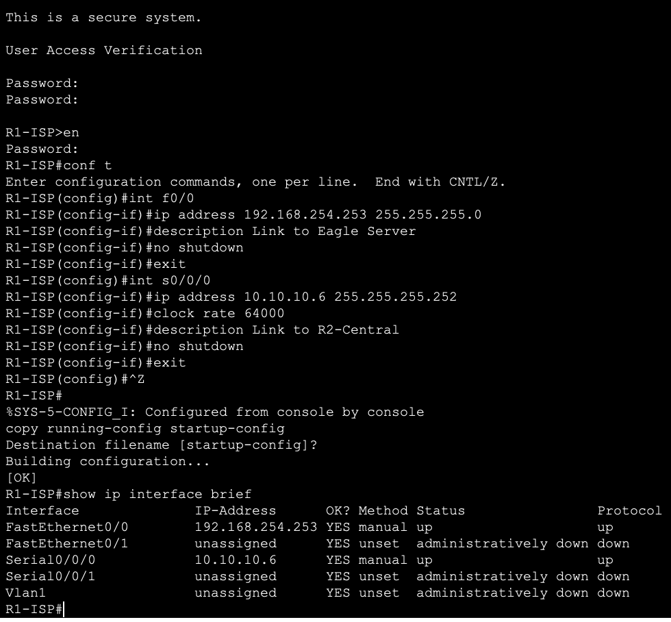

# Лабораторна робота 5

## Автори

Бригада 1, группа ІА-12.  
Молчанов Михайло Валерійович, Пуртова Аліна Геннадіївна, Запорожченко Анастасія Володимирівна, Глухов Іван Юрійович

## Виконання

### Завдання 1

Дано адресу мережі 192.168.1.0/24
Розділення на підмережі відбуватиметься наступним чином:

Так:

- у підмережі 192.168.1.0/26 буде 62 вільні хости (60 затребуваних)
- у підмережі 192.168.1.64/27 буде 30 вільних хостів (25 затребуваних)
- у підмережі 192.168.1.96/28 буде 14 вільних хостів (10 затребуваних)
- у підмережі 192.168.1.112/28 буде 14 вільних хостів (7 затребуваних)
- у підмережі 192.168.1.128/30 буде 2 вільні хости (2 затребуваних)
- у підмережі 192.168.1.132/30 буде 2 вільні хости (2 затребуваних)
- у підмережі 192.168.1.136/30 буде 2 вільні хости (2 затребуваних

Підключивши між собою девайси, матимемо наступну топологію

### Завдання 2

У цій вправі ми налаштуємо паролі та банери на маршрутизаторах і світчах.
В першому завданні ми повинні задати паролі та банери для роутера R1-ISP.
Для цього ми клікаємо на роутер та відкриваємо інтерфейс командного рядка, де і будемо працювати. По дефолту в нас завжди спочатку відкривається звичайний користувацький режим, тому щоб увійти у привілейований режим ми вводимо  команду `enable`. Далі, для того щоб відкрити режим глобальної конфігурації вбиваємо `config terminale` (або config t).

Використовуючи команду  `enable secret class` встановлюємо зашифрований пароль для привілейованого входу. У режимі глобальної конфігурації використовується команда `line console 0`, щоб увійти в конфігураційний режим рядка для консолі. Нуль використовується для позначення першого (а найчастіше - єдиного) інтерфейсу консолі. Друга команда - `password cisco` визначає пароль для консолі рядка. Потім необхідно ввести слово `login`, щоб дозволити вхід під вказаним паролем.

Наступною виконуємо процедуру аналогічну налаштуванню пароля на консоль, тільки дії виконуються не в режимі конфігурування консолі (con 0), а в режимі налаштування віртуальних терміналів `vty 0 4`, де цифри «0» і «4» слід трактувати як «Перейти в режим конфігурування всіх віртуальних терміналів з нульового до четвертого». Зазвичай для telnet-а використовуються саме ці 5 віртуальних терміналів. Якщо один термінал зайнятий підключенням, людина підключиться до наступного вільному. Цей пароль буде працювати і для доступу по SSH, якщо сам SSH налаштований.

У набір команд Cisco IOS входить команда, що дозволяє налаштувати повідомлення, яке бачитимуть всі, хто входить у систему на комутаторі. Це повідомлення називається повідомленням дня або банером MOTD (message of the day).

Після завершення налаштувань вводимо `copy running-configuration startup-configuration` - ця команда збереже поточні модифікації в налаштуваннях (running-configuration, що зберігається в RAM), в незалежну RAM (NVRAM). Якщо раптово зникне електроживлення, дані в NVRAM збережуться.
Для того, щоб перевірити всі модифікації можна використати команду `show running-config`, потім `exit -> enter`, щоб реконектнутись та побачити баннер.

Наступним підзавданням є повторити всі ці кроки на встановлення паролів та баннерів для інших девайсі, а саме, R2-Central та S1-Central.

### Завдання 3

У цьому завданні ми створимо резервну копію конфігурації роутера в текстовий файл, очистимо конфігурацію та відновимо її з текстового файлу.

Для цього ми заходимо в інтерфейс командного рядка роутера R2-Central за паролем cisco. І далі за паролем class переходимо у привілейований режим. Вводимо команду `show running-config`, щоб побачити дійсну конфігурацію та копіюємо все від "version" і до "end" у звичайний файл-блокнот.

Далі вводимо команду `erase startup-config` та `reload`.

Коли з’являється запит, вводимо ні, щоб обійти діалогове вікно конфігурації, входу до маршрутизатора та у режим глобальної конфігурації.

Переходимо до текстового файлу, який ми створили, і копіюємо його у режим глобальної конфігурації у вікні CLI, щоб ввести конфігурацію так, ніби її було введено. Перевіряємо конфігурацію, ввівши команду `show running-config`.

Завдання выконане

### Завдання 4

В цьому завданні потрібно використовуючи командний рядок приладів cisco налагодити інтерфейси та звичайну конфігурацію

В цьому завданні використовуємо наступну таблицю адресів:

Почнемо з роутера R1.

Виконаємо наступні кроки для його конфігурації:

- Підкючаємося за допомогою введення паролю `cisco`
- Заходимо в привілейований режим за допомогою команди `en` та з паролем `class`
- Починаємо конфігурацію з терміналу командою `conf t`
- Налагоджуємо інтерфейс fa0/0
  - Обираємо його за допомогою `int f0/0`
  - Налагоджуємо ip адресу `ip address 192.168.254.253 255.255.255.0`
  - Додаємо опис `description Link to Eagle Server`
  - Вмикаємо його `no shutdown`
  - Повертаємось назад `exit`
- Налагоджуємо інтерфейс s0/0/0
  - Обираємо його `int s0/0/0`
  - Ставимо ip адресу `ip address 10.10.10.6 255.255.255.252`
  - Оскільки це serial інтерфейс, встановимо також clock rate `clock rate 64000`
  - Додаємо опис `description Link to R2-Central`
  - Вмикаємо його `no shutdown`
  - Повертаємось `exit`
- Завершуємо конфігурацію за допомогою надсилання символу кінця файлу `^z`
- Збережемо цю конфігурацію в NvRAM `copy running-config startup-config`
- Можемо переглянути конфигурацию `show running-config`
- Щоб було зрозуміліше та зручніше переглядати інформацію можемо використати `show ip interface brief`

Вигляд виконання цих команд в packet tracerі:

Наступний крок - конфігурація R2-central. Оскільки всі дії такі самі, я не буду їх знову всі прописувати. Але ip адреси використовуємо інші:
| interface | ip                | description        |
| --------- | ----------------- | ------------------ |
| fa0/0     | 172.16.255.254/24 | Link to S1-Central |
| s0/0/0    | 10.10.10.5/30        | Link to R1-ISP     |

Вигляд виконання цих команд:

Налагоджуємо свіч

- Підключаємося за допомогою пароля `cisco`
- Відкриваємо привілейований доступ `en`, `class`
- Починаємо конфігурацію `conf t`
- Налагоджуємо vlan
  - Використовуємо `int vlan 1` для підключення до потрібного інтерфейсу
  - Налагоджуємо ip адресу `ip address 172.16.254.1 255.255.0.0`, дуже важливо не переплутати з маскою
  - Вмикаємо `no shutdown`
  - Повертаємось `exit`
- Для свіча потрібно нагалотиди default gateway, в нашому випадку `ip default-gateway 172.16.255.254`
- Завершуємо конфігурацію `^z`
- Зберігаємо `copy running-config startup-config`
- Переглядаємо конфігурацію інтерфейсів `show ip interface brief`

Приклад виконання цих команд

Завдання виконано

