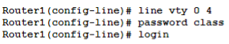
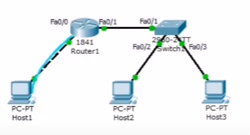
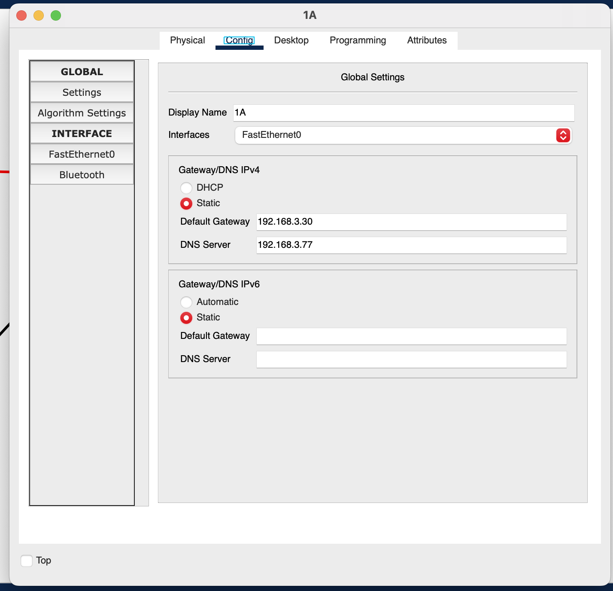

# Лабораторна робота 6

## Автори

Бригада 1, группа ІА-12.  
Молчанов Михайло Валерійович, Пуртова Аліна Геннадіївна, Запорожченко Анастасія Володимирівна, Глухов Іван Юрійович

## Виконання

### Завдання 1

Аби зрозуміти, чому команда команду `ping 192.168.254.254` не дає очікуваний результат, ми почергово пінгуємо різні ip-адреси.

Вводимо команду `ping 172.16.255.254` (IP-адреса локального інтерфейсу маршрутизатора R2-Central). Пінг успішний.

Вводимо команду `ping 10.10.10.5` (IP-адреса послідовного інтерфейсу маршрутизатора R2-Central). Пінг успішний.

Вводимо команду `ping 10.10.10.6` (IP-адреса послідовного інтерфейсу маршрутизатора R1-ISP). Пінг успішний.

Вводимо команду `ping 192.168.254.253` (IP-адреса інтерфейсу FastEthernet маршрутизатора R1-ISP). Виникає помилка, отже проблема саме із цим підключенням. Щоб вирішити цю проблему ми заходимо у вкладку CLI роутера R1-ISP. Далі вводимо команду `show ip interface brief`. Із результатів бачимо, що стан інтерфесу Serial0/0/0 down. Тому ми змінюємо цей стан за допомогою команди `no shutdown`. Після цього перевіряємо результат командою `ping 192.168.254.254`. Пінг успішний.

### Завдання 2

1. Обраховуємо потрібні ip адресси та сабнет маски   
2. Фізично підключайэмо пристрої. 
3. Підключяэмо хост-комп’ютер до маршрутизатора через термінал PT 
4. Налаштовуэмо налаштування імені хоста глобальної конфігурації  
5. Налаштовуэмо банер MOTD 
6. Налаштовуэмо привілейований пароль exec. 

7. Налаштовуэмо пароль консолі. 
8. Налаштовуэмо пароль віртуальної лінії  
9. Налаштовуэмо інтерфейс маршрутизатора fa0/0. 
10. Налаштовуэмо інтерфейс маршрутизатора fa0/1. 
11. Налаштовуэмо головний комп'ютер. 
12. Перевіряэмо підключення до мережі. 
13. Порівнюэмо конфігурації RAM і NVRAM маршрутизатора. 
14. Зберігаємо конфігурацію ОЗУ в NVRAM. 
15. Підключаємо хост до комутатора. 
16. Налаштовуємо налаштування імені хоста глобальної конфігурації. 
17. Налаштовуємо банер MOTD. 
18. Налаштовуємо привілейований пароль exec. 
19. Налаштовуємо пароль консолі. 
20. Налаштовуємо пароль віртуальної лінії. 

Отримаємо виконану частину лаборатоної

### Завдання 3

1. Зробити Основні конфігурації на ROUTER1  
2. Налаштувати сервер TFTP завдяки 3 параметрам 
3. Перевірити підключення. Усе праціює
4. Скопіювати конфігурації(Копіювати Запуск TFTP)
5. Перевірити передачу TFTP

Отримаємо виконану частину лабороторної

### Завдання 4

З'єднуємо компоненти між собою правильними кабелями в правильні порти. Отримаємо наступне: 

Для зручності роботи, заповнимо таблицю, щоб потім використовувати її для з'єднань(я буду писати тільки останню частину адрес, бо початок завжди однаковий)

| Device | Interface | IP  | Mask | Default Gateway |
| ------ | --------- | --- | ---- | --------------- |
| R1     | fa00      | 78  | 240  | no              |
| R1     | s000      | 98  | 252  | no              |
| R2     | fa00      | 30  | 224  | no              |
| R2     | s000      | 97  | 252  | no              |
| 1A     | no        | 1   | 224  | 30              |
| 1B     | no        | 2   | 224  | 30              |
| Eagle  | no        | 77  | 240  | 78              |
| Switch | VLan1     | 29  | 224  | no              |

Налагоджуємо сервер:

1. Вмикаємо та налагоджуємо dns 
2. Вмикаємо http 
3. Налагоджуємо інтерфейс 
4. Налагоджуємо default gateway 

Налагоджуємо роутер R1. Для цього використовуємо наступні команди

- `enable`
- `config t`
- `hostname R1-ISP`
- `banner motd %**This is lab router R1-ISP. Authorized access only.**%`
- `enable secret cisco`
- `line console 0`
- `password cisco`
- `login`
- `line vty 0 15`
- `password cisco`
- `exit`
- `int fa0/0`
- `ip address 192.168.3.78 255.255.255.240`
- `no shutdown`
- `exit`
- `int s0/0/0`
- `ip address 192.168.3.98 255.255.255.252`
- `clock rate 64000`
- `no shutdown`
- `exit`
- `ip route 192.168.3.0 255.255.255.224 192.168.3.97`
- `exit`
- `copy running-config startup-config`
- `exit`

Цей роутер можна вважати налагодженим, тепер налагодимо роутер R2. Більшість команд повторяються, але пропишемо їх всі

- `enable`
- `config t`
- `hostname R2-Central`
- `banner motd %**This is lab router R2-Central. Authorized access only.**%`
- `enable secret cisco`
- `line console 0`
- `password cisco`
- `login`
- `line vty 0 15`
- `password cisco`
- `login`
- `exit`
- `int fa0/0`
- `ip address 192.168.3.30 255.255.255.224`
- `no shutdown`
- `exit`
- `int s0/0/0`
- `ip address 192.168.3.97 255.255.255.252`
- `no shutdown`
- `exit`
- `ip route 0.0.0.0 0.0.0.0 192.168.3.98`
- `exit`
- `copy running-config startup-config`
- `exit`

Роутер нагалоджено. Залишилось тільки свіч та комп'ютери. Налагодимо свіч

- `enable`
- `config t`
- `enable secret cisco`
- `hostname S1-Central`
- `banner motd %**This is lab switch S1-Central. Authorized access only.**%`
- `line console 0`
- `password cisco`
- `login`
- `line vty 0 15`
- `password cisco`
- `login`
- `int vlan1`
- `ip address 192.168.3.29 255.255.255.224`
- `no shutdown`
- `exit`
- `exit`
- `copy running-config starup-config`

Залишились тільки комп'ютери. Встановлюємо їм однакові gateway та dns 

Та встановлюємо кожному свій ip.

Перевіремо роботу. Зайдемо на сайт eagle-server.example.com на одному з комп'ютерів

Все працює, отже завдання виконано
