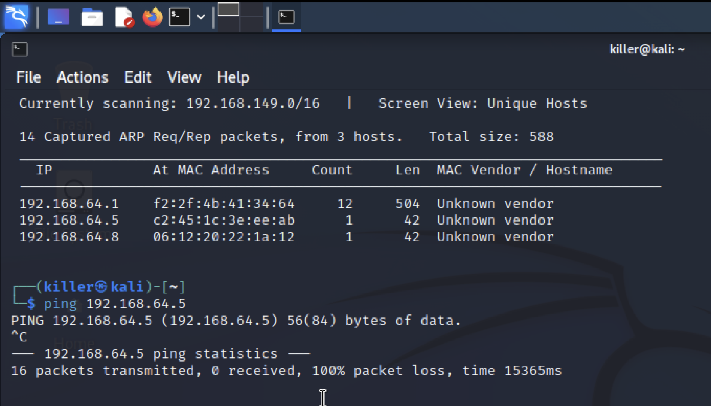
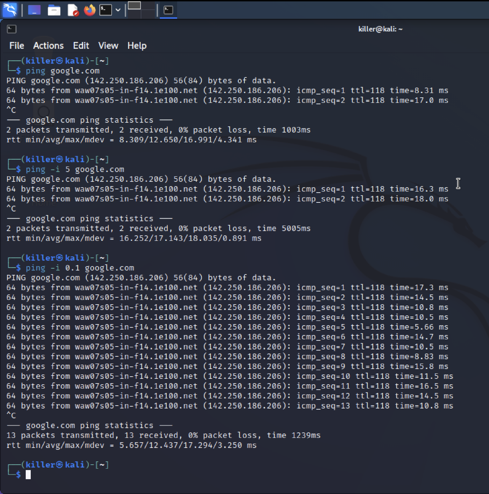

# Лабораторна робота 7

## Тема

Програмні засоби діагностики мереж, освоєння: — arp, arping, ping, traceroute, mtr

## Мета

Ознайомитись з програмними засобами діагностики мереж, освоївши при цьому arp, arping, ping, traceroute, mtr

## Виконання

Звдання з аналізу мережі я буду виконувати на операційній системі Kali Linux, бо це найкраща ОС для тестування безпеки мереж, застосунків та багато іншого. Загалом операції я буду проводити з іншою віртуальною машиною, яка є в тій самій мережі, Windows 11. За допомогою застосунку `netdiscover` переріримо межежу на хости, там буде старий запис з windows11 та новий, де я змінив mac адресу на щось цікавіше(06.12.2022 IA-12)

### Завдання 1

#### Зміна інтервалів

#### Кількість відправлень

#### Звук

#### Зміна розміру

#### Статистика

### Завдання 2

#### Подивитись кеш

ip адреса, тип mac адреси та сама mac адреса, флаги маски, інтерфейс за яким пристрій

#### Додати прибрати

### Завдання 3

На відміну від ping, arping використовує протокол arp, що працює на 2 рівні. Основні відмінності в параметрах - можна вказати вхідне чи вихідне повідомлення протоколу arp, налаштування тільки на броадкаст пакети

### Завдання 4

traceroute - команда, яка дозволяє аналізувати який шлях по маршрутизаторам проходять пакети перед тим як дійти до потрібної нам ip адреси.

mtr - парацює за принципом traceroute, але не припиняє пісня знаходження шляху, натомість постійно оновлює його та може використовуватися, щоб знайти "bottle neck" в мережі

## Висновок

На цій лабораторній роботі я познайомився з базовими утилітами для дослідження мережі з моїм пристроєм, та шляху до інших мереж. Також я трохи погрався з kali linux та пакетним менеджером, щоб встановити mtr
