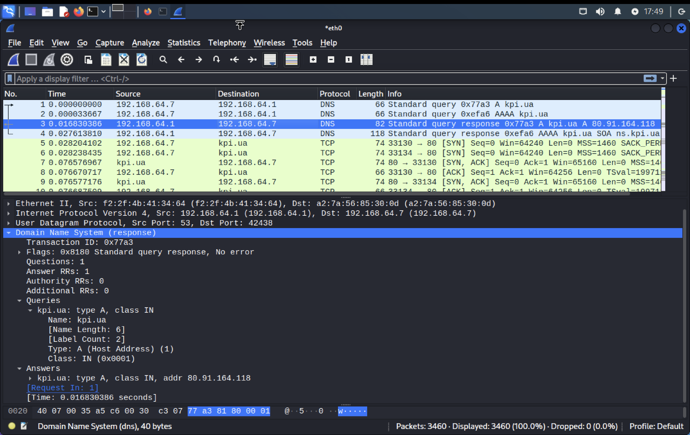

# Лабораторна робота 8

- [Лабораторна робота 8](#лабораторна-робота-8)
  - [Тема](#тема)
  - [Мета](#мета)
  - [Автор](#автор)
  - [Виконання](#виконання)
    - [Завдання 1](#завдання-1)
    - [Завдання 2](#завдання-2)
  - [Висновок](#висновок)

## Тема

МЕРЕЖЕВІ СНІФЕРИ — TCPDUMP, WIRESHARK

## Мета

Ознайомитися і навчитися працювати з такими мережевими сніферами, як tcpdump та wireshark. Освоєння аналізаторів мережного трафіку, отримання навичок написання фільтрів для аналізаторів та ознайомлення зі стеком мережевих протоколів

## Автор

Молчанов Михайло Валерійович, ІА-12

## Виконання

### Завдання 1

Команда в прикладі: `tcpdump -i ed1 -vvv -X -e host kid.stu and host ics-76-3.stu`, в ній використовуються наступні аргументи командного рядка:

- `-i ed1` - вказує на якому інтерфейсі необхідно прослуховувати
- `-vvv` - задає режим розширеного вивіду
- `-X` - додає до виводу короткий вміст пакету
- `-e` - додає заголовки канального рівня
- `host kid.stu and host ics-76-3.stu` - вираз який задає фільтри пакетів, цей фільтр залишить тільки пакети між хостами kid.stu та ics-76-3.stu

### Завдання 2

Для більшої цікавості завдання, я його трохи змінив: перехопивши пакети іншої машини, отримати пароль та логін користувача, який він ввів на слабо захищеному сайті, та проаналізувати пакети як в оригинальному завданні.

Слабо захищений сайт буде <http://testasp.vulnweb.com/Login.asp?RetURL=%2FDefault%2Easp%3F>, це сайт зроблений для тренування різних web атак. Він не використовує захисту логіну та паролю користувача та не використовує протокол https, тому ми зможемо перехопити введені користувачем параметри. Нехай login: user12, password: 26122022.

Налаштовуємо параметри wireshark

Обираємо інтерфейс eth0, оскільки через нього буде проходити трафік обох машин

Запускаємо wireshark та "логінимся на сайті"

Отримали наступну пачку пакетів

Аналізуємо їх.

Бачимо, що комп'ютер з якого надсилають запити має ip адрессу 192.168.64.7

Інформацію щодо логіну треба шукати серед протоколів http, з методом post. Бачимо саме такий пакет, переглядаємо його склад. В html form url encoded, можемо знайти логін та пароль, які були додані до рядку url як параметри, що неймовірно небезпечно саме через те що ми їх так перехопили. Бачимо що tfUName = user12, tfUPass = 26122022, саме те що користувач ввів.

Тобто ми отримали його логін та пароль до допомогою сніфера.

Тепер спробуємо проаналізувати пакети при переході на сайт kpi.ua

Бачимо, що на початку відбулися кілька dns запитів, щоб отримати ip адрессу kpi.ua, переглянемо відповідь.

В ній ми бачимо, що був один запит на знаходження ip адресси для kpi.ua, на нього є відповідь, що kpi.ua має адресу 80.91.164.118

Як видно, DNS використовує UDP, бо там є дані про User Datagram Protocol

А HTTP, використовує TCP

Також в Ethernet2, можемо побачити мак адреси комп'ютера з якого надсилався запит та до якого шлюза він пішов

## Висновок

На цій лабораторній роботі я дізнався про мережеві сніфери, а саме про tcpdump та wireshark, та використав kali linux для "взлому" користувача, який користується незахищеним сайтом. Навчився фільтрувати велику кількість пакетів за допомогою фільтрів.
