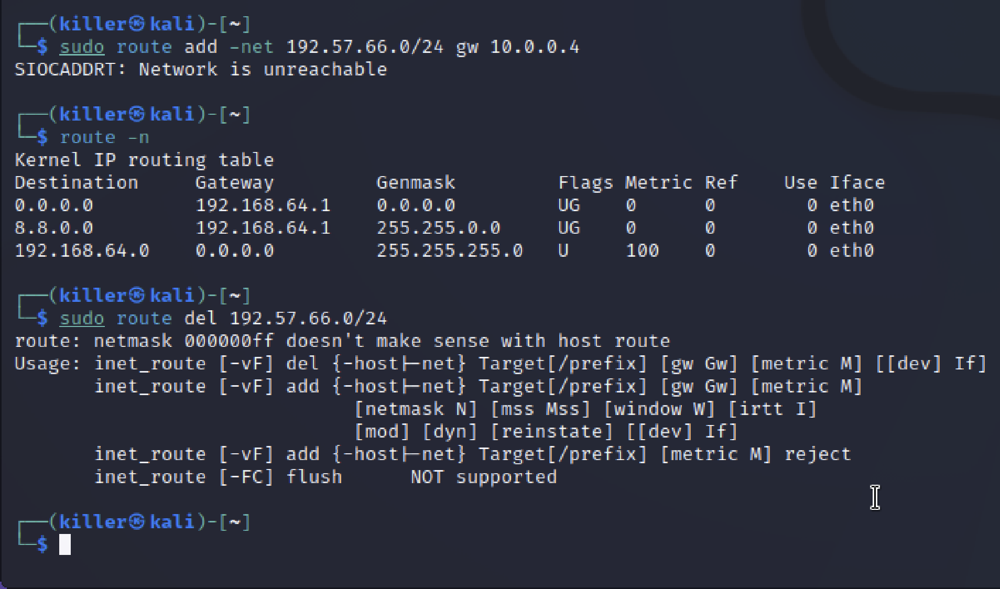

# Лабораторна робота 9

- [Лабораторна робота 9](#лабораторна-робота-9)
  - [Тема](#тема)
  - [Мета](#мета)
  - [Автор](#автор)
  - [Виконання](#виконання)
    - [Завдання 1](#завдання-1)
    - [Завдання 2](#завдання-2)
    - [Завдання 3](#завдання-3)
    - [Завдання 4](#завдання-4)
    - [Завдання 5](#завдання-5)
  - [Висновок](#висновок)

## Тема

КОНФІГУРАЦІЯ МЕРЕЖІ НА ПК, ОСВОЄННЯ: IFCONFIG, ROUTE, RESOLV.CONF, HOSTS, SERVICES

## Мета

Ознайомитися з методами конфігурації ПК, освоївши при цьому роботу з командами ifconfig та route, а також вивчивши файли resolv.conf, hosts і services.

## Автор

Молчанов Михайло Валерійович, ІА-12

## Виконання

### Завдання 1

Перегляд налаштувань для мережевого інтерфейсу

За допомогою аргументу -a отримаємо відображення всіх інтерфейсів, включаючи вимкнені

Вимкніть один з інтерфейсів (down), потім перегляньте статистику по всім інтерфейсам, увімкніть цей інтерфейс (up)

Призначте одному з інтерфейсів нову IP-адресу 192.168.2.2, змініть мережну маску на ньому ж - 255.255.255.0 і бродкаст адресу на 192.168.2.255 однією командою; після цього знову перегляньте статистику по всім інтерфейсам

### Завдання 2

Виведіть на екран таблицю маршрутизації за допомогою аргументу -n

Додайте маршрут по локальній мережі через один з інтерфейсів за допомогою аргументу add

За допомогою del default і add default змініть маршрут за замовчуванням. Перегляньте таблицю маршрутизації. Поверніть значення для первісного маршруту за замовчуванням (0.0.0.0)

Додайте маршрут до мережі 192.57.66.0/24 через шлюз 10.0.0.4, потім перегляньте таблицю і видаліть маршрут.

(Я не можу але це б виглядало так)

### Завдання 3

Відкрийте файл /etc/resolv.conf - ретельно вивчіть вміст файлу і за допомогою інформації в теоретичних відомостях пояснити все, що ви в ньому бачите.

Бачимо nameserver, тобто туди будуть переправлятися всі запити. Вони будуть викликатись почерзі доки один з них не спрацює.

Також там search, список пошуку для імен хостів що дозволяють створювати повні імена доменів разом з дефолтним

### Завдання 4

Відкрийте файл /etc/hosts - ретельно вивчіть вміст файлу і за допомогою інформації в теоретичних відомостях постарайтеся пояснити все, що ви в ньому бачите.

В цьому файлі були записи які дозволяли перетворювати буквані ім'я доменів на ip адреси. Зараз він не використовується, але там можуть бути налаштування за замовчуванням, коли dns не працює, саме тому там є localhost, він використовується при інсталяції. А інше ім'я це сайт з документаціями який встановлений разом з linux, та на нього зроблений таким шляхом посилання а не через dns сервер

### Завдання 5

Відкрийте файл /etc/services - ретельно вивчіть вміст файлу і за допомогою інформації в теоретичних відомостях постарайтеся пояснити все, що ви в ньому бачите.

В цьому файлі перераховані протоколи та сервіси з відповідними ним протоколами. Тут можна знайти популярні протоколи такі як udp, ftp, tcp, https. Мені сподобалось що я знайшов там git

## Висновок

На цій лабораторній роботі я дізнався про певні застосунки для роботи з інтерфейсами та для роботи з маршрутами. Також я дізнався про багато конфігураційних файлів операційної системи для роботи з мережею.
