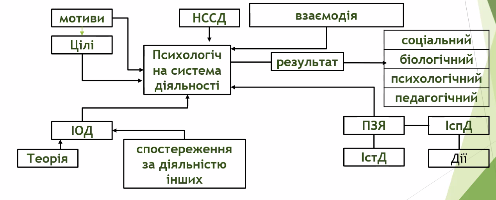

# Базові психологічні категорії: діяльність та спілкування

- [Базові психологічні категорії: діяльність та спілкування](#базові-психологічні-категорії-діяльність-та-спілкування)
  - [Ключові слова](#ключові-слова)
  - [Діяльність](#діяльність)
    - [Струкрута діяльності](#струкрута-діяльності)
      - [Скорочення](#скорочення)
  - [Особистість](#особистість)
  - [Поняття спілкування](#поняття-спілкування)
    - [Види](#види)
      - [Імператив](#імператив)
      - [Маніпуляція](#маніпуляція)
      - [Діалог](#діалог)
    - [Фактори ефективного спілкування](#фактори-ефективного-спілкування)
    - [Перепони або бар'єди у спілкуванні](#перепони-або-барєди-у-спілкуванні)
      - [Зовнішність людини](#зовнішність-людини)
      - [Вираз очей та обличчя](#вираз-очей-та-обличчя)
      - [Інтелект](#інтелект)
      - [Мотиваційний бар'єр](#мотиваційний-барєр)
      - [Моральний бар'єр](#моральний-барєр)
      - [Емоційний бар'єр](#емоційний-барєр)
    - [Структуар спілкування](#структуар-спілкування)
    - [Пецептивний процес](#пецептивний-процес)
      - [Схема сприймання іншої людини](#схема-сприймання-іншої-людини)
      - [Взаєморозуміння та пізнання(міжособистісна перцепція)](#взаєморозуміння-та-пізнанняміжособистісна-перцепція)
      - [Інтерпретація основних жестів](#інтерпретація-основних-жестів)
      - [Види погляду](#види-погляду)

## Ключові слова

- Діяльність
- Мотив
- Мета
- Спосіб
- Спілкування
- Перцепція
- Функції спілкування
- Імператив
- Маніпуляція
- Діалог
- Комунікація
- Інтеракція
- Взаємодія
- Помилки сприйняття

## Діяльність

> Діяльність - це форма активного ставлення людини до дійсності, що спрямоване на досягнення всідомо поставленої мети та отримання результату

- Експліцитна
  - Зовнішня
  - Спостережувана
- Імпліцитна
  - Внутрішня
  - Прихована

### Струкрута діяльності

####  Скорочення

- ІОД - інформаційна основа системи діяльності
- НССП - нормативно схвалений спосіб діяльності
- ПЗЯ - професійно-значущі якості
- ІСтД - індивідуальний стиль діяльності
- ІСпД - Іедивідуальний спосіб діяльності

## Особистість

Залежно від віку особистість формує:

- Гра(5-6 р.)
- Учіння(7-21 р.)
- Праця(22 р.)

Особистість завжди розглядається в єдності з діяльністю. Чим вона активніше, тим якскравіше проявляються її особливості

## Поняття спілкування

> Спілкування - взаємодія двої або більше людей, що має на меті обмін між ними інформацією пізнавальноо або афективно=оціночного характеру

|      Форми     |         Особливості        |
|:--------------:|:--------------------------:|
|      Пряме     | природний контакт          |
| Непряме        | тексти, технічні пристрої  |
| Міжособистісне | знайомі, конктерні особи   |
| Масове         | міжособистінс між багатьма |
| Рольове        | Люди мають ролі            |  

|         Функції         |                                    Зміст                                    |
|:-----------------------:|:---------------------------------------------------------------------------:|
|       Прагматична       | Об'єднана у спільній діяльності                                             |
| Формуюча                | Зміна себе та іншої людини                                                  |
| Підтверджуюча           | Ритуали, знайомство, знаки уваги                                            |
| Збереження та підтримка | Симпатія - антипатія, дружба - ворожнеча, або - або, зближення - віддалення |
| Внутрішньоособистісна   | Внутрішня мова (Універсальний спосіб мислення)                              |

### Види

#### Імператив

- Авторитарний
- Директивний вплив
- Вимоги
- Приписи
- Правила
- Кінцева мета - примус

#### Маніпуляція

- Істинні цілі спілкування приховані
- Стереотипи
  - Брехня
  - Цинізм
  - Недовіра

#### Діалог

- Півноправне
- Суб'єетне спілкування
- Апріорна довіра партнеру
- Персоніфікація (від першої особи)
- Обговорення проблем, а не догм
- Безоціночне сприймання партнера
- Терпіння

### Фактори ефективного спілкування

- Зовнішні
  - Обстановка
    - Офіційна
    - Інтимна
  - Характеристики сторін
    - Статус
    - Властивості особистості
    - Конфіденційність
    - Персоніфікація
- Внутрішні
  - Особливості сторін
    - Такт
    - Техніка
    - Правдивість
    - Авторитет
    - Емпатія

### Перепони або бар'єди у спілкуванні

#### Зовнішність людини

- Естетичні якості
- "Зустрічають за вбранням...
- "Фізична краса може підняти самооцінку рівень домагань, позитивне бачення світу

#### Вираз очей та обличчя

- Міміка
- Зміна виразу обличчя
- Очі - це джеркало душі людини
  
#### Інтелект

- Розумові здіюності людини
- Біопсихічна адаптація до обставин життя
- ... а проводжують по розуму

#### Мотиваційний бар'єр

- мотивація повинна бути переконливою для інших

#### Моральний бар'єр

- Результат дії життєво-побутових фактрів
- Різниця в статі, віці, соціальному положенні
- Належність до різних сходинок посадової ієрарії
- Психічні якості та особливості людини(сором'язливість, характер)

#### Емоційний бар'єр

- Пов'язаний з концепціями тих або іншиї "малих" або "великих" соціальних груп до який належить людина

### Структуар спілкування

Компоненти:

- Комунікація
- Перцепція
- Інтерація

Обмін інформацією:

- Зворотній зв'язок
  - Передача суті за допомогою інфомрації
  - Оцінка одне одного
    - Іронія
    - Радість
    - Роздратування
    - Реації
- Бар'єри
  - Нерозуміння
    - Дефекти мови
    - скоромовка
    - слова-паразити
    - Жаргони
    - Стиль мови
  - Соціонультурні відмінності
    - Стать
    - Вік
    - Національні особливості
    - Професія
  - Відносини
    - Невдріва
    - Неприязнь
- Вплив
  - Авторитарне
    - Некритичне пасивне сприймання
  - Діалогічне
    - Активна участь
- Рівні
  - Вербальний
    - Мова
  - Невербальний
    - Поза
    - Жести
    - Міміка
    - Час
    - Місце
    - Уважне мовчання

### Пецептивний процес

Функції соціальної перцепції:

- Пізнання себе
- Пізнання партнера
- Взаєморозуміння
- Взаємодія

#### Схема сприймання іншої людини

- Перевага
  - Завищена оцінка всіх якостей іншоно
- Привабливість
  - Загальна особистімсна переоцінка за значними якостями іншого
- Ставлення
  - При позитивному ставленні завищена оцінка іншого та навпаки
- Стереотипізація
  - Стіфні образи або уявлення про людей, факти

#### Взаєморозуміння та пізнання(міжособистісна перцепція)

Механізми

- Ідентифікація
  - Уподібнення себе значущому іншому
- Емпатія
  - Розуміння іншого через емоційний відгук
  - Однакову оцінку зовнішнього світу
- Атракція
  - Стійке позитивне ставлення до іншого
- Каузальна атрибуція
  - Пояснення поведінки іншого при нестачі інфомації

#### Інтерпретація основних жестів

|                        Жестикуляція                       |                     Інтерпретація                     |
|:---------------------------------------------------------:|:-----------------------------------------------------:|
|              Руки, розкриті долонями доверху              | Щирість, відктирість                                  |
| Піджак розстебнутий або знятий                            | Відвертість, дружня прихильність                      |
| Руки заховані за спину, в кишені                          | Напружене сприйняття ситуації                         |
| Руки сїрещені на грудяї                                   | Закритість від спілкування                            |
| Кулаки стиснуті                                           | Захист, оборона                                       |
| Кисті рук розслаблені                                     | Спокій                                                |
| Голова злегка нахилена набік                              | Уважне слухання                                       |
| Педагог спирається підборіддям                            | Критична оцінка                                       |
| Почісування підборіддя                                    | Обдумування рішення                                   |
| Педагог повільно знімає окуляри, ретельно протирає стекла | Бажання виграти час, підготуватися до відповіді, опір |
| Педагог ходить по класу                                   | Контроль                                              |
| Пощипування перенісся                                     | Напруга                                               |
| Педагог прикриває рота рукою під час свого висловлювання  | НЕщирість, обман                                      |
| Погляд убік від учня                                      | Сумнів                                                |

#### Види погляду

| Погляд та супутні дії                        | Тлумачення                  | Необхідні дії             |
|----------------------------------------------|-----------------------------|---------------------------|
| Підйом голови та погляди вверї               | Зачекай хвилину, пміркую    | Перервати контакт         |
| Рухи гоолвою та насуплені броти              | Не зрозумів, повтори        | Посилити контакт          |
| Посмішка, можливо, легкий нахил голови       | Розумію, мені нічого додати | Продовжити контакт        |
| Ритмічне кивання головою                     | Зрозуміло, що тобі потрібно | Продовжити контакт        |
| Довгий неруїхомий погляд в очі співбесідника | Хочу підпорядкувати собі    | Діяти відповідно ситуації |
| Погляд убік                                  | Зневака                     | Піти від контакту         |
| Погляд у підлогу                             | Струх та бажання піти       | Піти від контакту         |
